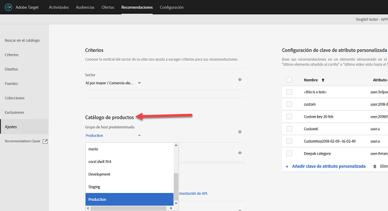
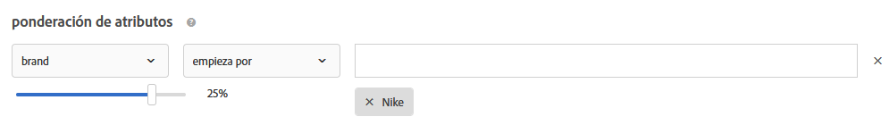

#  Preguntas más frecuentes sobre Recommendations{#recommendations-faq}

Lista de las preguntas más frecuentes (FAQ) sobre las actividades de Adobe Target Recommendations.

## ¿Por qué la búsqueda en el catálogo no muestra los resultados correctos cuando busco en un atributo personalizado con un valor numérico?

Cuando se realiza una búsqueda de catálogo en un atributo personalizado con un valor numérico, los resultados tratan el atributo personalizado como un tipo de cadena en lugar de un valor numérico.

Actualmente, no hay ninguna funcionalidad disponible que permita a los clientes cambiar el tipo de un atributo. Para realizar un cambio, [abra un problema con el cliente](/help/cmp-resources-and-contact-information.md#reference_ACA3391A00EF467B87930A450050077C) que haga referencia a los atributos que necesitan que el tipo cambie de cadena a numérico.

## ¿Cuánto tiempo llevará ver las actualizaciones de los elementos del catálogo en mi sitio?

Tras importar un archivo de fuente o recibir actualizaciones de entidad mediante API o mbox, los cambios siguientes se reflejarán en menos de 60 minutos:

* Atributos de elemento que se devuelven en la plantilla Diseño.
* Atributos de elemento utilizados en reglas de exclusión globales que impiden que el elemento se incluya en las recomendaciones devueltas.
* Atributos de elemento utilizados en reglas de inclusión dentro de los criterios que afectan si el elemento se incluye o se excluye en las recomendaciones devueltas.

Los siguientes cambios no se reflejan hasta que se ejecute el siguiente algoritmo (en 12-24 horas):

* Atributos de elemento utilizados en las reglas de recopilación usadas para la actividad.
* Atributos de elemento utilizados en una promoción en función de un atributo o una colección asociada con la actividad.
* Categoría del elemento en la que este aparece para una “Categoría actual” o “Categoría favorita” en los algoritmos Principales vendedores o Más visitados.
* “Clasificación de los elementos recomendados cuando el atributo ha cambiado” es un atributo personalizado que se usa como clave personalizada para un algoritmo.
* Clasificación de los artículos recomendados en función de los atributos modificados cuando la lógica de recomendación es “Elementos con atributos similares”, cuando se utilizan factores de ponderación “Similitud de contenido” o cuando se utilizan factores de “Ponderación de atributos”.

>[!NOTE]
>
>Un archivo de fuente se considera importado cuando su estado cambia de “Importación de elementos” a “Preparación de las actualizaciones del índice de búsqueda”. Las actualizaciones pueden tardar más de 60 minutos en reflejarse en la interfaz de usuario Búsqueda en el catálogo. La Búsqueda en el catálogo está actualizada cuando el estado de la fuente cambia a “Actualizaciones completadas”. Incluso si la Búsqueda en el catálogo aún no está actualizada, su sitio reflejará las actualizaciones en los periodos de tiempo enumerados arriba. El tiempo de actualización del índice de Búsqueda en el catálogo más reciente se muestra en la página Búsqueda en el catálogo.

## ¿Qué debo hacer si hay caracteres especiales que rompen la matriz?{#section_D27214116EE443638A60887C7D1C534E}

Utilice valores escapados en JavaScript. Las comillas ( &quot; ) pueden romper la matriz. El siguiente fragmento de código es un ejemplo de valores escapados:

```
#set($String='') 
#set($escaper=$String.class.forName('org.apache.commons.lang.StringEscapeUtils')) 
<script type="text/javascript"> 
console.log("$escaper.escapeJavaScript($entity1.name)") 
console.log("$escaper.escapeJavaScript($entity2.name)") 
console.log('$escaper.escapeJavaScript($entity3.name)') 
names.push("$escaper.escapeJavaScript($entity4.name)") 
</script>
```

## ¿Por qué no están disponibles para su selección todos los criterios, incluidos los personalizados, al crear una actividad de Recommendations?   {#section_B2265AC8B8A94E0298D495A05C5D817F}

Los criterios disponibles dependen de la categoría actual. Cuando crea ofertas de recomendaciones, el selector de algoritmo muestra criterios basados en el Id. de la categoría.

Si la ubicación en la que aplica los criterios no contiene el Id. de categoría, determinados criterios no están disponibles en el selector de algoritmo.

Si utiliza una ubicación en la que el Id. de categoría está presente en el mbox, el selector de criterio contendrá todos los criterios aplicables.

Target dispone de un ajuste  [Filtrar los criterios no compatibles](/help/c-recommendations/plan-implement.md#concept_C1E1E2351413468692D6C21145EF0B84) para controlar el filtrado inteligente del selector de algoritmo.

>[!NOTE]
>
>Este ajuste se aplica únicamente a las actividades creadas en el Compositor de experiencias visuales (VEC). No se aplica a las actividades creadas en el Compositor de experiencias basadas en formularios (Target carece de contexto de ubicación).

Para acceder al ajuste [!UICONTROL Filtrar los criterios no compatibles], haga clic en [!UICONTROL Recommendations] > [!UICONTROL Configuración]:


Si el ajuste [!UICONTROL Filtrar los criterios no compatibles] no está habilitado, Target no filtra los algoritmos en el selector de algoritmos y muestra todos ellos.

Si el ajuste [!UICONTROL Filtrar los criterios no compatibles] está habilitado, Target lee en las actividades VEC entityId y el Id. de categoría de la ubicación seleccionada y, a continuación, muestra los algoritmos basados en `currentItem|currentCategory` (si los valores respectivos están presentes en esa ubicación). Como resultado, de forma predeterminada solo se muestran en el selector de algoritmos aquellos compatibles con la ubicación seleccionada.

Aunque el ajuste [!UICONTROL Filtrar los criterios no compatibles] esté habilitado, puede ver los algoritmos no compatibles anulando la selección de la casilla [!UICONTROL Compatibles] al seleccionar los criterios.


La siguiente lista contiene casos especiales en los que Target no muestra la casilla [!UICONTROL Compatibles]:

* Tanto entityId como el Id. de categoría están presentes en la ubicación, por lo que no se filtra ningún resultado.
* Utiliza la versión 55 o anterior de [!DNL mbox.js].
* No se activa ninguna llamada a mbox desde la página (!config.isAutoCreateGlobalMbox &amp;&amp; !config.isRegionalMbox)
* Los parámetros de Target no están definidos.

## ¿Qué debería hacer si una colección en Recommendations resulta en cero (0)?   {#section_E2DB2FE67CF24EEC81412BFF3FA6385D}

Tenga en cuenta la siguiente información si ve que una colección que era distinta de cero resulta en cero:

* Puede volver a guardar la colección para comprobar si el número se actualiza. Tenga en cuenta que, al guardar de nuevo, la colección vuelve a ejecutar todos los algoritmos que la utilizan.
* ¿Está viendo el entorno correcto? Vaya a [!DNL /target/products.html#recsSettings] para asegurarse (como se muestra a continuación).

   

* ¿Está actualizado el índice? Vaya a [!DNL /target/products.html#productSearch] y compruebe cuándo se actualizó el índice (por ejemplo, “Indexado hace 3 hora(s)”). Puede actualizar el índice si lo desea.
* ¿Ha cambiado algo en la fuente o en la capa de datos que resulte en que sus entidades ya no cumplan las reglas de la colección? Compruebe que las mayúsculas y minúsculas concuerden.
* ¿Se ejecutó correctamente la fuente? ¿Ha cambiado alguien el directorio FTP, la contraseña, etc.?
* Target intenta que las actualizaciones del envío (en la página/aplicación del cliente) se produzcan lo más rápido posible. No obstante, también debemos proporcionar determinada representación en la interfaz de usuario para el experto en marketing. No retrasamos necesariamente las actualizaciones de envío hasta que las actualizaciones de la interfaz de usuario se sincronizan con ellas. Puede utilizar [mboxTrace](/help/c-activities/c-troubleshooting-activities/content-trouble.md) para comprobar el contenido del sistema en el momento de recibirse una solicitud.

## ¿Cuál es la diferencia entre la ponderación de atributos general y la específica para similitud de contenido?{#section_FCD96598CBB44B16A4C6C084649928FF}

Existen dos formas de ponderación de atributos: la “ponderación de atributos estándar” y la “ponderación de atributos de similitud de contenido”.

La “ponderación de atributos estándar” se aplica a la mayoría de los tipos de criterio, si no a todos (no solo a los de Similitud de contenido). Este tipo de ponderación da más peso a determinados valores de atributo. En el ejemplo siguiente, los productos de Nike reciben un empujón en las recomendaciones generadas.



La “ponderación de atributos de similitud de contenido” se aplica únicamente a los criterios de Similitud de contenido.

Este tipo de ponderación es más dinámico y se basa en la “clave de recomendación” actual (el elemento que se está viendo en ese momento). En el siguiente ejemplo (marca x 16), si un visitante estuviera viendo zapatillas de Nike, sería más probable que se le recomendaran otros productos de Nike (no necesariamente zapatillas) que zapatillas de otras marcas. Si un visitante estuviera viendo zapatillas de Adidas, tendría más probabilidades de recibir la recomendación de otros productos de Adidas.


## ¿Por qué a veces Target no puede mostrar recomendaciones?   {#section_DB3F40673AED42228E407C05437D99E9}

Target a veces no puede mostrar recomendaciones debido al bajo número de recomendaciones disponibles.

La cantidad de valores generados por criterio es 3 veces el número de entidades especificadas en el diseño. El filtrado en tiempo de ejecución (por ejemplo, el inventario, la coincidencia de atributos de mbox) se aplica después de que se generen los valores de 3x, por lo que es posible terminar con menos de 3 valores en el momento de la entrega. Para mitigar esta situación, aumente el número de entidades en el diseño al ocultar entidades adicionales.

Puede usar el siguiente JavaScript al comienzo del diseño para incrementar el número de entidades solicitadas. En este ejemplo, el recuento de entidades solicitadas sería 30 (3 x 10).

```
#foreach($entity in $entities) 
 #if( $foreach.count > 10 ) 
  #break 
 #end 
 #set ($foo = $entity.id) 
#end 
```

## ¿Cuál es el límite de tamaño de una llamada API para insertar/actualizar productos? ¿Puedo actualizar 50 000 productos en una llamada usando la API en vez de una fuente?   {#section_434FE1F187B7436AA39B7C14C7895168}

Target impone a las publicaciones un límite de 50 MB en el nivel de aplicación. Sin embargo, eso ocurre solamente cuando pasa el encabezado de tipo de contenido `application/x-www-form-urlencoded`.

Bien podría probar enviar 50 000 productos en una sola llamada. Si falla, debería dividir ese número en lotes. Habitualmente recomendamos que los clientes dividan sus llamadas en lotes de 5000 o 10 000 productos para reducir la probabilidad de tiempo de espera agotado debido a la carga del sistema.

## ¿Es necesario especificar el nombre del mbox al crear en Recommendations criterios, promociones o reglas de prueba de plantillas?   {#section_FFA42ABCC5954B48A46526E32A3A88A2}

Cuando se crean en Recommendations criterios, promociones o reglas de prueba de plantilla basadas en un parámetro de mbox, `mboxParameter` ya no le solicita `mboxName`. El nombre del mbox es ahora opcional. Este cambio le permite usar parámetros de varios mboxes o hacer referencia a un parámetro que aún no se haya registrado en el perímetro.

Para seleccionar el parámetro deseado:

* Cuando cree un nuevo criterio, promoción o regla de prueba de plantilla, seleccione un nombre de parámetro en la lista, empiece a escribir los primeros caracteres del nombre de parámetro deseado o escriba el nombre completo del parámetro.
* Si recuerda el nombre del mbox pero no el del parámetro, utilice la casilla de verificación para filtrar en función de un mbox conocido que pase el parámetro deseado.

Con ninguno de estos métodos existe vínculo entre el mbox y el parámetro. Los criterios, promociones y reglas de prueba de plantilla funcionarán sobre la base del parámetro en todos los mboxes que pasen dicho parámetro.

Si edita un criterio, promoción o regla de prueba de plantilla existente, el criterio de filtrado se muestra con el nombre de mbox que se suministró durante la creación.

## ¿Por qué no puedo guardar la actividad de Mis recomendaciones heredadas después de definir una nueva audiencia?   {#section_1E47C40B1FE7479BAC3EE0F50CE7C2C4}

Asegúrese de que la audiencia tiene un nombre único. Si le dio a la audiencia el mismo nombre que una audiencia existente, no puede guardar su actividad de Recommendations heredada (una actividad de Recommendations creada antes de octubre de 2016).

## ¿Cuál es el tamaño máximo de un archivo CSV para una carga de fuente?   {#section_20F1AF4839A447B9889B246D6E873538}

No hay un límite estricto en el número de filas o el tamaño del archivo para la carga del archivo CSV de una fuente. Sin embargo, como práctica recomendada, recomendamos limitar el tamaño del archivo CSV a 1 GB para evitar errores durante el proceso de carga del archivo. Si el tamaño del archivo excede 1 GB, lo ideal es que se divida en varios archivos de fuentes. El número máximo de columnas de atributos personalizados es 100 y los atributos personalizados están limitados a 4096 caracteres. Los límites adicionales en la longitud de las columnas requeridas están disponibles en la  [página Limitaciones de Target](/help/r-troubleshooting-target/target-limits.md#reference_BEFE60C3AAA442FF94D4EBFB9D3CC9B1).

## ¿Puedo excluir dinámicamente una entidad?

En la cadena de consulta, puede pasar los ID de entidad de las entidades que desee excluir de las recomendaciones. Por ejemplo, quizás desee excluir artículos que ya se encuentren en el carro de compras.

Para habilitar la funcionalidad de exclusión, utilice el parámetro mbox `excludedIds`. Este parámetro apunta a una lista de ID de entidad separados por comas. Por ejemplo, `mboxCreate(..., "excludedIds=1,2,3,4,5")`. El valor se envía al solicitar recomendaciones.

La exclusión solo se realiza para la llamada de Destinatario actual; los elementos no se excluyen en llamadas de Destinatario posteriores a menos que se vuelva a pasar el valor `excludedIds`. Para excluir elementos del carro de compras de las recomendaciones en cada página, siga pasando el valor `excludedIds` en cada página.

>[!NOTE]
>
>Si se excluyen demasiadas entidades, las recomendaciones se comportan como si no hubiera suficientes entidades para rellenar la plantilla de recomendaciones.

Para excluir `entityIds`, anexe el token `&excludes=${mbox.excludedIds}` a la dirección URL de contenido de la oferta. Cuando se extrae la dirección URL de contenido, se substituyen los parámetros requeridos mediante parámetros de solicitud de mbox actuales.

De forma predeterminada, esta característica está activada para las recomendaciones de nueva creación. Las recomendaciones existentes deben guardarse para permitir entidades dinámicamente excluidas.

## ¿Qué significa la respuesta NO_CONTENT devuelta a veces en el rastreo de contenido de Recommendations?

NO_CONTENT se devuelve cuando las recomendaciones no están disponibles para la combinación de algoritmo y clave solicitada. En general, esto ocurre cuando las copias de seguridad están desactivadas para el algoritmo y una o varias de las siguientes también son verdaderas:

* Los resultados aún no están listos.

   Esto suele ocurrir cuando primero se guarda una actividad recién creada o después de realizar cambios de configuración en la colección, los criterios o las promociones utilizadas en la actividad.

* Los resultados están listos, pero aún no se han almacenado en la caché en el servidor Edge más cercano, para la combinación de algoritmo y clave solicitada.

   La solicitud que se acaba de realizar iniciará una operación de almacenamiento en caché, por lo que esto debería resolverse después de que se vuelvan a cargar algunas páginas o pasen unos minutos.

* Los resultados están listos, pero no están disponibles para el valor de clave proporcionado.

   Esto suele ocurrir cuando se solicitan recomendaciones para un artículo que se agregó al catálogo después de que se ejecute el algoritmo más reciente y se resuelve después de que se ejecute el algoritmo siguiente.

* El procesamiento parcial de la plantilla está desactivado y no hay suficientes resultados disponibles para rellenar la plantilla.

   Esto suele ocurrir cuando tiene una regla de inclusión dinámica, que filtros agresivamente muchos elementos de los posibles resultados. Para evitarlo, habilite las copias de seguridad y no aplique la regla de inclusión a las copias de seguridad, o utilice los criterios de forma secuencial con criterios filtrados con menor agresividad.

