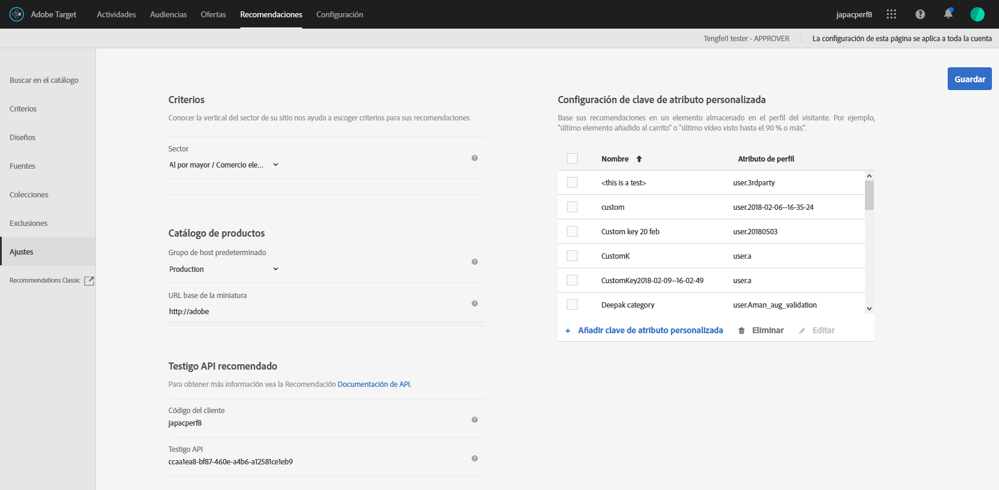

#  PREMIUMPlan e implemente Recommendations

Lo que debe saber antes de crear una actividad de Recommendations.

## Planificar e implementar recomendaciones {#concept_02AA644A4C7D4D5CB1D9CADA208CF8D1}

Lo que debe saber antes de crear una actividad de [!DNL Recommendations].

[!DNL Recommendations] requiere que configure la siguiente jerarquía de información:

| Paso | Información | Detalles |
|--- |--- |--- |
|  | Biblioteca de JavaScript | Cada página requiere una referencia a las versiones 0.9.1 (o posterior) de at.js o 55 (o posterior) de mbox.js. Este paso de implementación es necesario en todas las páginas donde se usará una actividad de Target y puede incluir claves como un ID de producto o categoría.<BR>Para obtener más información sobre at.js, consulte [Implementación de at.js](/help/c-implementing-target/c-implementing-target-for-client-side-web/t-mbox-download/c-target-atjs-implementation/target-atjs-implementation.md).<br>Para obtener más información sobre mbox.js, consulte [Implementación de mbox.js](/help/c-implementing-target/c-implementing-target-for-client-side-web/t-mbox-download/mbox-download.md). |
|  | Claves | La clave determina el tipo de producto o contenido que se muestra en las recomendaciones. Por ejemplo, la clave podría ser una categoría de producto. Consulte [Basar la recomendación en una clave de recomendación](/help/c-recommendations/c-algorithms/base-the-recommendation-on-a-recommendation-key.md). |
|  | Atributos | Los atributos proporcionan información más específica sobre los productos que quiere mostrar. Por ejemplo, es posible que quiera mostrar productos dentro de un determinado rango de precios o artículos cuyo inventario se ajuste a un determinado umbral. Los atributos se pueden proporcionar en el mbox o a través de una  [fuente](/help/c-recommendations/c-products/feeds.md).<br>Consulte  [Especificar reglas de inclusión](/help/c-recommendations/c-algorithms/create-new-algorithm.md#inclusion). |
|  | Exclusiones | Las exclusiones determinan qué artículos concretos no aparecen en las recomendaciones.<br>Consulte [Exclusiones](/help/c-recommendations/c-products/exclusions.md). |
|  | Detalles de la compra | Los detalles de la compra proporcionan información sobre los artículos comprados y el pedido una vez que se ha completado la compra. |

## Implementación de base {#concept_D1154A3FB0FB4467A29AD2BDD21C82D5}

La implementación de base requiere que envíe a su página parámetros que determinen qué productos o servicios aparecen en las recomendaciones.

Antes de comenzar a configurar una actividad de [!DNL Recommendations], debe saber cómo se proporcionan los datos de los productos a [!DNL Recommendations] y decidir el método que mejor se adapta a sus necesidades.

Existen dos métodos para proporcionar información sobre productos y servicios a [!DNL Recommendations]:

| Método | Descripción |
|--- |--- |
| Pasar parámetros directamente a la página | Este método funciona bien para artículos que cambian con frecuencia. Sin embargo, como este método requiere que los cambios se realicen directamente en la página, en muchas organizaciones es necesario recurrir al departamento de TI y al personal que implementa las páginas. |
| Pasar parámetros a través de una fuente de Google o de CSV | Este método funciona bien para las colecciones que no cambian con frecuencia. Normalmente no es necesario cambiar la implementación de o el código de otra página para proporcionar información de producto a través de una fuente. Sin embargo, la lista de productos permanece estática, así que los cambios rápidos con más difíciles. Para obtener más información, consulte [Fuentes](/help/c-recommendations/c-products/feeds.md). |

Estos métodos se pueden usar juntos o separados, como en los ejemplos siguientes.

## Ejemplo 1: Combinar páginas y fuentes.   {#section_DF6BAE4BF11548BD9C44D0A426BCF5A7}

Una opción de implementación común de [!DNL Recommendations] usa tanto fuentes como parámetros de página.

Este método puede ser el preferido de un negocio minorista que tenga un catálogo de productos relativamente establecido, pero que quiera destacar determinados artículos de temporada o en rebajas. Es posible que la mayoría de los clientes proporcionen su información principalmente a través de la fuente y que realicen ajustes ocasionales en la página.

Utilice una fuente para proporcionar información que no cambie con frecuencia. Tanto si usa una fuente de Google o un archivo CSV, use estos parámetros:

* Parámetros necesarios

   * `entity.id`

* Parámetros útiles

   * `entity.name`
   * `entity.categoryId`
   * `entity.brand`
   * `entity.pageUrl`
   * `entity.thumbnailUrl`
   * `entity.message`
   * Todos los atributos personalizados

Una vez la fuente esté configurada y pasada a [!DNL Recommendations], pase parámetros en la página para los atributos que cambian con frecuencia, es decir, con más frecuencia que los diarios.

* Parámetros necesarios

   * `entity.id`
   * `entity.categoryId`

* Parámetros útiles

   * `entity.inventory`
   * `entity.value`

Se da prioridad a cualquier conjunto de datos ejecutado más recientemente. Si primero pasa la fuente y luego actualiza los parámetros de la página, los cambios que se hagan en estos se mostrarán y reemplazarán la información del artículo que se pasó en la fuente.

## Ejemplo 2: Pasar todos los parámetros en la página de detalles del producto (o contenido) {#section_D5A4F69457604CA7AACFD7BFF79B58A9}

Si pasa todos los parámetros de la página, podrá hacer actualizaciones rápidamente cuando actualice la página. En algunas organizaciones, para hacer esto es necesario recurrir al personal de TI o al equipo de diseño web.

Este ejemplo puede resultar especialmente útil para una compañía de contenido multimedia, cuyo contenido cambia constantemente.

* Parámetros necesarios

   * `entity.id`
   * `entity.categoryId`
   * Resto de atributos

## Código de ejemplo.   {#section_6E8A73376F30468BB549F337C4C220B1}

Por ejemplo, puede usar el código siguiente en la sección de encabezado de sus páginas de producto o contenido.

```
function targetPageParams() {
 return {
    "entity": {
       "id": "32323",
       "categoryId": "My Category",
       "value": 105.56,
       "inventory": 329
    }
 }
}
```

Para ver más ejemplos del código que podría usar en diferentes tipos de páginas, consulte  [Implementación según el tipo de página](/help/c-recommendations/plan-implement.md#reference_DE38BB07BD3C4511B176CDAB45E126FC).

## Implementación según el tipo de página {#reference_DE38BB07BD3C4511B176CDAB45E126FC}

El tipo de página influye en la implementación de [!DNL Recommendations].

Por ejemplo, los tipos de recomendaciones que quiere presentar pueden aparecer de forma distinta en una página de producto, en una página de categoría o en la página principal. En cada página, puede ejecutar determinadas funciones antes de la llamada de mbox para mostrar las recomendaciones adecuadas.

Para obtener información sobre los atributos en los ejemplos, consulte [Atributos de entidad](/help/c-recommendations/c-products/entity-attributes.md#reference_3BCC1383FB3F44F4A2120BB36270387F).

Se requiere un formato de JSON válido.

La siguiente función `targetPageParams` es especialmente útil si va a usar una solución de administración de etiquetas para implementar las páginas. [!DNL Adobe Experience Platform Launch] coloca la referencia a at.js/mbox.js y la  `targetPageParams` función en la página y le permite configurar los valores. Debe colocar esa función antes de la llamada a at.js/mbox.js o en la sección Extra de JavaScript de su at.js/mbox.js.

## Todas las páginas {#section_A22061788BAB42BB82BA087DEC3AA4AD}

Todas las páginas que contienen recomendaciones requieren una referencia de [!DNL at.js] o [!DNL mbox.js] en la página. Añada una de las siguientes referencias en todas las páginas con recomendaciones:

```
<script src="/help/at.js /></script>
```

```
<script src="/help/mbox.js /></script>
```

Esta implementación requiere:

* [!DNL at.js] versión 0.9.2 (o posterior) o [!DNL mbox.js] versión 55 (o posterior).

* [!DNL mbox.js] debe incluir la referencia a [!DNL target.js] ([!DNL at.js] no requiere una referencia a [!DNL target.js]).

Para obtener más información sobre la implementación de [!DNL at.js], consulte [Implementación de at.js](/help/c-implementing-target/c-implementing-target-for-client-side-web/how-to-deployatjs/how-to-deployatjs.md#topic_ECF2D3D1F3384E2386593A582A978556).

Para obtener más información sobre la implementación [!DNL mbox.js], consulte [Implementación de mbox.js](/help/c-implementing-target/c-implementing-target-for-client-side-web/t-mbox-download/mbox-download.md#task_4EAE26BB84FD4E1D858F411AEDF4B420).

Si desea más información sobre las diferencias entre las dos bibliotecas de Target JavaScript, consulte [Ventajas de at.js](/help/c-implementing-target/c-implementing-target-for-client-side-web/t-mbox-download/c-target-atjs-implementation/target-atjs-implementation.md#benefits).

## Página de categoría {#section_F51A1AAEAC0E4B788582BBE1FEC3ABDC}

En una página de categoría, lo más seguro es que quiera restringir las recomendaciones a los productos o el contenido dentro de esa categoría. Para configurar una página de categoría, configure las claves usadas por la página. Para obtener más información, consulte [Basar la recomendación en una clave de recomendación](/help/c-recommendations/c-algorithms/base-the-recommendation-on-a-recommendation-key.md).

```
function targetPageParams() { 
   return { 
      "entity": { 
         "categoryId": "My Category" 
      } 
   } 
}
```

## Página de productos {#section_205B3953C9664125A17CA8574FA6B2A3}

En una página de productos, preferirá recomendar determinados artículos, o artículos con un precio o un nivel de inventario concreto. Para una página de producto, es posible que tenga que configurar atributos que cambian (como el valor y el inventario), además de las claves necesarias para la página de categoría.

```
function targetPageParams() { 
   return { 
      "entity": { 
         "id": "32323", 
         "categoryId": "My Category", 
         "value": 105.56, 
         "inventory": 329 
      } 
   } 
}
```

## Página del carro de compras   {#section_D37E48700F074556B925D0CA0291405E}

En una página de carro de compras, es probable que quiera excluir algunos artículos de las recomendaciones, como aquellos artículos que ya están dentro del carro de la compra.

```
<script type="text/javascript">
function targetPageParams() {
   return {
      "excludedIds": [352, 223, 23432, 432, 553]
      }
}
</script>
```

## Página de agradecimiento.   {#section_C6126A4517A1478693AB7EC2A1D4ACCA}

En la página de agradecimiento, puede interesarle mostrar el total del pedido y el ID del pedido, y mostrar los productos que se han comprado, sin recomendar otros artículos. Puede implementar un segundo mbox para capturar la información del pedido.

* Si está usando at.js, consulte  [Seguimiento de conversiones](/help/c-implementing-target/c-implementing-target-for-client-side-web/how-to-deployatjs/implementing-target-without-a-tag-manager.md#task_E85D2F64FEB84201A594F2288FABF053).
* Si utiliza mbox.js, consulte [Creación de una confirmación de pedido mbox: mbox.js](/help/c-implementing-target/c-implementing-target-for-client-side-web/t-mbox-download/orderconfirm-create.md#task_0036D5F6C062442788BB55E872816D82).

## Configuración {#concept_C1E1E2351413468692D6C21145EF0B84}

Utilice la configuración para administrar la implementación de [!DNL Recommendations].

Para acceder a las opciones de [!UICONTROL Configuración de Recommendations], abra [!DNL Target] en [!DNL Adobe Experience Cloud] y haga clic en **[!UICONTROL Recommendations]** > **[!UICONTROL Configuración]**.



Las opciones disponibles son las siguientes:

| Configuración | Descripción |
|--- |--- |
| Mbox global personalizado | (Opcional) Especifique el mbox global personalizado que se usa para aprovisionar actividades de [!DNL Target]. De forma predeterminada, el mbox global utilizado por [!DNL Target] se usa para [!DNL Recommendations].<br>Nota: Esta opción se establece en la página  [!DNL Target]  Administración. Abra [!DNL Target] y haga clic en [!UICONTROL Administración] > [!UICONTROL Compositor de experiencias visuales]. |
| Sector | El sector se usa para ayudarle a categorizar los criterios de recomendaciones. De este modo, los miembros de su equipo podrán encontrar criterios que tengan sentido para una página en particular, como los criterios que son más adecuados para la página del carro de compras o para una página de contenido multimedia. |
| Criterios incompatibles de filtro | Habilite esta opción para mostrar únicamente aquellos criterios donde la página seleccionada pasa los datos necesarios. No todos los criterios se ejecutarán correctamente en cada página. La página o el mbox necesitan pasar `entity.id` o `entity.categoryId` para que las recomendaciones de la categoría actual o el elemento actual sean compatibles. En general, se recomienda mostrar solamente criterios compatibles. Sin embargo, si desea que haya disponibles criterios incompatibles para la actividad, desactive esta opción.<br>Se recomienda deshabilitar esta opción si se usa una solución de administración de etiquetas.<br>Para obtener más información sobre esta opción, consulte [Preguntas frecuentes de Recommendations](/help/c-recommendations/c-recommendations-faq/recommendations-faq.md). |
| Grupo de hosts predeterminado | Seleccione su grupo de hosts predeterminado.<br>El grupo de hosts puede utilizarse para separar los elementos disponibles en el catálogo para usos diferentes. Por ejemplo, puede utilizar grupos de hosts para entornos de desarrollo y producción, marcas diferentes o regiones geográficas diferentes. De forma predeterminada, la vista previa de los resultados en Búsqueda de catálogo, Colecciones y Exclusiones se basa en el grupo de hosts predeterminado. (También puede seleccionar otro grupo de hosts para obtener una vista previa de los resultados mediante el filtro Entorno). De forma predeterminada, los elementos recién añadidos están disponibles en todos los grupos de hosts a menos que se especifique un ID de entorno al crear o actualizar el elemento. Las recomendaciones enviadas dependen del grupo de hosts especificado en la solicitud.<br>Si no ve sus productos, asegúrese de que esté usando el grupo de hosts correcto. Por ejemplo, si configura que la recomendación use un entorno de ensayo y establece el grupo de hosts en Ensayo, puede que tenga que volver a crear las colecciones en el entorno de ensayo para que se puedan mostrar los productos. Para ver qué productos están disponibles en cada entorno, use Búsqueda en catálogo con cada entorno. También puede obtener una vista previa del contenido de las colecciones y exclusiones de Recommendations para un entorno seleccionado (grupo de hosts).<br>**Nota:** Después de cambiar el entorno seleccionado, debe hacer clic en Buscar para actualizar los resultados devueltos.<br>El filtro [!UICONTROL Entorno] está disponible en los siguientes lugares de la interfaz de usuario de [!DNL Target]:<ul><li>Búsqueda en el catálogo (Recommendations > Buscar en el catálogo)</li><li>Cuadro de diálogo Crear colección ([!UICONTROL Recommendations > Colecciones > Crear nuevo])</li><li>Cuadro de diálogo Actualizar colección ([!UICONTROL Recommendations > Colecciones > Editar])</li><li>Cuadro de diálogo Crear exclusión ([!UICONTROL Recommendations > Exclusiones > Crear nuevo])</li><li>Cuadro de diálogo Actualizar exclusión ([!UICONTROL Recommendations > Exclusiones > Editar])</li></ul>Para obtener más información, consulte [Hosts](/help/administrating-target/hosts.md). |
| Dirección URL de base en miniatura | Al establecer una dirección URL de base para su catálogo de productos, es posible usar direcciones URL relativas al especificar vistas en miniatura de sus productos al pasar su dirección URL de vista en miniatura.<br>Por ejemplo:<br>`"entity.thumbnailURL=/Images/Homepage/product1.jpg"`<br> establece una dirección URL relativa para la dirección URL de base de vista en miniatura. |
| Token de API de Recommendations | Use este token en las llamadas de la API de Recommendations como, por ejemplo, la API de Descargar. |
