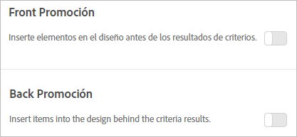

#  Añadir promociones{#add-promotions}

Añada elementos promocionados y controle su ubicación en sus diseños de Recommendations. Puede añadir promociones estáticas y dinámicas.

>[!IMPORTANT]
>
>Las reglas de exclusión estáticas y dinámicas son funciones potentes que pueden ayudarle en sus estrategias de marketing. Para obtener información detallada, ejemplos y casos de uso, consulte [Uso de reglas de inclusión dinámicas y estáticas](/help/c-recommendations/c-algorithms/use-dynamic-and-static-inclusion-rules.md#concept_4CB5C0FA705D4E449BD0B37B3D987F9F).

Al crear una actividad de [!DNL Recommendations], tiene la opción de incluir elementos promocionados en el diseño de [!DNL Recommendations]. Las promociones se ubican en los espacios libres del diseño y tienen prioridad sobre los resultados de criterios y las recomendaciones de copia de seguridad. Por ejemplo, si su diseño tiene seis espacios y utiliza dos para las promociones, quedarán cuatro espacios disponibles para los elementos recomendados a partir de los criterios.

Las promociones se eliminan de la duplicación de elementos recomendados por los criterios de la actividad, por lo que un elemento dado no aparecerá dos veces en una sola bandeja de recomendaciones.

Puede promocionar elementos concretos del modo habitual o de forma dinámica, así como elementos basados en atributos o colecciones.

>[!NOTE]
>
>Si utiliza promociones, se cambiarán la estructura y los resultados del CSV. Estos cambios no afectan a ningún proceso externo que utilice el CSV, como el correo electrónico.

1. En la página **[!UICONTROL Opciones]**, haga clic en la opción **[!UICONTROL Promoción principal]** o **[!UICONTROL Promoción secundaria]**.

   La siguiente ilustración muestra la opción de [!UICONTROL Promoción principal] en la posición “Activada”.

   

   Puede introducir promociones antes *o* después de los resultados de criterios.
1. Defina el número de espacios del diseño que se utilizarán para los elementos promocionados.

   Puede utilizar hasta 20 espacios en función de su diseño de [!DNL Recommendations]. Todos los espacios que utilice dejarán de estar disponibles para las recomendaciones ofrecidas a partir de sus criterios.

1. Defina una fecha de inicio y una fecha de finalización para los elementos promocionados.

   Si no define una fecha de inicio, la promoción se inicia inmediatamente. Si no define una fecha de finalización, la promoción se ejecuta indefinidamente.

1. Seleccione un **[!UICONTROL Tipo de promoción]**.

   * Seleccione **[!UICONTROL Lista de elementos]** e introduzca los valores `entity.id`, separados por comas, de los elementos específicos que desea promocionar.

      Si la lista incluye más elementos que el número de espacios definido para las promociones, puede seleccionar la casilla **[!UICONTROL Ordenar elementos de forma aleatoria]** para que se vayan mostrando distintos elementos promocionados en el diseño. Elegir esta opción hace que Target seleccione aleatoriamente la cantidad de elementos habilitados para las promociones en la plantilla de todo el conjunto de promociones para cada visita.

   * Seleccione **[!UICONTROL Promocionar por atributo]** y agregue reglas para definir los atributos de los elementos que desea promocionar.

      Si selecciona Promocionar por atributo, puede crear coincidencias dinámicas. Para obtener más información, consulte [Uso de reglas de inclusión dinámicas y estáticas](/help/c-recommendations/c-algorithms/use-dynamic-and-static-inclusion-rules.md#concept_4CB5C0FA705D4E449BD0B37B3D987F9F).

   * Seleccione **[!UICONTROL Promocionar una colección]** y elija la colección de elementos que desea promocionar. Puede crear nuevas colecciones para utilizarlas en las promociones. Consulte [Crear una colección](/help/c-recommendations/c-products/collections.md#task_1256DFF6842141FCAADD9E1428EF7F08) para obtener más información.

1. Haga clic en **[!UICONTROL Guardar.]**.

Las promociones se aplican a todas las experiencias de la actividad.
