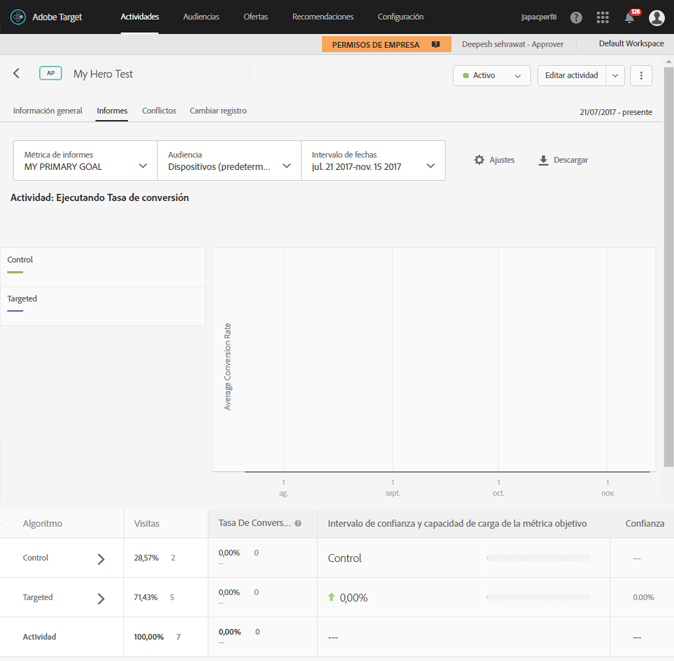

# Informe Resumen de segmentación automática{#auto-target-summary-report}

Información sobre la interpretación del informe Resumen de segmentación automática.

En la ilustración siguiente, se ve el aspecto que tiene un informe resumen típico cuando se usa la segmentación automática:

Algunos consejos y consideraciones a medida que interpreta sus informes de segmentación automática:

* Las distintas filas de la tabla permiten conocer el rendimiento de la actividad.

   * Las dos filas superiores de la tabla en la página de informes muestran los resultados de una prueba A/B entre los visitantes que fueron asignados al control (es decir, experiencias servidas al azar) y los visitantes que fueron asignados al algoritmo de personalización. Esta información se puede usar para medir cómo se realizó el algoritmo de personalización en comparación con el control servido al azar.
   * Las filas restantes muestran resultados de nivel de experiencia. Para cada experiencia, hay una comparación entre la respuesta promedio de los visitantes a quienes se les mostró esa experiencia como un control servido aleatoriamente, y la respuesta promedio de los visitantes a quienes se les mostró la experiencia usando el algoritmo de personalización.

* El icono de verificación verde junto a cada experiencia en el informe indica que para dicha experiencia se ha generado un modelo personalizado de aprendizaje automático. El icono del reloj indica que no se ha servido tráfico suficiente para crear el modelo.

   * Debido a que el modelo se construye por experiencia, es posible ver un modelo para algunas experiencias con un cheque verde y otras con un icono de reloj.
   * En este caso, para aumentar la velocidad de la actividad con modelos creados para todas las experiencias, se envía tráfico adicional a las experiencias con modelos no construidos.
   * Debe haber al menos dos experiencias con modelos integrados (marca de verificación verde) para que comience la personalización.

* Comparar la tasa de conversión de la experiencia A con la de la experiencia B no es lo adecuado en la segmentación automática. La pregunta es si la experiencia A rinde mejor cuando se sirve de una manera inteligente en lugar de aleatoria (en otras palabras, frente al control). Los profesionales del marketing también deben tener precaución al interpretar los aumentos de las experiencias individuales porque el algoritmo de personalización está intentando optimizar la métrica del éxito sobre toda la actividad, no sobre cada experiencia individual.
* Las experiencias con el alza más elevada se pueden considerar como las de mayor diferenciación dentro de la población. Es decir, el algoritmo ha encontrado la experiencia que más gusta a un segmento.

