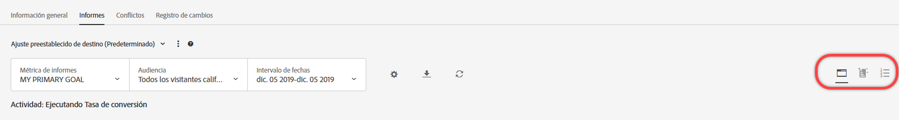
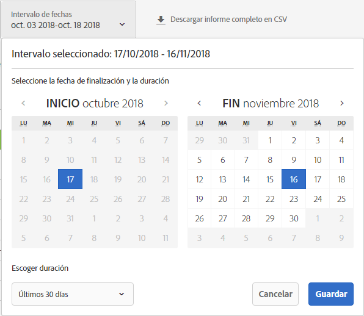
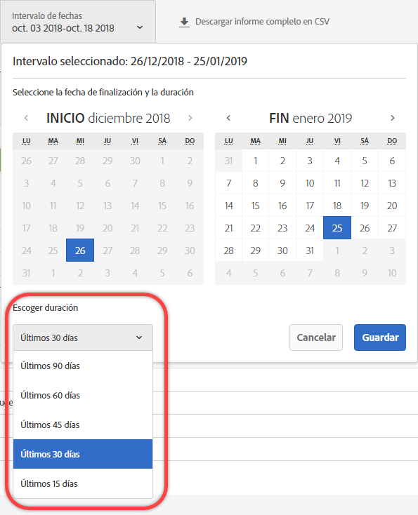
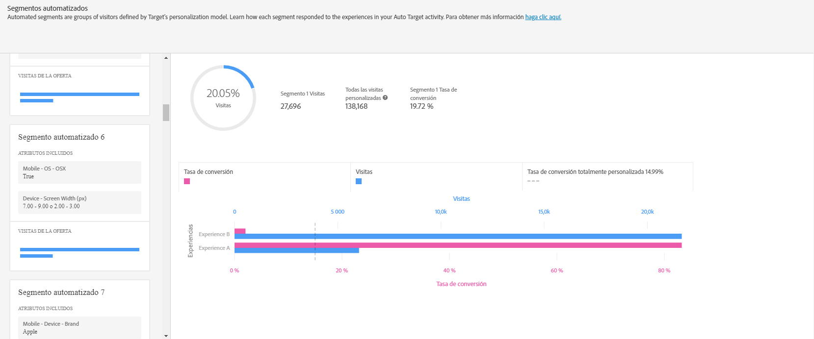
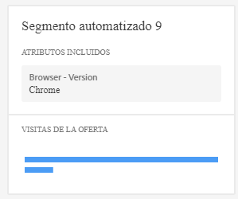
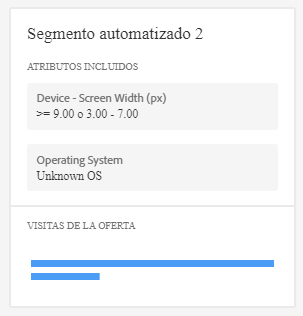

#  Informe Segmentos automatizados{#automated-segments-report}

Información sobre el informe Segmentos automatizados, uno de los dos informes especializados disponibles para los usuarios de las actividades de Personalización automatizada (AP) y Segmentación automática (AT).

>[!NOTE]
>
>Tenga en cuenta lo siguiente al utilizar los informes de Perspectivas de personalización:
>
>* Las actividades de AP y AT están disponibles como parte de la solución [!DNL Target Premium]. No se incluyen en [!DNL Target Standard] sin una licencia [!DNL Target Premium].
   >
   >
* [!UICONTROL Los informes de Perspectivas de personalización están disponibles solo para actividades de AP y AT que utilizan un objetivo de optimización de conversión. ] Tampoco se admiten las actividades en las que el objetivo de optimización se cambió a la conversión de ingresos después de que la actividad ya estaba activa.
   >
   >
* [!UICONTROL Los informes de perspectivas] de personalización solo están disponibles si se selecciona el Objetivo  principal en la lista desplegable Métrica [!UICONTROL de] informes.
   >
   >
* Los informes de perspectivas de personalización solo son compatibles con el [entorno predeterminado](/help/administrating-target/hosts.md).
   >
   >
* [!UICONTROL Los informes de Perspectivas] de personalización se generan solamente para actividades que están en estado [!UICONTROL Activo] y que se han activado y recibido tráfico durante al menos 15 días.

Los distintos visitantes responden de forma diferente a las ofertas y experiencias de su actividad AP/AT. Este informe muestra cómo los distintos segmentos automatizados definidos por los modelos de personalización de Target respondieron a las ofertas y experiencias de la actividad.

## Acceso al informe Segmentos automatizados {#section_8E8F997AAAF44A1B9EE06EB6FB652801}

1. Click **[!UICONTROL Activities]**, then click the desired [Automated Personalization](/help/c-activities/t-automated-personalization/automated-personalization.md#task_8AAF837796D74CF893CA2F88BA1491C9) or [Auto-Target](/help/c-activities/auto-target/auto-target-to-optimize.md) activity from the list.

   If you have many activities, you can filter the list by selecting options from the [!UICONTROL Type], [!UICONTROL Status], [!UICONTROL Property], [!UICONTROL Reporting Source], [!UICONTROL Experience Composer], [!UICONTROL Metrics Type], and [!UICONTROL Activity Source] drop-down lists.

1. Haga clic en **[!UICONTROL Informes]**.

   The [Automated Personalization Summary](/help/c-reports/reports-ap.md) or [Auto-Target Summary](/help/c-reports/auto-target-summary-report.md) report displays, which provides information about the performance of your activities, represented by the first screen icon. Los dos iconos adicionales representan los dos informes de Perspectivas de personalización: Segmentos automatizados y Atributos importantes. Tenga en cuenta que Segmentación automática dispone de un icono de gráfico adicional para la visualización gráfica del informe [!UICONTROL Resumen].

   

   >[!IMPORTANT]
   >
   >El informe [!UICONTROL Segmentos automatizados] no estará disponible hasta al menos 15 días después de que haya activado su actividad. Durante este periodo inicial, no podrá acceder a este informe o hacer clic en el icono [!UICONTROL Segmentos automatizados]. Después de que hayan transcurrido 15 días, suponiendo que haya suficiente tráfico personalizado en su actividad, el informe [!UICONTROL Segmentos automatizados] estará disponible.

1. Transcurridos 15 días a partir de la activación de la actividad, puede hacer clic en el icono **[!UICONTROL Segmentos automatizados.]**

   

1. Seleccione el intervalo de fechas deseado.

   A diferencia del informe [!UICONTROL Resumen] (informe de rendimiento), [!UICONTROL Perspectivas de personalización], incluido [!UICONTROL Segmentos automatizados] solo está disponible para intervalos de fechas fijos: 15 días, 30 días, 45 días, 60 días y 90 días. Estos intervalos de fechas fijos permiten que [!UICONTROL Perspectivas de personalización] utilice un intervalo de datos lo bastante grande como para reducir la probabilidad de que se obtengan perspectivas a partir de un patrón de actividad breve. Las dos opciones que tiene para el intervalo de fechas son “Fecha de finalización” y “Duración”. Observe que “Inicio” aparece atenuado. La fecha de inicio cambia automáticamente según las selecciones que realice para la fecha de finalización y la duración.

   

   Puede acceder a los intervalos de fechas fijos disponibles desde la lista desplegable [!UICONTROL Elegir duración].

   

1. Revise los datos del informe [!UICONTROL Segmentos automatizados].

   

1. (Opcional) [Descargue el informe en formato CSV](/help/c-reports/c-report-settings/report-settings.md#section_77E65C50BAAF4AB79242DB3A8778ADEF) para su análisis con Excel y otras herramientas.

   >[!NOTE]
   >
   >El informe de la interfaz de usuario de Perspectivas de personalización contiene información seleccionada. La descarga de CSV para el informe Segmentos automatizados contiene detalles adicionales. La descarga del informe Segmentos automatizados incluye segmentos automatizados adicionales que se suman a los ya incluidos en la interfaz de usuario, así como información sobre el comportamiento de dichos segmentos ante sus ofertas o experiencias.

## Interpretación del informe Segmentos automatizados

La tabla siguiente explica cómo se interpreta el informe y describe sus elementos:

| Elemento | Detalles |
|--- |--- |
| Panel lateral izquierdo | El panel lateral izquierdo enumera los 20 “segmentos automatizados” más grandes que los modelos de personalización de Target han identificado para esta actividad. Un “segmento automatizado” es como una audiencia, pero se define mediante modelos de personalización de Target en vez de hacerlo el experto en marketing. Cada segmento automatizado está formado por valores (o intervalos de valores) específicos de atributos específicos. Tenga en cuenta que los segmentos automatizados pueden superponerse. Los segmentos automatizados se pueden definir mediante uno, dos, tres o cuatro atributos. Consulte los ejemplos siguientes para obtener más detalles. Para obtener más información sobre los modelos de personalización de Target, consulte [Algoritmo de bosque aleatorio](/help/c-activities/t-automated-personalization/algo-random-forest.md). Para obtener más información sobre los atributos que utilizan los modelos de personalización de Target para crear segmentos automatizados, consulte [Recopilación de datos para algoritmos de personalización de Target](/help/c-activities/t-automated-personalization/ap-data.md). |
| Gráfico central | Los gráficos centrales muestran el rendimiento del contenido de su actividad para el segmento automatizado resaltado. Cuando hace clic en diferentes segmentos del panel izquierdo, los gráficos centrales se actualizan. |
| Gráficos circulares | Los gráficos circulares de la parte superior del panel central muestran el tamaño del segmento automatizado, así como la cantidad total de visitas personalizadas en la actividad (por ejemplo, el tráfico a esta actividad servido por el modelo de personalización. No se incluye el tráfico de control ni el tráfico servido por el modelo ganador general). Tenga en cuenta que el tamaño del segmento depende únicamente de las visitas personalizadas.  |
| Gráfico de barras de eje doble | El gráfico de barras de eje doble incluye información sobre visitas y conversiones para cada oferta o experiencia y para ese segmento automatizado específico. |
| Barra rosa | La barra rosa representa la tasa de conversión y utiliza el eje inferior del gráfico. Puede pasar el puntero del ratón sobre la barra para obtener más información. |
| Barra azul | La barra azul representa el número de visitas y utiliza el eje superior del gráfico. Puede pasar el puntero del ratón sobre la barra para obtener más información. |
| Línea de puntos gris | La línea de puntos gris representa la tasa de conversión para todas las visitas personalizadas en la actividad, todas las ofertas/experiencias y todos los segmentos automatizados. |

**Ejemplo 1 de segmento automatizado**

Este segmento automatizado se define mediante un único atributo. Los visitantes incluidos en este segmento automatizado vieron esta actividad de AP en un día laborable, pero fuera de los horarios de trabajo habituales, o en un fin de semana.

**Ejemplo 2 de segmento automatizado**

Este segmento automatizado se define mediante dos atributos. Los visitantes incluidos en este segmento automatizado que vieron esta actividad de AP tenían menos de tres visualizaciones de página en su visita actual y se encontraban entre las latitudes 42,57 y 47,29 (aproximadamente, entre New Hampshire/Oregón y Washington/Maine para una empresa estadounidense).

## Preguntas más frecuentes sobre Segmentos automatizados {#section_740910A52FA646B4AC9452F98C2F5719}

**Los informes de Perspectivas de personalización aún no están disponibles para mi actividad. ¿A qué se debe?**

Existen varias razones para que los informes de [!UICONTROL Perspectivas de personalización] aún no estén disponibles para su actividad:

* No han transcurrido 15 días desde que se activó la actividad. Los informes Segmentos automatizados y Atributos importantes no estarán disponibles al menos hasta 15 días después de haberse iniciado la actividad. Durante este periodo inicial no podrá acceder a estos informes ni hacer clic en los iconos de Segmentos automatizados o Atributos importantes.
* La actividad no tuvo suficiente tráfico durante el periodo de tiempo especificado. Transcurridos 15 días, y suponiendo que haya tráfico personalizado suficiente en la actividad para crear los modelos de personalización, estarán disponibles los informes Segmentos automatizados y Atributos importantes.
* Su actividad tiene un objetivo de optimización de ingresos. En este momento, [!UICONTROL Perspectivas de personalización] solo está disponible para actividades de optimización de la conversión. En una futura versión añadiremos compatibilidad con las actividades de optimización de los ingresos.

¿**Qué es un atributo?**

Un atributo es información sobre un visitante o sobre su visita específica que los algoritmos de personalización utilizan para aprender a personalizar el tráfico. Por ejemplo, un atributo podría ser el tipo de navegador, la ubicación, la hora del día de la visita, etcétera.

Para obtener más información sobre qué atributos utiliza [!DNL Target] en sus modelos de personalización, consulte [Recopilación de datos para algoritmos de personalización de Target](/help/c-activities/t-automated-personalization/ap-data.md). Para obtener más información sobre cómo cargar nuevos atributos en Target para usarlos en modelos de personalización de Target, consulte [Métodos para introducir datos a Target](/help/c-implementing-target/c-considerations-before-you-implement-target/c-methods-to-get-data-into-target/methods-to-get-data-into-target.md#concept_0069C0EFB56C4700BB33F2F35C2B9B17).

**¿Qué es un segmento automatizado?**

Un “segmento automatizado” es como una audiencia, pero se define mediante modelos de personalización de Target en vez de hacerlo el experto en marketing.

Un segmento automatizado está formado por valores (o intervalos de valores) específicos de atributos específicos. Consulte el paso 5 anterior para ver ejemplos de segmentos automatizados. Tenga en cuenta que los segmentos pueden superponerse.

Para obtener más información sobre el algoritmo de personalización de bosque aleatorio, que es la base de los modelos de personalización de Target, consulte   [Algoritmo de bosque aleatorio](/help/c-activities/t-automated-personalization/algo-random-forest.md).

**¿Cómo se decide el orden de los segmentos automatizados? **

Para cada segmento se calcula una puntuación en función de su tamaño y de su desempeño ante el contenido de la actividad. La combinación de estas entradas determina el orden de los segmentos automatizados, de manera que los segmentos más grandes y con diferencias mayores en la respuesta ante los distintos contenidos aparecen más arriba en la lista de segmentos.

**¿Por qué solo algunas de mis ofertas y experiencias aparecen en el informe Segmentos automatizados?**

Las actividades de AP y AT crean un modelo por oferta (en el caso de AP) y un modelo por experiencia (en el caso de AT). Estas actividades comienzan a servir tráfico personalizado y crean sus [!UICONTROL Perspectivas de personalización] con solo dos modelos construidos. Si no ve todas las ofertas y experiencias en [!UICONTROL Perspectivas de personalización], es probable que no haya construido modelos para esas ofertas y experiencias concretas. Puede comprobar en el informe [!UICONTROL Resumen] de su actividad si hay un icono de reloj junto a la oferta o experiencia. Este icono indica que todavía no se han creado modelos para esa oferta o experiencia.

**¿Por qué, para un determinado segmento automatizado, algunas ofertas o experiencias con una tasa de conversión menor que otras reciben una mayor cantidad de tráfico?**

Existen varias causas potenciales para que una oferta o experiencia con una tasa de conversión menor pueda tener más visitas dentro de un segmento automatizado, como las siguientes:

* Hay un número de vistas pequeño para algunas o para todas las ofertas o experiencias en un segmento automatizado concreto.
* Actividades de menor volumen en las que determinadas ofertas y experiencias carecen de modelos construidos, o para las que se construyeron modelos antes para unas ofertas y experiencias que para otras.
* Las reglas de segmentación de una oferta específica indican qué visitantes pueden ver cada oferta o experiencia.

**¿La información que aparece en los informes [!UICONTROL Segmentos automatizados] y [!UICONTROL Atributos importantes] es la misma que la que aparece en la descarga de CSV?**

No, el informe Interfaz de usuario contiene información seleccionada. La descarga de CSV contiene detalles adicionales. La descarga del informe Perspectivas de segmentos automatizados incluye segmentos automatizados adicionales que se suman a los ya incluidos en la interfaz de usuario, así como información sobre el comportamiento de dichos segmentos ante sus ofertas o experiencias. El informe Atributos importantes incluye los 100 principales atributos de visitante y su importancia relativa, mientras que Interfaz de usuario solo incluye los 10 principales atributos de visitante.

**¿Puedo ver [!UICONTROL Perspectivas de personalización] para un intervalo de fechas personalizado?**

Los informes de Perspectivas de personalización (tanto [!UICONTROL Segmentos automatizados] como [!UICONTROL Atributos importantes]) solo están disponibles para intervalos de fechas fijos: 15 días, 30 días, 45 días, 60 días y 90 días. Estos intervalos de fechas fijos permiten que [!UICONTROL Perspectivas de personalización] utilice un intervalo de datos lo bastante grande como para reducir la probabilidad de que se obtengan perspectivas a partir de un patrón de actividad breve. Puede seleccionar estas duraciones para cualquier fecha de finalización (mientras haya datos suficientes en la actividad para satisfacer la duración).

**¿Cómo se crea [!UICONTROL Perspectivas de personalización]?**

[!UICONTROL Perspectivas de personalización] se crea empleando una técnica de Adobe con patente en trámite llamada MAGIX (Model Agnostic Globally Interpretable Explanations). Puede obtener más información sobre MAGIX en el documento publicado por el equipo de investigación de Adobe en la [página web arXiv.org](https://arxiv.org/abs/1706.07160).

**¿Por qué los datos totales de tráfico de visitantes en el informe [!UICONTROL Segmentos automatizados] no coinciden con mi informe de resumen/rendimiento de AP o AT?**

Los informes de [!UICONTROL Perspectivas de personalización] incluyen solo aquellos visitantes para los que los modelos de personalización de Target seleccionaron algún contenido (es decir, no se incluye el tráfico de control ni el tráfico servido por el modelo ganador general). Este tipo de tráfico se denomina tráfico “personalizado”. El informe Resumen de rendimiento de AP/AT incluye el tráfico de control y el tráfico “segmentado”. El tráfico segmentado incluye el tráfico personalizado, así como también el tráfico servido mediante el modelo ganador general y elementos de tráfico aleatorios que se utilizan para profundizar en el aprendizaje.

**¿Los segmentos automatizados son mutuamente excluyentes?**

No, existe superposición entre los segmentos automatizados.

**¿Está disponible [!UICONTROL Perspectivas de personalización] para objetivos de modelado basados en los ingresos o para objetivos principales?**

En este momento, [!UICONTROL Perspectivas de personalización] solo está disponible para actividades de optimización de la conversión. En una futura versión añadiremos compatibilidad con las actividades de optimización de los ingresos.

**¿De qué maneras puedo aprovechar la información de Perspectivas de personalización?**

* Descubra nuevas audiencias para segmentar: si detecta un segmento automatizado concreto que funciona especialmente bien, plantéese crear una audiencia para poder reutilizarlo en otros informes.
* Pruebe hipótesis sobre el tipo de visitantes que responderán a cada una de sus experiencias.
* Descubra qué contenido funcionó para cada tipo de visitante: ¿qué ofertas fueron las responsables de atraer a un tipo concreto de visitantes?
* Identifique el contenido de bajo rendimiento.
* Averigüe qué atributos resultaron más importantes para el aprendizaje del modelo.
* Vea qué atributos se utilizan en los modelos de personalización y qué importancia tienen.
* Identifique oportunidades para incluir nuevos puntos de datos que puede pasar a Target para profundizar en la personalización.

**¿Hay alguna lógica en el orden en que aparecen los atributos en una tarjeta de segmento?**

No, el orden de las tarjetas se basa solamente en una clasificación descrita anteriormente. El orden de los atributos dentro de una tarjeta no se basa en ninguna lógica.