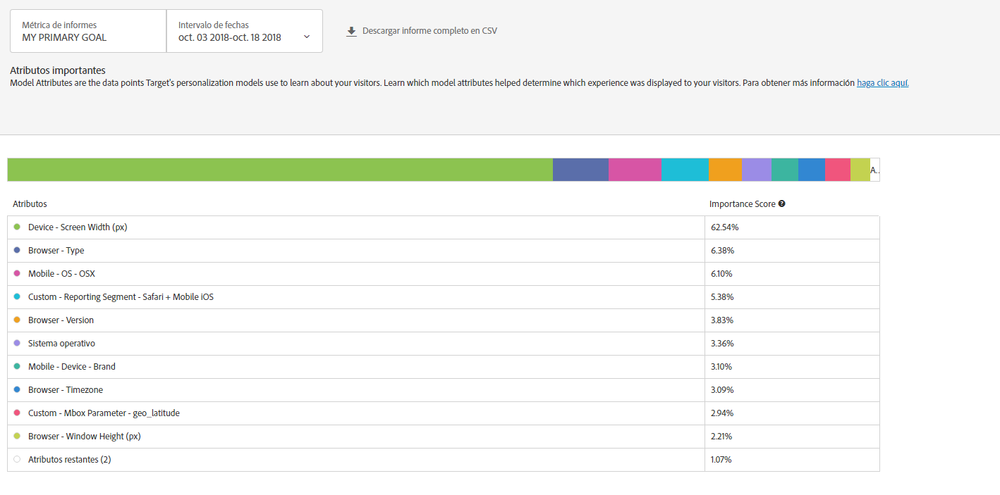

#  Informe de Atributos importantes{#important-attributes-report}

Información sobre el informe Atributos importantes, uno de los dos informes especializados disponibles para los usuarios de las actividades de Personalización automatizada (AP) y Segmentación automática (AT).

>[!NOTE]
>
>Tenga en cuenta lo siguiente al utilizar los informes de Perspectivas de personalización:
>
>* Las actividades de AP y AT están disponibles como parte de la solución [!DNL Target Premium]. No se incluyen en [!DNL Target Standard] sin una licencia [!DNL Target Premium].
   >
   >
* [!UICONTROL Los informes de Perspectivas de personalización están disponibles solo para actividades de AP y AT que utilizan un objetivo de optimización de conversión. ] Tampoco se admiten las actividades en las que el objetivo de optimización se cambió a la conversión de ingresos después de que la actividad ya estaba activa.
   >
   >
* [!UICONTROL Los informes de ] perspectivas de personalización solo están disponibles si se seleccionan los objetivos  [!UICONTROL principales ] en la lista desplegable  [!UICONTROL Métricas de ] informes.
   >
   >
* Los informes de perspectivas de personalización solo son compatibles con el [entorno predeterminado](/help/administrating-target/hosts.md).
   >
   >
* [!UICONTROL Los informes ] Perspectivas de personalización se generan solamente para actividades que están en el   estado Activo y que se han activado y recibido tráfico durante al menos 15 días.

En las distintas actividades, distintos atributos son más o menos importantes para el modo en que el modelo decide realizar la personalización. Este informe muestra los atributos que más influyeron en el modelo y su importancia relativa.

## Acceso al informe Atributos importantes {#section_8E8F997AAAF44A1B9EE06EB6FB652801}

1. Haga clic en **[!UICONTROL Actividades]** y, a continuación, haga clic en la actividad [Automated Personalization](/help/c-activities/t-automated-personalization/automated-personalization.md#task_8AAF837796D74CF893CA2F88BA1491C9) o [Destinatario automático](/help/c-activities/auto-target/auto-target-to-optimize.md) que desee de la lista.

   Si tiene muchas actividades, puede filtrar la lista seleccionando opciones en las listas desplegables [!UICONTROL Tipo], [!UICONTROL Estado], [!UICONTROL Fuente de informes], [!UICONTROL Compositor de experiencias], [!UICONTROL Tipo de métricas] y [!UICONTROL Fuente de la actividad].

1. Haga clic en **[!UICONTROL Informes]**.

   Se muestra el informe [Resumen de Automated Personalization](/help/c-reports/reports-ap.md) o [Resumen de Destinatario automático](/help/c-reports/auto-target-summary-report.md), que proporciona información sobre el rendimiento de sus actividades, representada por el icono de la primera pantalla. Los dos iconos adicionales representan los dos informes de Perspectivas de personalización: Segmentos automatizados y Atributos importantes. Tenga en cuenta que Segmentación automática dispone de un icono de gráfico adicional para la visualización gráfica del informe [!UICONTROL Resumen].

   

   >[!IMPORTANT]
   >
   >El informe [!UICONTROL Atributos importantes] no estará disponible hasta al menos 15 días después de que haya activado su actividad. Durante este periodo inicial, no podrá acceder a este informe o hacer clic en el icono [!UICONTROL Atributos importantes]. Después de que hayan transcurrido 15 días, suponiendo que haya suficiente tráfico personalizado en su actividad, el informe [!UICONTROL Atributos personalizados] estará disponible.

1. Transcurridos 15 días a partir de la activación de la actividad, puede hacer clic en el icono **[!UICONTROL Atributos importantes]**.

   

1. Seleccione el intervalo de fechas deseado.

   A diferencia del informe [!UICONTROL Resumen] (informe de rendimiento), [!UICONTROL Perspectivas de personalización], incluido [!UICONTROL Atributos importantes], solo estará disponible para intervalos de fechas fijos: 15 días, 30 días, 45 días, 60 días y 90 días. Estos intervalos de fechas fijos permiten que [!UICONTROL Perspectivas de personalización] utilice un intervalo de datos lo bastante grande como para reducir la probabilidad de que se obtengan perspectivas a partir de un patrón de actividad breve. Las dos opciones que tiene para el intervalo de fechas son “Fecha de finalización” y “Duración”. Observe que “Inicio” aparece atenuado. La fecha de inicio cambia automáticamente según las selecciones que realice para la fecha de finalización y la duración.

   

   Puede acceder a los intervalos de fechas fijos disponibles desde la lista desplegable [!UICONTROL Elegir duración].

   

1. Revise los datos del informe [!UICONTROL Atributos importantes].

   

1. (Opcional) [Descargue el informe en formato CSV](/help/c-reports/c-report-settings/report-settings.md#section_77E65C50BAAF4AB79242DB3A8778ADEF) para su análisis con Excel y otras herramientas.

   >[!NOTE]
   >
   >El informe de la interfaz de usuario de Perspectivas de personalización contiene información seleccionada. La descarga de CSV para el informe Atributos importantes contiene detalles adicionales. La descarga del informe Atributos importantes incluye la lista completa de los 100 principales atributos, mientras que el informe Interfaz de usuario solo incluye los 10 primeros. Si busca un atributo específico en el informe, pero no aparece, no significa que el atributo no influyera en esta actividad, solo que no estuvo entre los 100 principales.

## Interpretación del informe Atributos importantes

La tabla siguiente explica cómo se interpreta el informe y describe sus elementos:

| Elemento | Detalles |
|--- |--- |
| Gráfico de barras | El gráfico de barras multicolor en la parte superior de la pantalla le permite visualizar estas puntuaciones de importancia relativa. Los valores se representan con el color de punto que se indica en la tabla junto a cada atributo. También puede pasar el cursor sobre un color específico del gráfico de barras para ver a qué atributo representa.  Las puntuaciones de importancia de los 100 principales atributos suman el 100 %. Para obtener más información sobre cómo añadir más atributos que los modelos de personalización de Target puedan utilizar, consulte  [Carga de datos para los algoritmos de personalización de Target](/help/c-activities/t-automated-personalization/uploading-data-for-the-target-personalization-algorithms.md). |
| Gráfico de Clasificación de atributos de modelo | Clasificación de atributos de modelo incluye los 10 atributos que fueron más importantes para que el modelo de personalización de Target determinara qué contenido se asignaba a cada visitante. La puntuación de importancia muestra, en relación con los 100 principales atributos, el peso que tuvo un atributo específico en los modelos de personalización de Target para la actividad. |

## Preguntas más frecuentes sobre Atributos importantes {#section_740910A52FA646B4AC9452F98C2F5719}

**Los informes de Perspectivas de personalización aún no están disponibles para mi actividad. ¿A qué se debe?**

Existen varias razones por las que los informes de [!UICONTROL Perspectivas de personalización] pueden no estar aún disponibles para su actividad:

* No han transcurrido 15 días desde que se activó la actividad. Los informes Segmentos automatizados y Atributos importantes no estarán disponibles al menos hasta 15 días después de haberse iniciado la actividad. Durante este periodo inicial no podrá acceder a estos informes ni hacer clic en los iconos de Segmentos automatizados o Atributos importantes.
* La actividad no tuvo suficiente tráfico durante el periodo de tiempo especificado. Transcurridos 15 días, y suponiendo que haya [tráfico personalizado suficiente](/help/c-activities/auto-target/auto-target-to-optimize.md#section_BA4D83BE40F14A96BE7CBC7C7CF2A8FB) en la actividad para crear los modelos de personalización, estarán disponibles los informes Segmentos automatizados y Atributos importantes.
* Su actividad tiene un objetivo de optimización de ingresos. En este momento, [!UICONTROL Perspectivas de personalización] solo está disponible para actividades de optimización de la conversión. En una futura versión añadiremos compatibilidad con las actividades de optimización de los ingresos.

¿**Qué es un atributo?**

Un atributo es información sobre un visitante o sobre su visita específica que los algoritmos de personalización utilizan para aprender a personalizar el tráfico. Por ejemplo, un atributo podría ser el tipo de navegador, la ubicación, la hora del día de la visita, etcétera.

Para obtener más información sobre qué atributos utiliza [!DNL Target] en sus modelos de personalización, consulte [Recopilación de datos para algoritmos de personalización de Target](/help/c-activities/t-automated-personalization/ap-data.md). Para obtener más información sobre cómo cargar nuevos atributos en Target para usarlos en modelos de personalización de Target, consulte [Métodos para introducir datos a Target](/help/c-implementing-target/c-considerations-before-you-implement-target/c-methods-to-get-data-into-target/methods-to-get-data-into-target.md#concept_0069C0EFB56C4700BB33F2F35C2B9B17).

**¿La información que aparece en los informes [!UICONTROL Segmentos automatizados] y [!UICONTROL Atributos importantes] es la misma que la que aparece en la descarga de CSV?**

No, el informe Interfaz de usuario contiene información seleccionada. La descarga de CSV contiene detalles adicionales. La descarga del informe Perspectivas de segmentos automatizados incluye segmentos automatizados adicionales que se suman a los ya incluidos en la interfaz de usuario, así como información sobre el comportamiento de dichos segmentos ante sus ofertas o experiencias. El informe Atributos importantes incluye los 100 principales atributos de visitante y su importancia relativa, mientras que Interfaz de usuario solo incluye los 10 principales atributos de visitante.

**¿Puedo ver Perspectivas de personalización para un intervalo de fechas personalizado?**

Los informes de Perspectivas de personalización (tanto [!UICONTROL Segmentos automatizados] como [!UICONTROL Atributos importantes]) solo están disponibles para intervalos de fechas fijos: 15 días, 30 días, 45 días, 60 días y 90 días. Estos intervalos de fechas fijos permiten que [!UICONTROL Perspectivas de personalización] utilice un intervalo de datos lo bastante grande como para reducir la probabilidad de que se obtengan perspectivas a partir de un patrón de actividad breve. Puede seleccionar estas duraciones para cualquier fecha de finalización (mientras haya datos suficientes en la actividad para satisfacer la duración).

**¿Cómo se crea [!UICONTROL Perspectivas de personalización]?**

[!UICONTROL Perspectivas de personalización] se crea empleando una técnica de Adobe con patente en trámite llamada MAGIX (Model Agnostic Globally Interpretable Explanations). Puede obtener más información sobre MAGIX en el documento publicado por el equipo de investigación de Adobe en la [página web arXiv.org](https://arxiv.org/abs/1706.07160).

**¿Está disponible [!UICONTROL Perspectivas de personalización] para objetivos de modelado basados en los ingresos o para objetivos principales?**

En este momento, [!UICONTROL Perspectivas de personalización] solo está disponible para actividades de optimización de la conversión. En una futura versión añadiremos compatibilidad con las actividades de optimización de los ingresos.

**¿Qué representa la puntuación de importancia de atributo en el informe Atributos importantes?**

La puntuación de importancia en la parte “Clasificación de la importancia del atributo” del informe ofrece información sobre cuáles de las variables que el algoritmo utilizó para aprender fueron más importantes al decidir el reparto de todos los visitantes entre los segmentos identificados. Se asigna una puntuación porcentual a los 100 principales atributos utilizados por el modelo.

**¿Por qué, para un determinado segmento automatizado, algunas ofertas o experiencias con una tasa de conversión menor que otras reciben una mayor cantidad de tráfico?**

Existen varias causas potenciales para que una oferta o experiencia con una tasa de conversión menor pueda tener más visitas dentro de un segmento automatizado, como las siguientes:

* Hay un número de vistas pequeño para algunas o para todas las ofertas o experiencias en un segmento automatizado concreto.
* Actividades de menor volumen en las que determinadas ofertas o experiencias no tienen modelos creados.
* Actividades de menor volumen en las que los modelos se crearon antes para algunas ofertas o experiencias. Por ejemplo, supongamos que se creó un modelo adicional el día 22 y que está viendo los datos de los días 10-24.
* Las reglas de segmentación de una oferta específica limitan a los visitantes que pueden ver cada oferta o experiencia.
* No existen intervalos de confianza en los informes de perspectivas. Sin embargo, si las tasas de conversión son lo suficientemente cercanas, el modelo podría servir tráfico para que sea más alto en la cantidad de punto, pero no son números “estadísticamente distintos”.

Saber cómo funciona el modelo que proporciona tráfico puede ser útil. Cada persona se sirve en función de su perfil total. Sin embargo, los informes de perspectivas generalizan este comportamiento para hacerlo más interpretativo por parte de un humano. Como resultado, los segmentos no son mutuamente excluyentes. Esto puede generar segmentos individuales que muestren este tipo de comportamiento, porque la misma persona puede aparecer en varios segmentos.

**¿De qué maneras puedo aprovechar la información de Perspectivas de personalización?**

* Descubra nuevas audiencias para segmentar: si detecta un segmento automatizado concreto que funciona especialmente bien, plantéese crear una audiencia para poder reutilizarlo en otros informes.
* Pruebe hipótesis sobre el tipo de visitantes que responderán a cada una de sus experiencias.
* Descubra qué contenido funcionó para cada tipo de visitante: ¿qué ofertas fueron las responsables de atraer a un tipo concreto de visitantes?
* Identifique el contenido de bajo rendimiento.
* Averigüe qué atributos resultaron más importantes para el aprendizaje del modelo.
* Vea qué atributos se utilizan en los modelos de personalización y qué importancia tienen.
* Identifique oportunidades para incluir nuevos puntos de datos que puede pasar a Target para profundizar en la personalización.