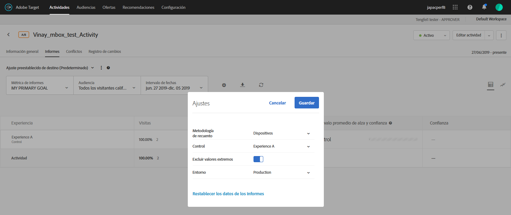

# Excluir valores extremos

You can exclude extreme values from affecting reports in [!DNL Adobe Target] so a few unusual orders don&#39;t affect your activity results. Un ejemplo de pedido inusual puede ser el caso de un entrenador que compre uniformes para todo un equipo en lugar de compradores que compren uniformes de forma individual.

>[!NOTE]
>
>El indicador [!UICONTROL Excluir valores extremos] se aplica a las actividades con tipos de métrica de ingresos y participación.

Los valores extremos se marcan automáticamente en función de las reglas descritas a continuación. Puede alternar entre ver y excluir los valores extremos de los informes. Los valores extremos de una actividad se excluirán cuando la actividad se haya ejecutado durante una hora o cuando se hayan realizado 15 pedidos, lo que suceda antes.

Un valor se considera extremo si cuenta con más de 3 desviaciones estándares +/- del valor de pedido promedio según los datos del último mes (hasta el momento en el que se realizó el cálculo).

Por ejemplo, el filtro de valores extremos a menudo resulta útil cuando se usa RPV. RPV combina valor de pedido promedio y tasa de conversión, y a menudo expone la volatilidad de esas métricas. Si usa RPV y determina que los pedidos no parecen estar distribuidos normalmente, podría ver resultados más normales al aplicar el filtro de pedidos extremos.

Cuando se marca un valor como extremo, su valor se reemplaza por el valor de pedido promedio de la experiencia para el último mes, excluidos los extremos. The order is also marked as extreme in the [!UICONTROL Order Details] report and in the CSV download for daily results.

**Para excluir valores extremos de los informes:**

1. Abra una actividad que incluya tipos de métrica de ingresos o participación y, después, haga clic en la pestaña **[!UICONTROL Informes]**.
1. Haga clic en el icono de engranaje para mostrar el cuadro de diálogo **[!UICONTROL Configuración]** .

   

1. Deslice el botón **[!UICONTROL Excluir valores]** extremos a la posición &quot;activado&quot; o &quot;desactivado&quot;, según desee.
1. Haga clic en **[!UICONTROL Guardar]**.
