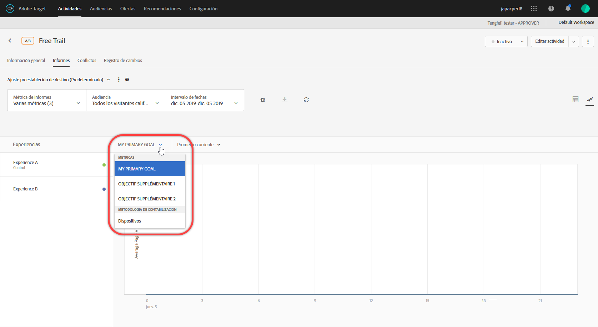

# Ver varias métricas en un informe{#view-multiple-metrics-in-a-report}

Puede seleccionar varias métricas para la vista en un [!DNL Adobe Target] informe.

Tenga en cuenta la siguiente información cuando trabaje con varias métricas en los informes:

* The ability to view multiple metrics is available for [A/B Test](/help/c-activities/t-test-ab/test-ab.md), [Auto-Allocate](/help/c-activities/automated-traffic-allocation/automated-traffic-allocation.md), [Auto-Target](/help/c-activities/auto-target-to-optimize.md), and [Experience Targeting](/help/c-activities/t-experience-target/experience-target.md) (XT) activities only.
* You cannot add more than 20 metrics to a report for an activity that uses [Analytics for Target](/help/c-integrating-target-with-mac/a4t/a4t.md) (A4T). You can add as many metrics as you have in your activity to reports for activities that do *not* use A4T.
* Si selecciona varias métricas, no puede utilizar la opción Descargar para descargar informes a CSV. Para habilitar la opción [!UICONTROL Descargar], seleccione una única métrica.
* You cannot view multiple metrics for activities created before the July 2015 [!DNL Target] release (July 30, 2015).

**Para seleccionar varias métricas que se mostrarán en el informe:**

1. Para mostrar un informe, haga clic en **[!UICONTROL Actividades]**, en la actividad que quiera de la lista y luego en la ficha **[!UICONTROL Informes.]**
1. Haga clic en la lista desplegable **[!UICONTROL Métrica de informes]** para ver las listas [!UICONTROL Métricas mostradas] y [!UICONTROL Métricas ocultas].

   

   Puede utilizar el cuadro [!UICONTROL Buscar] para encontrar rápidamente métricas disponibles que se añadirán a la lista [!UICONTROL Métricas mostradas].

   Tenga en cuenta que puede seleccionar varias métricas tanto en la [!UICONTROL Visualización de tabla] como en la [!UICONTROL Visualización de gráfico] del informe.

1. Pase el puntero del ratón sobre la métrica deseada en la lista [!UICONTROL Métricas ocultas] y, a continuación, haga clic en **[!UICONTROL Seleccionar]** para moverlas a la lista [!UICONTROL Métricas mostradas].

   O

   Arrastre y suelte las métricas deseadas de la lista [!UICONTROL Métricas ocultas] a la lista [!UICONTROL Métricas mostradas].

   Debe haber al menos una métrica en la lista [!UICONTROL Métricas mostradas].

   Puede reorganizar las métricas arrastrándolas y soltándolas en el orden deseado en la lista [!UICONTROL Métricas mostradas]. The selected order will be reflected in the [!UICONTROL Table View] and [!UICONTROL Graph View]. Para eliminar una métrica de la lista [!UICONTROL Métricas mostradas], pase el puntero del ratón sobre ella y, a continuación, haga clic en el icono **X**.

1. Haga clic en **[!UICONTROL Guardar]** cuando termine.
1. (Conditional) While viewing the report in the [!UICONTROL Table View], hover your mouse pointer on any metric&#39;s column header to display a blue arrow. Haga clic en la flecha para expandir la tabla y mostrar el [!UICONTROL Alza] y la [!UICONTROL Confianza] para esa métrica.

   

   Solo puede expandir una métrica/coluna a la vez. Vuelva a hacer clic en la flecha para contraer las columnas.

1. (Condicional) Al ver el informe en la Vista Gráfico, puede seleccionar métricas individuales para mostrarlas en la lista desplegable:

   

