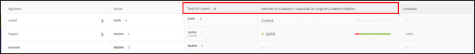
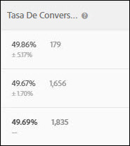
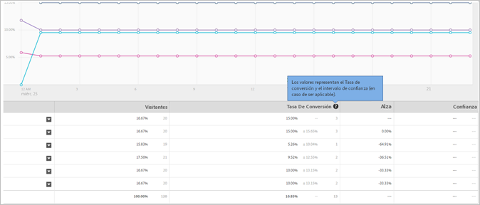
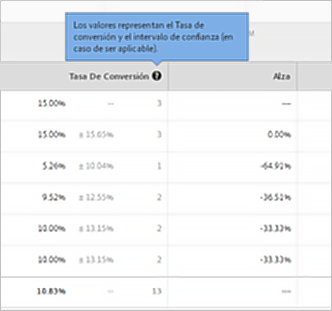
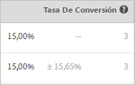

# Tasa de conversión

De cada experiencia, se informa de la tasa de conversión, el alza, la confianza (relevancia estadística) y el intervalo de confianza.

La siguiente ilustración muestra el encabezado de gráfico de una actividad de muestra, con los encabezados [!UICONTROL Tasa de conversión], [!UICONTROL Alza] y [!UICONTROL Confianza] destacados.

>[!NOTE]
>
>En todos los datos se omiten los pedidos duplicados si se pasa un `orderID`. En el informe de auditoría se enumeran los pedidos duplicados que se han omitido.

## Tasa de conversión {#section_07A36846C4E84D0881906809B9CE5A74}

Indica la tasa de conversión media, el intervalo de confianza y el número de conversiones.

Examine la siguiente columna del informe Tasa de conversión a modo de ejemplo:

La primera línea corresponde a la experiencia de control. Muestra una tasa de conversión del 15%, con tres conversiones. En la segunda línea, Experiencia B, se muestra una tasa de conversión del 15%, con un intervalo de confianza de más o menos 15,65% y tres conversiones.

>[!NOTE]
>
>Actualmente, el intervalo de confianza solo se calcula para las métricas binarias.

## Alza {#section_0F409572C720433D9378092ABC999982}

Compara la tasa de conversión de cada experiencia con la experiencia de control.

Alza = (tasa de conversión de la experiencia - tasa de conversión de control): tasa de conversión de control

Si el control es 0, no existe alza de porcentaje.

## Confianza (relevancia estadística)    {#section_35DB6724813D40C7B0808DE18FE595C1}

Este número indica la probabilidad de que los resultados se dupliquen si la prueba se realiza de nuevo. La confianza se redondea al 100,00 % cuando la confianza es superior o igual al 99,995 %.

Consulte [Nivel de confianza e intervalo de confianza](/help/c-reports/conversion-rate.md#concept_0D0002A1EBDF420E9C50E2A46F36629B).

## Datos comerciales {#section_30A674731BA6440E9BB93C421BE990EE}

Si ha insertado un mbox [Realizar pedido](/help/c-implementing-target/c-implementing-target-for-client-side-web/t-mbox-download/orderconfirm-create.md) (`orderConfirmPage`) y lo ha seleccionado como mbox de conversión, se muestran los datos de AOV (valor de pedido promedio), RPV (ingresos por visitante) y ventas de cada experiencia.

## Nivel de confianza e intervalo de confianza {#concept_0D0002A1EBDF420E9C50E2A46F36629B}

En cada experiencia se muestran el nivel de confianza y el intervalo de confianza.

Las conversiones y las variables continuas para métricas basadas en Target, como las métricas de ingresos y participación, se calculan del siguiente modo:

* **Conversión:** sí o no
* **El resto:** valores de un rango

Puede realizar cálculos sin conexión en for Target (A4T), pero tendrá que realizar un paso de exportaciones de datos en [!DNL Analytics]Analytics. Para obtener más información, véase “Realización de cálculos sin conexión en Analytics for Target (A4T)”, más adelante.

### Nivel de confianza {#section_26FE5E44BDD5478792A65FCFD83DCCDC}

El *nivel de confianza* se representa por medio de un porcentaje más oscuro en la columna Tasa de conversión de cada experiencia.

  

El nivel de confianza (o relevancia estadística) indica en qué medida el éxito de una experiencia no depende del azar. Un nivel de confianza elevado pone de manifiesto lo siguiente:

* El rendimiento de la experiencia es considerablemente distinto al del control.
* El rendimiento de la experiencia no se debe simplemente al ruido.
* Si realizara esta prueba de nuevo, probablemente obtendría los mismos resultados.

En caso de que el nivel de confianza supere el 90% o 95%, el resultado se puede considerar estadísticamente relevante. Antes de tomar una decisión empresarial, espere a que el tamaño de la muestra sea lo suficientemente grande y que las cuatro barras de confianza de una o varias experiencias se mantengan constantes durante un periodo de tiempo ininterrumpido. De este modo, se asegurará de que los resultados son estables.

>[!NOTE]
>
>La confianza se redondea al 100,00 % cuando la confianza es superior o igual al 99,995 %.

### Intervalo de confianza {#section_F582738DFE1648C78B93D81EBC6CACF7}

>[!NOTE]
>
>Actualmente, el intervalo de confianza solo se calcula para las métricas binarias.

El *intervalo de confianza* es un intervalo en el que se puede encontrar el valor verdadero en cualquier nivel de confianza. El intervalo de confianza aparece como un porcentaje positivo o negativo de color gris claro en la columna Tasa de conversión. En el ejemplo siguiente, el intervalo de confianza de alza de la Experiencia B es más o menos 15,65%.

**Ejemplo:** El RPV de una experiencia es 10 $, su nivel de confianza es 95% y su **intervalo de confianza** es 5 $ a 15 $. Si ejecutáramos esta prueba varias veces, el 95% del tiempo el RPV estaría entre 5 $ y 15 $.

**¿Qué afecta al intervalo de confianza?** La fórmula sigue métodos estadísticos estándar para calcular intervalos de confianza.

* **Tamaño de la muestra:** A medida que la muestra crece, el intervalo se reduce. Esto es recomendable, ya que pone de manifiesto que los informes se aproximan al valor real de la métrica de éxito.
* **Desviación estándar menor:** Más resultados similares, como AOV similares o la conversión de números o visitantes similares cada día, reducen la desviación estándar.

## El cálculo de confianza y cómo realizarlo sin conexión    {#section_86F7C231943043A5B8B6BFE67B706E3B}

El [informe CSV descargado](/help/c-reports/downloading-data-in-csv-file.md#concept_3F276FF2BBB2499388F97451D6DE2E75) solo contiene datos sin procesar; no incluye métricas calculadas, como los ingresos por visitante, el alza o la confianza, utilizadas en las pruebas A/B.

Para calcular estas métricas calculadas, descargue el archivo de Excel [Calculadora de confianza completa](/help/assets/complete_confidence_calculator.xlsx) del Destinatario para introducir el valor de la actividad o revise los [cálculos estadísticos utilizados por Destinatario](/help/assets/statistical-calculations.pdf).

>[!NOTE]
>
>Esta calculadora es para informes basados en Target y no para informes de A4T.

## Realización de cálculos sin conexión en Analytics for Target (A4T) {#section_B34BD016C8274C97AC9564F426B9607E}

Puede realizar cálculos sin conexión para A4T, pero es necesario realizar un paso de exportaciones de datos en [!DNL Analytics].

Para A4T empleamos un cálculo t-test de estudiante con variables continuas (en vez de métricas binarias). En Analytics, siempre se realiza un seguimiento de los visitantes y se cuenta toda acción realizada. Por tanto, si el visitante realiza varias compras o visita varias veces una métrica de éxito, todas estas visitas adicionales se cuentan. Esto convierte la métrica en una variable continua. Para realizar el cálculo de la prueba T del estudiante, se requiere la &quot;suma de cuadrados&quot; para calcular la varianza, que se utiliza en el denominador de la estadística t. [Este documento explica los ](/help/assets/statistical-calculations.pdf) detalles de las fórmulas matemáticas utilizadas. La suma de cuadrados se puede recuperar de [!DNL Analytics]. Para obtener datos de la suma de los cuadrados, debe realizar una exportación en el nivel de visitante de la métrica que desea optimizar durante un periodo de muestra.

Por ejemplo, si está optimizando las vistas de página por visitante, exportaría una muestra del número total de vistas de página por cada visitante durante un tiempo concreto, tal vez un par de días (no necesita más que unos pocos miles de puntos de datos). A continuación, elevaría al cuadrado cada valor y sumaría los totales (en este caso, el orden de las operaciones es esencial). Este valor “suma de los cuadrados” se utiliza en la calculadora de confianza completa. Para estos valores, utilice la sección “ingresos” de dicha hoja de cálculo.

**Para utilizar a este respecto la función de exportación de datos de [!DNL Analytics]:**

1. Iniciar sesión en [!DNL Adobe Analytics].
1. Haga clic en **[!UICONTROL Herramientas]** > **[!UICONTROL Data Warehouse]**.
1. En la pestaña **[!UICONTROL Solicitud de Data Warehouse]**, rellene los campos.

   Para obtener más información acerca de cada campo, consulte &quot;Descripciones de Data Warehouse&quot; en [Data Warehouse](https://experienceleague.adobe.com/docs/analytics/export/data-warehouse/data-warehouse.html).

   | Campo | Instrucciones |
   |--- |--- |
   | Nombre de la solicitud | Especifica un nombre para su solicitud. |
   | Fecha de informes | Especifica un periodo de tiempo y una granularidad. Como práctica recomendada, elija no más de una hora o un día de datos para la primera solicitud.  Los archivos del Data Warehouse tardan más en procesarse cuanto mayor es el periodo solicitado, por lo que siempre se recomienda solicitar primero un periodo corto para garantizar que el archivo devuelva el resultado esperado. A continuación, vaya a Solicitar administrador, duplique la solicitud y solicite más datos esta vez. Además, si establece la granularidad en cualquier valor distinto de “Ninguna”, el tamaño del archivo aumentará de forma drástica.  |
   | Segmentos disponibles | Aplique un segmento, según sus necesidades. |
   | Desgloses | Seleccione las dimensiones que desee:     Estándar es el valor predeterminado, mientras que Personalizado incluye eVars y props. Se recomienda utilizar “ID de visitante” si se necesita información en este nivel, en vez de “ID de visitante de Experience Cloud”.<ul><li>El ID de visitante es el ID último utilizado por Analytics. Será AID (en el caso de un cliente heredado) o MID (si el cliente es nuevo o si borró las cookies desde el inicio del servicio ID de visitante de MC).</li><li>El ID de visitante de Experience Cloud solo se establecerá para clientes nuevos o que hayan borrado las cookies desde el inicio del servicio ID de visitante de MC.</li></ul> |
   | Métricas | Seleccione las métricas que desee. Estándar es el valor predeterminado, mientras que Personalizado incluye eventos personalizados. |
   | Vista previa del informe | Revise la configuración antes de programar el informe.  |
   | Programar envío | Introduzca una dirección de correo electrónico a la que enviar el archivo, asigne un nombre a este y, a continuación, seleccione [!UICONTROL Enviar inmediatamente]. Nota: El archivo se puede enviar mediante FTP desde [!UICONTROL Opciones de envío avanzadas] . |

1. Haga clic en **[!UICONTROL Solicitar este informe]**.

   El envío de archivos puede tardar hasta 72 horas, dependiendo de la cantidad de datos solicitados. Puede comprobar el progreso de la solicitud en cualquier momento haciendo clic en [!UICONTROL Herramientas] > [!UICONTROL Data Warehouse] > [!UICONTROL Solicitar administrador].

   Si desea volver a solicitar datos ya pedidos en el pasado, puede duplicar una solicitud antigua desde [!UICONTROL Solicitar administrador].

Para obtener más información sobre el [!DNL Data Warehouse], vea los siguientes vínculos en la documentación de ayuda de [!DNL Analytics]:

* [Crear una solicitud del Data Warehouse](https://experienceleague.adobe.com/docs/analytics/export/data-warehouse/t-dw-create-request.html)
* [Prácticas recomendadas de Data Warehouse](https://experienceleague.adobe.com/docs/analytics/export/data-warehouse/data-warehouse-bp.html)

## Metodología de contabilización {#concept_EC19BC897D66411BABAF2FA27BCE89AA}

Los informes se pueden visualizar a través de distintas metodologías de contabilización con objeto de conocer el modo en que las actividades afectan a los usuarios durante sus visitas o en una sola sesión.

Los siguientes tipos de actividad admiten la metodología de contabilización:

* Prueba A/B

   Como excepción, las actividades A/B de segmentación automática solo admiten la metodología de contabilización predeterminada “Visitas”.

* Segmentación de experiencias (XT)
* Prueba multivariable (MVT)

   En el caso del informe de contribución de elementos de la MVT, Target no admite las impresiones de actividad para tipos de métrica de ingresos.

* Recommendations

Actualmente, las actividades de Personalización automatizada (AP) solo soportan la metodología de contabilización predeterminada (Visitas).

Puede visualizar informes siguiendo las siguientes metodologías de contabilización:

* **Visitante:** participante individual en la actividad a lo largo de la actividad.

   Una persona se contabiliza como nuevo visitante si realiza la visita al sitio desde un equipo o un navegador nuevo, elimina la cookie o genera una conversión y regresa a la actividad con la misma cookie. Un visitante se identifica mediante el identificador PCID en la cookie de mbox del visitante. Si PCID cambia, la persona se considerará un nuevo visitante.

* **Visita:** participante individual en una experiencia durante una sola sesión de navegador de 30 minutos.

   Si se logra una conversión o un visitante vuelve al sitio después de haber estado ausente 30 minutos como mínimo, un visitante de retorno se considera una nueva visita. Una visita se identifica mediante el identificador `sessionID` en la cookie de mbox del visitante. Si `sessionID` cambia, la visita se considerará como nueva.

* **Impresión/Vista de página:** se contabiliza cada vez que un visitante carga una página de la actividad.

   Una sola visita puede abarcar varias impresiones de, por ejemplo, su página principal.

>[!NOTE]
>
>Los recuentos se suelen determinar a partir de las cookies y la actividad de la sesión. Sin embargo, si se alcanza el punto de conversión final de una actividad y se vuelve a entrar en ella, se le considerará un visitante nuevo y una nueva visita a la actividad. Esto ocurre incluso cuando los valores de PCID y `sessionID` no han variado.

## ¿Por qué el Destinatario recomienda utilizar las pruebas T de estudiante? {#t-test}

Las pruebas A/B son experimentos para comparar el valor medio de alguna métrica comercial en una variante de control (también conocida como experiencia) con el valor medio de esa misma métrica en una o más experiencias alternativas.

[!DNL Target] recomienda utilizar dos pruebas [ T de ](https://en.wikipedia.org/wiki/Student%27s_t-test#:~:text=The%20t%2Dtest%20is%20any,the%20test%20statistic%20were%20known.)estudiante de muestra, ya que requieren menos suposiciones que otras alternativas como las pruebas z, y son la prueba estadística adecuada para realizar comparaciones por pares de métricas comerciales (cuantitativas) entre una experiencia de control y una experiencia alternativa.

### Más detalles

Al ejecutar pruebas A/B en línea, cada usuario/visitante se asigna aleatoriamente a una sola variante. Posteriormente, realizamos mediciones de las métricas comerciales de interés (por ejemplo: conversiones, pedidos, ingresos, etc.) para visitantes en cada variante. La prueba estadística que utilizamos luego prueba la hipótesis de que la métrica comercial media (por ejemplo, tasa de conversión, pedidos por usuario, ingresos por usuario, etc.) es igual para el control y una variante alternativa determinada.

Aunque la métrica de negocios en sí puede distribuirse de acuerdo con alguna distribución arbitraria, la distribución de la media de esta métrica (dentro de cada variante) debe converger a una distribución normal a través del [Teorema de límite central](https://en.wikipedia.org/wiki/Central_limit_theorem). Tenga en cuenta que, aunque no hay garantía de la rapidez con la que esta distribución de muestreo de la media convergerá a la normalidad, esta condición suele alcanzarse dada la escala de visitantes en las pruebas en línea.

Dada esta normalidad de la media, puede demostrarse que la estadística de prueba que se va a utilizar sigue una distribución t, ya que es la proporción de un valor distribuido normalmente (la diferencia en los medios de la métrica comercial) con un término de escala basado en una estimación de los datos (el error estándar de la diferencia en los medios). El **t-test** del estudiante es entonces la prueba de hipótesis adecuada, dado que la estadística de la prueba sigue una distribución t.

### Por qué no se utilizan otras pruebas

Un **z-test** no es apropiado porque en el escenario típico de prueba A/B, el denominador de la estadística de prueba no se deriva de una varianza conocida y, en su lugar, debe estimarse a partir de los datos.

**No se utilizan** pruebas Chi-squared porque son adecuadas para determinar si existe una relación cualitativa entre dos variantes (es decir, una hipótesis nula de que no hay diferencia entre las variantes). Las pruebas T son más apropiadas para el escenario de _comparación cuantitativa_ de métricas.

La **prueba U de Mann-Whitney** es una prueba no paramétrica, que es apropiada cuando la distribución de muestra de la métrica comercial media (para cada variante) no se distribuye normalmente. Sin embargo, como se ha explicado anteriormente, dadas las magnitudes de tráfico que implican las pruebas en línea, el teorema de límite central suele aplicarse, por lo que la prueba t se puede aplicar de forma segura.

Se pueden aplicar métodos más complejos como **ANOVA** (que generalizan pruebas t a más de dos variantes) cuando una prueba tiene más de dos experiencias (&quot;pruebas A/Bn&quot;). Sin embargo, ANOVA responde a la pregunta de &quot;si todas las variantes tienen la misma media&quot;, mientras que en la prueba A/Bn típica estamos más interesados en _qué variante específica_ es la mejor. En [!DNL Target], por lo tanto, aplicamos pruebas t regulares comparando cada variante con un control, con una corrección de Bonferroni para tener en cuenta múltiples comparaciones.
