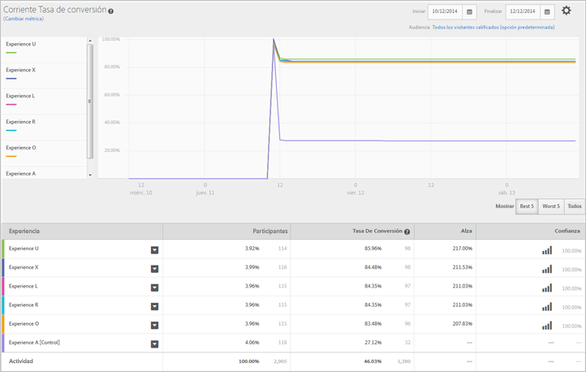

# Informe Rendimiento de las experiencias (MVT){#experience-performance-report-mvt}

El informe Rendimiento de las experiencias muestra cómo funciona cada experiencia de la actividad. Este informe incluye información sobre el número de participantes, la tasa de conversión, el alza y la confianza.

Puede seleccionar una o varias experiencias para compararlas. Haga clic en una experiencia y seleccione **[!UICONTROL Vista previa]** para abrir la experiencia en un navegador web.

En la parte superior del informe se muestra la métrica, las fechas de inicio y finalización y la audiencia que se han empleado para elaborar el informe. Puede cambiar cualquiera de estos factores.

>[!NOTE]
>
>Los selectores de audiencia y de métricas solo están disponibles si Analytics se usa como fuente de informes.

A continuación se muestra un gráfico de líneas que compara cada experiencia en determinados intervalos de tiempo. Este gráfico permite observar el rendimiento de cada experiencia y cómo este puede variar según la hora del día.

Puede mostrar todas las experiencias, las cinco mejores o las cinco peores. Las cinco mejores y las cinco peores experiencias vienen determinadas por el alza, e incluyen una sexta experiencia que muestra el control para la comparación. Se recomienda que visualice las cinco mejores y las cinco peores para determinar el éxito de sus experiencias. Si las ve todas, será más difícil extraer la información que desea y, además, no todas las experiencias pueden mostrarse en el gráfico. Utilice Ver todo si desea observar una experiencia concreta que no se encuentra entre las cinco mejores o las cinco peores.

>[!NOTE]
>
>Los informes de pruebas multivariable no muestran ninguna experiencia excluida cuando se seleccionan las cinco mejores o las cinco peores experiencias.

Debajo del gráfico, se muestra una tabla con la cantidad de participantes que vio cada experiencia y otra información relevante para la métrica de éxito.

## Vídeo de formación: Crear una prueba MVT  

En este vídeo se explica cómo crear una prueba multivariable siguiendo el flujo de trabajo guiado de tres pasos de Target. El informe Rendimiento de las experiencias se describe a partir del minuto 8:20.

>[!VIDEO](https://video.tv.adobe.com/v/17395)