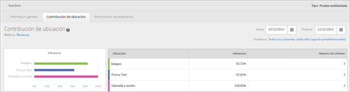
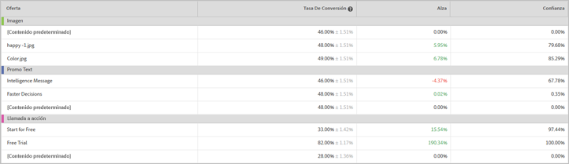

# Informe Contribución de ubicación (MVT){#location-contribution-report-mvt}

El informe Contribución de ubicación muestra el rendimiento de cada elemento y cada oferta.

En la parte superior del informe se muestra la métrica, las fechas de inicio y finalización y la audiencia que se han empleado para elaborar el informe. Puede cambiar cualquiera de estos factores.

>[!NOTE]
>
>Los selectores de audiencia y de métricas solo están disponibles si Analytics se usa como fuente de informes.

El informe Contribución de ubicación incluye dos tablas.

La primera tabla muestra la influencia relativa de cada elemento. Muestra cuál de los elementos en el que ha añadido ofertas está generando más conversiones.

La segunda tabla proporciona un informe de nivel de oferta. Muestra la tasa de conversión, el alza y la confianza para cada oferta en cada elemento. Esto le ayuda a determinar qué ofertas tienen más éxito. La segunda columna muestra los valores para la métrica seleccionada (tasa de conversión, ingresos por visitante, valor de pedido promedio, pedidos o métricas de participación) de la oferta y una estandarización.

## Vídeo de formación: Crear una prueba MVT  

En este vídeo se explica cómo crear una prueba multivariable siguiendo el flujo de trabajo guiado de tres pasos de Target. El informe Contribución de ubicación se describe a partir del minuto 8:45.

>[!VIDEO](https://video.tv.adobe.com/v/17395)