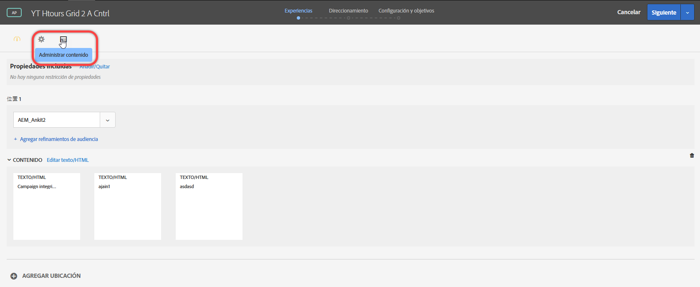
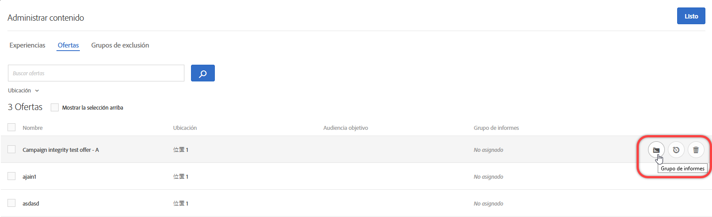
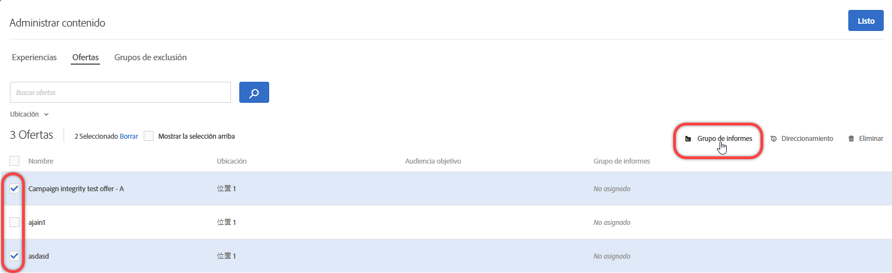
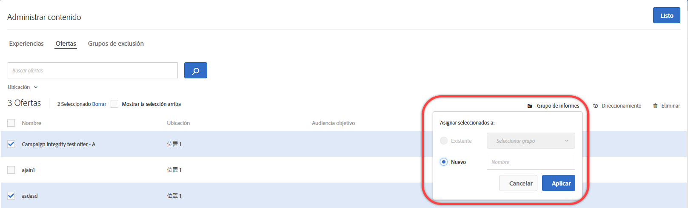

#  Grupos de informes de ofertas en Personalización automatizada{#offer-reporting-groups-in-automated-personalization}

Information about using reporting groups in [Automated Personalization](/help/c-activities/t-automated-personalization/automated-personalization.md) (AP) activities.

Los grupos de informes realizan dos funciones clave:

* Permiten ver las ofertas agrupadas en informes de actividad de AP.
* They play a key role with how the [!DNL Target] personalization models function.

When you use reporting groups, [!DNL Target] creates only one personalization model for each reporting group instead of each offer in your AP activity using the data from all offers in that group.

Si la configuración de su actividad no tiene datos suficientes para crear un modelo de personalización para cada oferta, los grupos de informes pueden ayudar a reducir los requisitos de datos para el uso de la personalización automatizada. Los grupos de informes también pueden ayudar a resolver el problema de “inicio en frío” de las nuevas ofertas. Lo hacen agrupando ofertas similares, de modo que cada modelo disponga de más datos con los que trabajar. Los grupos de modelado también se pueden utilizar para aquellas actividades de AP en las que se introducen nuevas ofertas con regularidad.

Este enfoque funciona bien si los visitantes responden de la misma manera a todas las ofertas de un grupo. Una práctica recomendada es agrupar aquellas ofertas a las que grupos de visitantes similares responden de forma similar. En otras palabras, agrupe las ofertas con tasas de conversión similares. Nunca debe colocar todas las ofertas en un solo grupo de informes. Grouping all offers or grouping offers with very different conversion rates likely reduces the effectiveness of the [!DNL Target] personalization models.

>[!NOTE]
>
>Si se remplaza o elimina una oferta de un grupo de modelado particular, el tráfico histórico de la oferta también se elimina del grupo de modelado. In other words, deleted offers do not contribute to what data is used for the [!DNL Target] personalization models to learn.

**Para configurar grupos de informes:**

1. On the [!UICONTROL Experiences] page of an AP activity, click the **[!UICONTROL Manage Content]** icon.

   

1. Haga clic en la pestaña **[!UICONTROL Ofertas]** en la parte superior del cuadro de diálogo [!UICONTROL Administrar contenido].
1. (Condicional) Agregue experiencias específicas a un grupo de informes pasando el puntero sobre la oferta deseada y haciendo clic en el icono de la carpeta **[!UICONTROL Grupo de informes]**.

   

1. (Condicional) Incluya experiencias en lote en un grupo de informes seleccionando la casilla de las experiencias relevantes y haciendo clic en el icono de la carpeta **[!UICONTROL Grupo de informes]**, en la esquina superior derecha del cuadro de diálogo.

   

1. (Conditional) To assign the selected offer to an existing reporting group, select **[!UICONTROL Existing]**, select the desired reporting group from the drop-down list, then click **[!UICONTROL Apply]**.

   O

   Para crear un nuevo grupo de informes al que asignar la oferta seleccionada, elija **[!UICONTROL Nuevo]**, asigne un nombre al nuevo grupo de informes y haga clic en **[!UICONTROL Aplicar]**.

   

