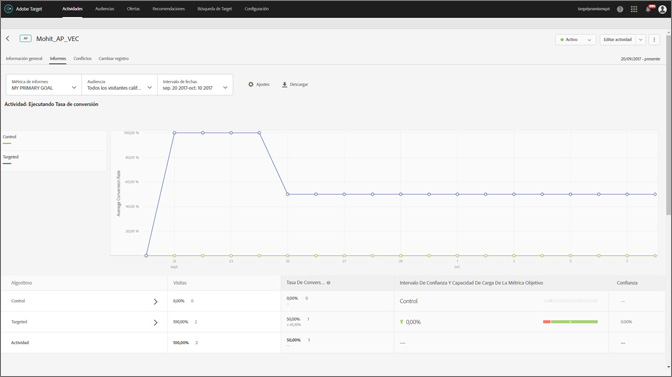

#  Informes Resumen de personalización automatizada{#automated-personalization-summary-reports}

Hay informes especializados disponibles para los usuarios de Personalización automatizada.

>[!NOTE]
>
>La personalización automatizada está disponible como parte de la solución [!DNL Target Premium]. No se incluye con [!DNL Target Standard] sin una [!DNL Target Premium]licencia.

1. Haga clic en **[!UICONTROL Actividades]**, en la actividad de [!UICONTROL Personalización automatizada] que quiera de la lista y luego en la pestaña **Informes[!UICONTROL .]**

   Si tiene muchas actividades, puede filtrar la lista seleccionando [!UICONTROL Personalización automatizada] en la lista desplegable [!UICONTROL Tipo].

1. (Opcional) Haga clic en el icono [!UICONTROL Descargar] para obtener la vista de resumen (por ejemplo, para ver una comparación del tráfico de Control y el segmentado) desglosada por todas las métricas de éxito disponibles.

>[!NOTE]
>
>El icono [!UICONTROL Configuración] no está disponible para informes de [!UICONTROL Personalización automatizada].

[!UICONTROL Personalización automatizada] ofrece los siguientes informes:

## Informe Nivel de actividad   {#section_6F72FC5C790B4492B3DCECBFFA971337}

El informe [!UICONTROL Nivel de actividad] compara el rendimiento global del uso de un algoritmo de [!UICONTROL Personalización automatizada] para el contenido suministrado de manera aleatoria (control).

Las reglas estándar de interpretación de resultados para prueba A/B aún se aplican, incluidos alza, confianza, tendencias, duración, etc. Para obtener más información sobre interpretación de resultados, consulte   [Acerca de la tasa de conversión](../c-reports/conversion-rate.md#concept_2D9FEDE8F94A485DAC86D611BFBDC844).

## Informe Nivel de oferta {#section_CAA6409879E349C6906E2BE8156D87A1}

El informe [!UICONTROL Nivel de oferta] para la experiencia de bosque aleatorio compara el rendimiento de cada oferta que tiene un algoritmo aplicado con la misma oferta suministrada de manera aleatoria (control). De esta manera, las ofertas no deberían comprarse entre sí en esta vista. En el ejemplo siguiente, puede afirmarse que la oferta D exhibe un alza del 12,43 % cuando se proporciona según la lógica del algoritmo (bosque aleatorio) en comparación con la manera aleatoria (control).

Haga clic en el algoritmo de la experiencia (bosque aleatorio o control) para ver el informe de nivel de oferta.

Las ofertas se pueden mostrar dentro de grupos de informes, que se pueden contraer o expandir. Seleccione [!UICONTROL Grupo de informes] en la lista desplegable para ver información resumida por grupos de informes en lugar de por ofertas.

>[!NOTE]
>
>El icono de reloj indica que el modelo de algoritmo aún se está generando. El icono de marca de verificación indica que se ha establecido el algoritmo base.

