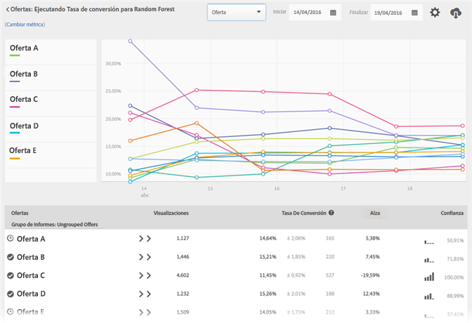

#  Informes Resumen de personalización automatizada

Los usuarios de actividades [!UICONTROL Automated Personalization] pueden obtener informes resumidos especializados en [!DNL Adobe Target].

>[!NOTE]
>
>[!UICONTROL La personalización automatizada] está disponible como parte de la solución [!DNL Target Premium]. No se incluye con [!DNL Target Standard] sin una licencia de [Target Premium](/help/c-intro/intro.md#premium).

1. Haga clic en **[!UICONTROL Actividades]**, en la actividad de [!UICONTROL Personalización automatizada] que quiera de la lista y luego en la pestaña **[!UICONTROL Informes.]**

   Si tiene muchas actividades, puede filtrar la lista seleccionando [!UICONTROL Personalización automatizada] en la lista desplegable [!UICONTROL Tipo].

1. (Opcional) Haga clic en el icono **[!UICONTROL Descargar]** para obtener la vista de resumen (por ejemplo, para ver una comparación del tráfico de Control y el segmentado) desglosada por todas las métricas de éxito disponibles.

[!UICONTROL Personalización automatizada] ofrece los siguientes informes:

* Nivel de actividad
* Nivel de oferta
* Segmentos automatizados
* Atributos importantes

## Informe de nivel de actividad {#section_6F72FC5C790B4492B3DCECBFFA971337}

El informe [!UICONTROL Nivel de actividad] compara el rendimiento global del uso de un algoritmo de [!UICONTROL Personalización automatizada] para el contenido suministrado de manera aleatoria (control).

Las reglas estándar de interpretación de resultados para prueba A/B aún se aplican, incluidos alza, confianza, tendencias, duración, etc. Para obtener más información sobre interpretación de resultados, consulte   [Acerca de la tasa de conversión](/help/c-reports/conversion-rate.md#concept_2D9FEDE8F94A485DAC86D611BFBDC844).

## Informe de nivel de oferta {#section_CAA6409879E349C6906E2BE8156D87A1}

El informe [!UICONTROL Nivel de oferta] para la experiencia de bosque aleatorio compara el rendimiento de cada oferta que tiene un algoritmo aplicado con la misma oferta suministrada de manera aleatoria (control). De esta manera, las ofertas no deberían comprarse entre sí en esta vista.

Haga clic en el algoritmo de experiencia (bosque aleatorio o control) para vista del informe [!UICONTROL Nivel de Oferta].

Las ofertas se pueden mostrar dentro de grupos de informes, que se pueden contraer o expandir. Seleccione [!UICONTROL Grupo de informes] en la lista desplegable para ver información resumida por grupos de informes en lugar de por ofertas.

>[!NOTE]
>
>El icono de reloj indica que el modelo de algoritmo aún se está generando. El icono de marca de verificación indica que se ha establecido el algoritmo base.

## Segmentos automatizados

Haga clic en el icono [!UICONTROL Segmentos automatizados]. Este informe muestra cómo los diferentes visitantes responden de manera diferente a las ofertas y experiencias de su actividad AP/AT. Este informe muestra cómo los distintos segmentos automatizados definidos por los modelos de personalización de Target respondieron a las ofertas y experiencias de la actividad.

Para obtener más información, consulte [Informe Segmentos automatizados](/help/c-reports/c-personalization-insights-reports/automated-segments-report.md).

## Atributos importantes

Haga clic en el icono [!UICONTROL Atributos importantes]. Este informe muestra cómo, en diferentes actividades, los diferentes atributos son más (o menos) importantes para la forma en que el modelo decide personalizar. Este informe muestra los atributos que más influyeron en el modelo y su importancia relativa.

Para obtener más información, consulte [Informe de atributos importantes](/help/c-reports/c-personalization-insights-reports/important-attributes-report.md).

## Preguntas frecuentes

### ¿Por qué hay diferencias en los datos entre los informes Nivel de Actividad y Nivel de Oferta?

**[!UICONTROL Informe ] de nivel** de actividad: Las visitas registradas en el informe  [!UICONTROL Niveles de ] Actividad capturan el número de visitas a las experiencias de control en comparación con tráfico &quot;dirigido&quot;. El tráfico objetivo incluye una combinación de tráfico de exploración y tráfico personalizado.

**Informe** de nivel de oferta: Las impresiones registradas en el informe  [!UICONTROL Niveles de ] Oferta capturan el número de impresiones de cada oferta. Por lo tanto, en una actividad con más de una ubicación, la cantidad total de visitas registradas en el informe [!UICONTROL Nivel de Oferta] en todos los grupos de Sistemas de informes es igual al múltiplo de la cantidad de visitas registradas para tráfico de Control o de Destino en el informe [!UICONTROL Nivel de Actividad] veces la cantidad total de ubicaciones en la actividad. Las impresiones del contenido predeterminado que se producen en ubicaciones en las que el contenido predeterminado era una opción disponible se registran en el grupo de ofertas &quot;Contenido predeterminado&quot;. Las impresiones de ofertas que no se asignaron a un grupo de sistemas de informes se registran en el grupo de ofertas &quot;Desagrupadas&quot;.

>[!NOTE]
>
>El número de impresiones registradas en el informe [!UICONTROL Nivel de Oferta] puede no ser un número entero exacto del número de visitas registradas en el informe [!UICONTROL Nivel de Actividad]. Esto se debe a discrepancias menores que se producen en la captura del tráfico de datos de sistema de informes a través de Internet (la tasa de discrepancia típica es inferior al 5 %). Por lo tanto, el número de impresiones no será un múltiplo exacto cuando el número de ubicaciones disponibles en la actividad cambie después de activar la actividad.
