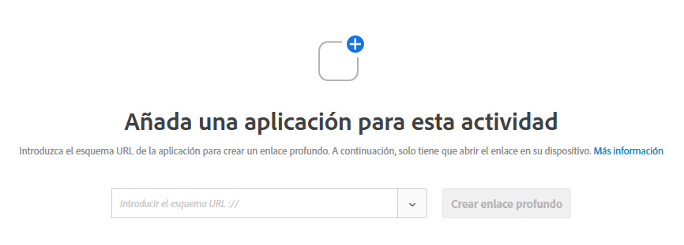

# Compositor de experiencias visuales para aplicaciones móviles{#mobile-app-visual-experience-composer}

El Compositor de experiencias visuales (VEC) para aplicaciones móviles nativas le permite crear actividades y personalizar contenido en aplicaciones móviles nativas por su cuenta, sin las continuas dependencias y los ciclos de lanzamiento de aplicaciones de un desarrollo.

El [Compositor de experiencias visuales](../../c-experiences/experiences.md#section_34265986611B4AB8A0E4D6ACC25EF91D) existente ofrece la capacidad de crear actividades y personalizar experiencias a su modo, y de enviarlas de forma dinámica a sus propiedades web mediante el mbox global de Target sin intervención del desarrollador. Ahora puede aprovechar el VEC para que haga lo mismo para sus aplicaciones móviles nativas. El VEC de aplicaciones móviles, disponible en [AEP SDK v5](https://aep-sdks.gitbook.io/docs/using-mobile-extensions/adobe-target-vec), se puede utilizar para crear actividades de [Prueba A/B](/help/c-activities/t-test-ab/test-ab.md) y de [Segmentación de experiencias (XT)](/help/c-activities/t-experience-target/experience-target.md) para aplicaciones móviles. En el futuro se admitirán otros tipos de actividades.

El VEC de aplicaciones móviles es compatible con los exploradores enumerados en [Exploradores compatibles](../../c-implementing-target/c-considerations-before-you-implement-target/supported-browsers.md#reference_01B4BF99E7D545A7998773202A2F6100).

## Uso del Compositor de experiencias visuales para aplicaciones móviles nativas.  {#using-the-mobile-vec}

La siguiente ilustración representa el proceso de uso del VEC de aplicaciones móviles:

| Proceso | Detalles |
|--- |--- |
| Enlace | Autorice de forma segura su aplicación móvil y dispositivo para trabajar con Target. Este paso solo es necesario una vez por dispositivo. |
| Creación | Autor a [Actividad de Target](/help/c-activities/activities.md), con vista previa en tiempo real de acciones realizadas en la interfaz de usuario de Target. |
| Entrega | Target entrega automáticamente actividades en su aplicación móvil nativa. |

**Enlace:**

El VEC de aplicaciones móviles se conecta en tiempo real con la aplicación móvil del experto en marketing para la creación de actividades de Target. Para habilitar eso, el primer paso es vincular de forma segura (autorizar) el dispositivo y la aplicación móviles con Target.

1. Al crear una actividad de prueba A/B, por ejemplo, seleccione **[!UICONTROL Aplicación móvil]**, **[!UICONTROL Visual (Predeterminada)]** y, a continuación, haga clic en **[!UICONTROL Siguiente]**.

   

1. Introduzca la URL de la aplicación y, a continuación, haga clic en **[!UICONTROL Crear vínculo profundo]**.

   

El proceso de enlace contiene los siguientes pasos:

1. Introduzca el esquema de URL de la aplicación que se pueda usar para generar un vínculo profundo. Un vínculo profundo típico se asemeja a:

   `mymobileapp://path?params`

1. El vínculo profundo se encuentra disponible como código QR o URL. Los usuarios pueden escanear el código QR desde el teléfono o enviarse la dirección URL por correo electrónico o mensaje. La URL de vínculo profundo tiene un token de autorización que se usa para vincular de forma segura la aplicación móvil y el dispositivo con Target.
1. Abra la URL de vínculo profundo en su dispositivo móvil. Se inicia la aplicación móvil. El SDK identifica que la aplicación se abrió para enlace y creación en el VEC.

   El SDK realiza una solicitud al servidor de Target y se registra. El servidor de Target autoriza el token y establece una conexión en tiempo real con el dispositivo (usando actualmente sockets web).

   Una vez establecida la conexión, aparece una vista en tiempo real de la aplicación en la interfaz de Target. La aplicación tiene una superposición de límite de color rojo que es un indicador de que la aplicación está conectada a Target, tal como se muestra en la ilustración más abajo.

   

   Los dispositivos que ya están enlazados pueden volver a conectarse al abrir la aplicación y la interfaz de creación.

**Creación:**

Una vez que la aplicación esté conectada y que aparezca una vista en tiempo real de la aplicación en el VEC, puede comenzar a crear su actividad. En este momento, se admiten las siguientes acciones:

| Acción | Detalles |
|--- |--- |
| Intercambiar imagen | Intercambie una imagen por otra seleccionando una oferta de imagen diferente o configurando directamente la dirección URL CDN de una imagen. Las ofertas de imágenes en Target se sirven a través de [Adobe Scene7](/help/administrating-target/scene7-settings.md). |
| Cambiar texto | Cambie el contenido del texto, el color o el tamaño de fuente en un elemento de texto, botón o etiqueta. |
| Cambio de fondo | Cambiar el contenido o el fondo del elemento para un área de texto o un botón. |

Las acciones realizadas en el VEC pueden verse en tiempo real en la aplicación, lo que permite la funcionalidad de vista previa en tiempo real durante la creación. Las acciones están asociadas con pantallas móviles o vistas relevantes, y se asocian como corresponde.

**Administrar varias versiones de la aplicación**

Cuando se detecta una nueva versión de la aplicación, se le notifica que la versión de la aplicación se ha agregado a la lista de versiones de destino.

Se pueden agregar y eliminar varias versiones de aplicaciones móviles de forma manual del cuadro de diálogo [!UICONTROL Administrar versiones].

## Vistas de Target y aplicaciones móviles {#target-views}

El VEC de aplicaciones móviles aprovecha un nuevo concepto de Vistas: un grupo lógico de elementos visuales que, juntos, constituyen una experiencia de aplicación móvil.

**Presentación de las vistas de Target**

Tomemos como ejemplo una aplicación de compras para flores. La aplicación permite a los usuarios hacer las siguientes tareas:

* Mostrar una lista de flores y ramos disponibles
* Ver detalles
* Ordenar flores
* Controlar la configuración, como las opciones de pago y las direcciones

En esta aplicación, cada una de estas tareas puede lograrse en una pantalla separada de la aplicación móvil. A medida que los usuarios examinan la aplicación, se representa una pantalla que les permite realizar una de las siguientes tareas. Si es desarrollador de Android, es muy probable que cree cuatro clases de actividad diferentes de Android y que cada una de ellas se asocie a una de estas tareas.

En este caso, cada una de estas tareas puede considerarse como vistas por las que pasa la aplicación móvil. Nos referiremos a estas como Vistas de Target (cada una caracterizada exclusivamente). Una vista de Target, o una vista de forma más corta, es un contenedor lógico de elementos visuales que se muestran en la pantalla móvil. Algunos ejemplos de vista son una pantalla o una clase de actividad en Android.

Las aplicaciones móviles rara vez son tan simples. Vamos a hacerlo un poco más realista. En la primera tarea, que muestra una lista de flores y ramos disponibles, agreguemos la capacidad de crear varios diseños y, por ende, pantallas diferentes. Por ejemplo, vamos a agregar una función “Ordenar por” que tenga tres opciones:

* Por popularidad
* Precio - De bajo a alto
* Precio - De alto a bajo

En este ejemplo, cada vez que un usuario selecciona una opción “Ordenar por” diferente, aparece una nueva pantalla, incluso cuando la clase de actividad es la misma. Cada una de estas pantallas puede, por ende, considerarse como diferentes vistas de Target.

Como experto en marketing, le interesa crear distintas experiencias y ejecutar ofertas diferentes en cada una de estas visualizaciones sin tener que pedir a los desarrolladores que configuren mboxes locales o que realicen un ciclo de lanzamiento de aplicación.

## Configuración del VEC de aplicaciones móviles de Target {#setting-up}

Los desarrolladores deben hacer lo siguiente para habilitar el VEC de aplicaciones móviles para una aplicación móvil:

* Configuración de la extensión VEC de Adobe Target en Launch
   * La extensión VEC depende de la [extensión de Adobe Target](/help/c-implementing-target/c-implementing-target-for-client-side-web/how-to-deployatjs/cmp-implementing-target-using-adobe-launch.md). Asegúrese de que la extensión de Adobe Target ya está configurada y habilitada.
* Agregue la extensión VEC de Target a su aplicación.
   * [Android: Configuración de la aplicación móvil](/help/c-target-mobile-app/c-mobile-visual-experience-composer/mobile-visual-experience-composer-android.md)
   * [iOS: Configuración de la aplicación móvil](/help/c-target-mobile-app/c-mobile-visual-experience-composer/mobile-visual-experience-composer-ios.md)

## Métodos de implementación para el VEC de Target

La extensión VEC de Target recupera las experiencias de Target relevantes para su aplicación a través de una solicitud de red. Las ofertas se recuperan a través de esta llamada de red y se aplican automáticamente en las pantallas de destino. No se realizan solicitudes de red subsiguientes para recuperar las experiencias de VEC cuando el usuario navega por varias pantallas de la aplicación.

El comportamiento predeterminado de la extensión es hacer una solicitud de red sincrónica (llamada de bloqueo) en el momento del lanzamiento de la aplicación. Puede utilizar Launch para controlar el comportamiento de esta solicitud de red para cumplir con el comportamiento de la aplicación.

### Actividades de Target de recuperación automática

Es el comportamiento predeterminado en el que la extensión VEC de Target inicia automáticamente una solicitud de red. Puede utilizar una de las siguientes opciones para hacer que esta solicitud sea una llamada de bloqueo o una solicitud asincrónica.

* Recuperación en una llamada sincrónica (el segundo plano está desactivado)

   Cuando se selecciona, la extensión VEC de Target crea una solicitud de red como una llamada de bloqueo al inicio de la aplicación. Las ofertas se aplican inmediatamente y no hay parpadeo en la aplicación. Este es el comportamiento predeterminado de la extensión.

* Recuperación en una llamada asincrónica (el segundo plano está activado)

   Cuando se selecciona, la extensión VEC de Target realiza una solicitud de red en segundo plano al inicio de la aplicación, pero no bloquea la carga de la aplicación. Si las experiencias se crean en la pantalla principal de la aplicación, es posible que las ofertas no se apliquen a la pantalla principal si la pantalla se procesa antes de que se complete la llamada. El procesamiento de la pantalla de la aplicación se suele identificar mediante eventos de ciclo vital `didFinishLaunchingWithOptions` y `onActivityResumed` y en iOS y Android respectivamente. Las ofertas se aplican automáticamente en todas las pantallas subsiguientes.

### Recuperación de actividades de Target mediante programación

Puede deshabilitar la extensión VEC de Target para que la solicitud de red se realice automáticamente y que decida llamar mediante programación a la API de extensiones. Esto proporciona a los programadores control sobre cómo desean integrar las ofertas VEC de Target en la aplicación. La extensión VEC de Target tiene dos métodos estáticos `prefetchOffers` y `prefetchOffersBackground` que pueden utilizarse para recuperar de forma programada ofertas VEC de Target.

* El método `prefetchOffers` oculta la pantalla actual hasta que se recuperan las ofertas VEC de Target. Las ofertas se aplican automáticamente a la pantalla actual, si corresponde, y la pantalla vuelve a ser visible.
* El método `prefetchOffersBackground` no oculta la pantalla actual y se realiza una llamada para recuperar las ofertas de Target relevantes. Las ofertas de Target *no* se aplican en la pantalla actual y no hay parpadeo. A medida que el usuario navega a pantallas subsiguientes, las ofertas se aplican automáticamente, según corresponda.

### Gestión de las restricciones del espacio de trabajo de Target

Puede definir el valor `at_property` del espacio de trabajo mediante la interfaz de Launch. Esto garantiza que solo las actividades de ese espacio de trabajo se entreguen a la aplicación móvil.

## Directrices generales para llamadas de API de Target {#section_C7276795F02540DCA230AEEDF882A833}

Para agregar correctamente vistas de Target para Android, le presentamos una tabla sencilla que describe las ubicaciones correctas para colocar la llamadas de `targetView`:

| Ubicación de TargetView aceptable | Debajo de las adiciones correctas |
|--- |--- |
| Al final de `Activity::onStart`, `Activity::onResume` | El desarrollador debe considerar si `OnStart` y `OnResume` como iguales o diferentes `targetViews`. Si son iguales, use el mismo `viewName`. Si son diferentes, use diferentes `viewNames`. El SDK agrega automáticamente estos eventos. |
| Inmediatamente después de una llamada de.`Activity::SetContent` | Si la interfaz de usuario no cambia, podemos insertar una llamada a `targetView`. |
| Dentro de `View::willAppear` | Si la vista seleccionada que aparece únicamente en una jerarquía de vista específica. |
| Inmediatamente después de una llamada de.`Activity::SetContentView` | Si la actividad no cambia ni modifica ningún contenido en el siguiente código. |

Para Android, le presentamos una tabla de ubicaciones incorrectas para colocar la llamadas de `targetView`:

| Ubicación de TargetView inaceptable | Motivo |
|--- |--- |
| Dentro de `Activity::onCreate` | La actividad se ha creado, pero no se garantiza que la vista asociada con la actividad esté completa o que se adjunte a la ventana. Esta colocación podría llevar a que la pantalla de creación no se muestree o que se muestree incompletamente, o que las ofertas se apliquen de una manera no determinista. |
| Dentro de `View::didAppear` | La vista ya ha aparecido y la aplicación de la oferta creará una mala experiencia de interfaz del usuario con parpadeo. |
| Dentro de `View::didLoad` | La vista no está adjunta a la jerarquía de vista principal, y podría crearse una instancia, pero no se garantiza que se muestre en la interfaz del usuario de la aplicación. |

## Entrega {#delivery}

Las actividades de Target creadas con el VEC de aplicaciones móviles se entregan de forma automática en aplicaciones móviles. Estas actividades se recuperan previamente al abrir la aplicación (según la configuración de lanzamiento) y se aplican a medida que el usuario navega por las diferentes Vistas de Target, a menudo asignadas directamente a las pantallas.

Al llamar al método API `TargetVEC.prefetchOffersBackground()`, las ofertas de Target se recuperan desde Target Edge y se almacenan en la caché localmente. De este modo la experiencia de usuario es más suave, ya que las ofertas de Target se aplican inmediatamente desde la caché cuando las vistas de Target se activan mediante llamadas a `targetView()`, en lugar de tener que obtenerse a través de la red.

Para obtener más flexibilidad, también puede llamar a la API `TargetVEC.prefetchOffers()`, que oculta el diseño actual hasta que las ofertas de Target sean previamente recuperadas y aplicadas a la Vista de Target (causando posiblemente parpadeo).

Es posible realizar llamadas repetidas a `TargetVEC.prefetchOffersBackground()` mientras el usuario se desplaza por una aplicación de cliente para actualizar la caché local de ofertas de Target con el contenido más adecuado (en función de las últimas actualizaciones del perfil de Target del usuario actual).

Tenga en cuenta que, cada vez que se obtienen ofertas de Target, también se aplican (si es posible) las ofertas para la última vista de Target activada con `AdobeTargetMobile.targetView()`.

## Resolución de problemas {#ts}

**El VEC de aplicaciones móviles indica que la aplicación está desconectada.**

Puede que se haya interrumpido la conexión a Internet. Vuelva a abrir la aplicación después de que Internet esté disponible para que se establezca una nueva conexión. Recomendamos crear una actividad del VEC de aplicaciones móviles con conexión WiFi.

**El VEC de aplicaciones móviles no está sincronizado con mi aplicación móvil.**

Haga clic en el botón [!UICONTROL Actualizar] del VEC para sincronizar la visualización.

## Limitaciones conocidas {#limitations}

* El VEC de aplicaciones móviles se puede utilizar actualmente para crear actividades de [Prueba A/B](/help/c-activities/t-test-ab/test-ab.md) y Actividades de [segmentación de experiencias (XT)](/help/c-activities/t-experience-target/experience-target.md) para aplicaciones móviles. En el futuro se admitirán otros tipos de actividades.
* Al intentar reconectar la aplicación al VEC de aplicaciones móviles, debe salir de la aplicación completamente y volver a iniciarla.

   Si la aplicación móvil ya está abierta durante cualquiera de las situaciones enumeradas a continuación, debe cerrarla y volverla a abrir. No obstante, la aplicación *debe* cerrarse desde la sección de aplicaciones recientes y *no* presionando el botón Atrás. Si la aplicación se cierra presionando el botón Atrás, podrían producirse problemas de conexión intermitente.

   Hay varias situaciones en las que se debe reiniciar la aplicación para conectarse al VEC de aplicaciones móviles si la aplicación ya está abierta:

   * Cuando se crea una nueva actividad, después de seleccionar la aplicación móvil aparece el cuadro de diálogo de la lista de dispositivos. Si la aplicación ya está abierta, debe cerrarla y volver a iniciarla para que su dispositivo aparezca como disponible para seleccionar.
   * El cuadro de diálogo de dispositivos se muestra cuando se empieza a editar una actividad. Si la aplicación ya está abierta, debe cerrarla y volver a iniciarla para que su dispositivo aparezca como disponible para seleccionar.
   * El cuadro de diálogo de dispositivos se muestra cuando se desplaza del paso “Objetivos y configuración” al paso “Creación” (paso 1). Si la aplicación ya está abierta, debe cerrarla y reiniciarla para conectarse de nuevo al VEC de aplicaciones móviles.
   Asegúrese de cerrar la aplicación desde la sección de aplicaciones recientes y no presionando el botón [!UICONTROL Atrás].

## Vídeo de formación: Compositor de experiencias visuales de la aplicación móvil de Adobe Target (3:33) {#video}

>[!VIDEO](https://video.tv.adobe.com/v/27528?captions=spa)