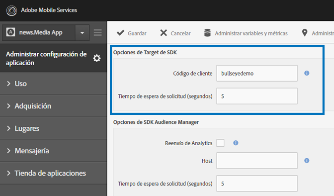
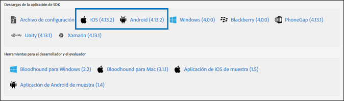

# Habilitar Target en el SDK{#enable-target-in-the-sdk}

Añada el SDK de Adobe Mobile Services a su aplicación.

1. Si todavía no ha instalado el SDK de Adobe Mobile Services en su aplicación, use las credenciales de Analytics o Experience Cloud y descargue el SDK desde el sitio web de [Adobe Mobile Services](https://mobilemarketing.adobe.com).

1. Añada el SDK de Adobe Mobile Services a su aplicación.

   Encontrará las instrucciones en [Implementación básica y ciclo de vida](https://docs.adobe.com/content/help/en/mobile-services/ios/getting-started-ios/dev-qs.html).

1. Añada código de cliente, tiempo de espera y habilite SSL.

   En Experience Cloud, abra Mobile Services y vaya a **[!UICONTROL Administrar configuración de aplicación]** > **[!UICONTROL Opciones de Target de SDK]**.

   Añada el código de cliente y el tiempo de espera de Target. El código de cliente es exclusivo de la cuenta o compañía. El tiempo de espera es el número de segundos que Target espera la respuesta antes de mostrar el contenido predeterminado. Compruebe que la opción **[!UICONTROL Utilizar HTTPS]** esté marcada en la página Administrar configuración de aplicación de Adobe Mobile Services. Si HTTPS no está habilitado, todas las llamadas en iOS9+ se bloquearán a menos que lista de permitidos al servidor de Destinatario.

   

1. Cuando haya creado o encontrado la aplicación, busque la configuración de la aplicación y descargue el SDK que quiera.

   

>[!IMPORTANT]
>
> Si no tiene acceso a la interfaz de marketing móvil, puede hacer los cambios directamente en el archivo de configuración en el código de la aplicación, pero no se sincronizarán con la página de configuración de la interfaz de usuario.

