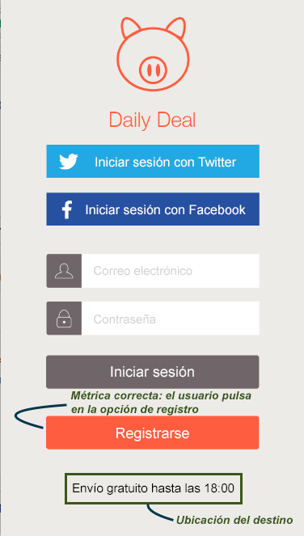
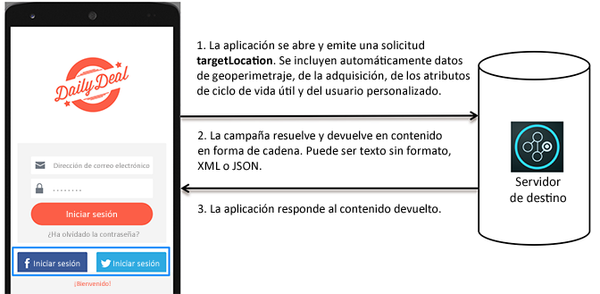

# ¿Cómo funciona Target en las aplicaciones móviles?{#how-target-works-in-mobile-apps}

El SDK de Adobe Mobile contacta con el servidor de Target para obtener el contenido y otros puntos de datos y, así, mostrar la experiencia adecuada a cada usuario.

## Ubicaciones de Target y métricas de éxito   {#section_A08AAB0ABA9C4568A5AFD4D27EF1CE74}

Las *ubicaciones de target* también se denominan mbox. Una ubicación identificada en la aplicación se habilita para realizar pruebas o personalizaciones (por ejemplo, el mensaje de bienvenida de la pantalla de inicio). Estas ubicaciones se identifican durante el proceso de creación de la prueba.

Una *[métrica de éxito](../c-activities/r-success-metrics/success-metrics.md#reference_D011575C85DA48E989A244593D9B9924)* es una acción realizada por el usuario que indica si una actividad determinada se realizó correctamente (como iniciar sesión, efectuar una compra o reservar un billete).

* **Ubicación de Target:** el contenido que aparece debajo del botón de registro.

   Este usuario se beneficia de envío gratuito hasta las 18.00 h. Esta ubicación se puede reutilizar en varias actividades de Target para realizar pruebas A/B y personalizaciones.

* **Métrica de éxito:** la acción que realiza el usuario al pulsar el botón de registro.

**Funcionamiento de Target en el SDK**

