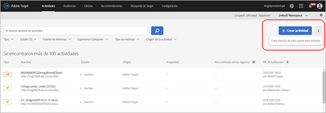
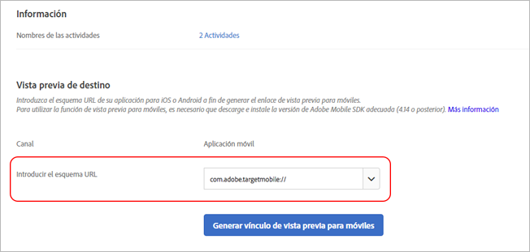
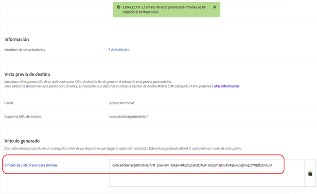

# Vista previa para móviles en Target{#target-mobile-preview}

Use el vínculo de vista previa en móviles para realizar fácilmente un control de calidad exhaustivo de las actividades de aplicaciones móviles y registrarse en diversas experiencias directamente en el dispositivo sin tener que usar uno especial para pruebas.

>[!NOTE]
>
>La función de vista previa para móviles requiere que descargue e instale la versión apropiada (4.14 o posterior) del SDK de Adobe Mobile.

## Información general {#section_981D6FA4AEE64098809EA606E89E4A5E}

La funcionalidad de vista previa para móviles le permite probar completamente sus actividades de aplicación móvil antes del lanzamiento.

## Requisitos previos   {#section_A763C564C9E84B0EB448237B5B1E4068}

1. **Utilice una versión compatible del SDK:** la función de vista previa para móviles requiere que descargue e instale la versión apropiada (4.14 o posterior) del SDK de Adobe Mobile en las aplicaciones correspondientes.

   Para obtener instrucciones sobre la descarga del SDK apropiado, consulte:

   * **iOS:** [Antes de realizar el inicio](https://experienceleague.adobe.com/docs/mobile-services/ios/getting-started-ios/requirements.html) en la Ayuda *de iOS de* Mobile Services.
   * **Android:** [Antes de realizar el inicio](https://experienceleague.adobe.com/docs/mobile-services/android/getting-started-android/requirements.html) en la Ayuda *de Android de* Mobile Services.

1. **Configure un esquema de direcciones URL:** el vínculo de vista previa utiliza un esquema de direcciones URL para abrir la aplicación. Debe especificar un esquema de URL exclusivo para la vista previa.

   La siguiente ilustración muestra un ejemplo en iOS:

   

   La siguiente ilustración muestra un ejemplo en Android:

   

1. **Seguimiento de Adobe DeepLink**

   **iOS:** en el delegado de la aplicación, realice una llamada a `[ADBMobile trackAdobeDeepLink:url` cuando se le pida al delegado que abra el recurso con el esquema de la URL especificado en el paso anterior.

   El siguiente fragmento de código es un ejemplo:

   ```
   - (BOOL) application:(UIApplication *)app openURL:(NSURL *)url 
                options:(NSDictionary<NSString *,id> *)options { 
   
       if ([[url scheme] isEqualToString:@"com.adobe.targetmobile"]) { 
           [ADBMobile trackAdobeDeepLink:url]; 
           return YES; 
       } 
       return NO; 
   } 
   ```

   **Android:** en la aplicación, realice una llamada a `Config.trackAdobeDeepLink(URL);` cuando se pida a la persona que llama que abra el recurso con el esquema de la URL especificado en el paso anterior.

   ```
    private Boolean shouldOpenDeeplinkUrl() { 
        Intent appLinkIntent = getIntent(); 
        String appLinkAction = appLinkIntent.getAction(); 
        Uri appLinkData = appLinkIntent.getData; 
        if (appLinkData.toString().startsWith("com.adobe.targetmobile")) { 
            Config.trackAdobeDeepLink(appLinkData); 
            return true; 
        } 
        return false; 
     }
   ```

   Para que la vista previa para móviles funcione en Android, también debe añadir el siguiente fragmento de código en [!DNL AndroidManifest.xml]:

   ```
   <activity android:name="com.adobe.marketing.mobile.FullscreenMessageActivity" />
   ```

## Generación de un vínculo de vista previa {#section_D9D58173FFF34E9BB75EBF357273F128}

1. En la interfaz de usuario de Target, haga clic en el icono **[!UICONTROL Más opciones]** (tres elipses verticales) y, a continuación, seleccione **[!UICONTROL Crear vista previa para móviles]**.

   

1. Seleccione las actividades de las que desea obtener una vista previa y, a continuación, haga clic en **[!UICONTROL Generar vínculo de vista previa para móviles]**.

   >[!NOTE]
   >
   >Solo se pueden seleccionar actividades AB y XT basadas en formularios.

   

1. Especifique el esquema de URL de su aplicación.

   Debe ser el mismo que está presente en su aplicación iOS o Android. Si es necesario, repita este proceso de forma separada para iOS y Android.

   

1. Haga clic en **[!UICONTROL Generar vínculo de vista previa para móviles]** y, a continuación, copie el vínculo.

   

## Vista previa en su dispositivo {#section_521F0D46F3DE4A2A98283A1B73FF69F6}

Abra el vínculo en un navegador móvil en un dispositivo en el que tenga instalada la aplicación. Puede ser la aplicación de producción descargada desde la tienda App Store de Apple o la tienda Google Play. No es necesario que sea una compilación especial. Si tiene un vínculo de vista previa activo, podrá ver las experiencias en el dispositivo.

1. Abra el vínculo en su navegador móvil.

   Comparta el vínculo que copió en el paso previo en la interfaz de usuario de Target con su dispositivo móvil mediante cualquier método, como un mensaje de texto, un correo electrónico o Slack.

   |||

   Su aplicación se abre e inicia el modo Vista previa para móviles en Target.

1. Seleccione la combinación de experiencias que desee usar y, a continuación, haga clic en **[!UICONTROL Launch Experiences]**.

   ||||
||||

## Limitaciones {#section_4E9BDED0F718485292527EFB508305BD}

* Debe volver a cargarse la vista para que el nuevo contenido se muestre después de hacer clic en el botón [!UICONTROL Launch Experiences]. El modo más sencillo es cambiar a una pantalla diferente y regresar a aquella en la que espera que se produzca el cambio.
* La vista previa para móviles no es compatible con las versiones de Android anteriores a API-19 (KitKat).