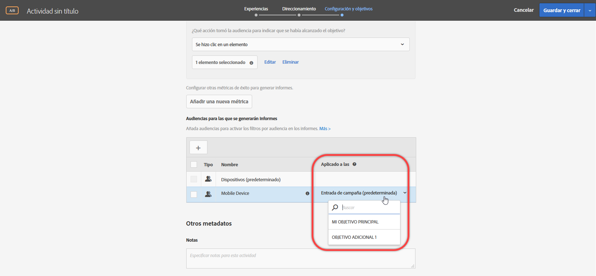

# Aplicación de una audiencia de informes a una métrica de éxito

Elija una métrica de éxito que permita al usuario entrar en la audiencia de informes.

Para todas las actividades, la lista desplegable [!UICONTROL Aplicado a] le permite aplicar una audiencia a una métrica de éxito, de modo que pueda ver los números del informe una vez que se alcance la métrica y en acciones posteriores.

Por ejemplo, supongamos que ha creado una actividad para todos los visitantes que entran en su página de inicio y alcanzan la página de conversión, pero que también desea obtener más datos sobre los visitantes que añadieron más de 50 $ al carro antes de la conversión.

La lista desplegable Aplicado a proporciona hasta tres posibles categorías: cualquier visitante de la actividad, solo los visitantes que alcancen un paso determinado en la actividad o solo los visitantes que alcancen la conversión. O, dicho de otro modo, puede especificar que un visitante debe haber alcanzado un mbox en la página de entrada de la actividad, un mbox que define algún punto en la mitad de la actividad o el mbox de conversión al final de la actividad.

[Las métricas de éxito](/help/c-activities/r-success-metrics/success-metrics.md#reference_D011575C85DA48E989A244593D9B9924) solo están disponibles si las ha configurado para su actividad. Si no ha definido métricas de éxito, verá solo dos opciones en la lista desplegable: Entrada de campaña y Conversión.

Tenga en cuenta la siguiente información al aplicar una audiencia de informes a una métrica de éxito:

* Para las acciones anteriores a la acción con la métrica de éxito aplicada, Target no aplica ninguna audiencia segmentada.
* Para las acciones posteriores a la métrica de éxito aplicada, Target aplica una audiencia segmentada.

Para ver la segmentación en los informes, seleccione la audiencia deseada en la lista desplegable Audiencia del informe de la actividad.

