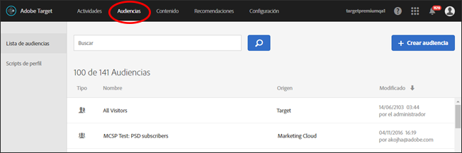
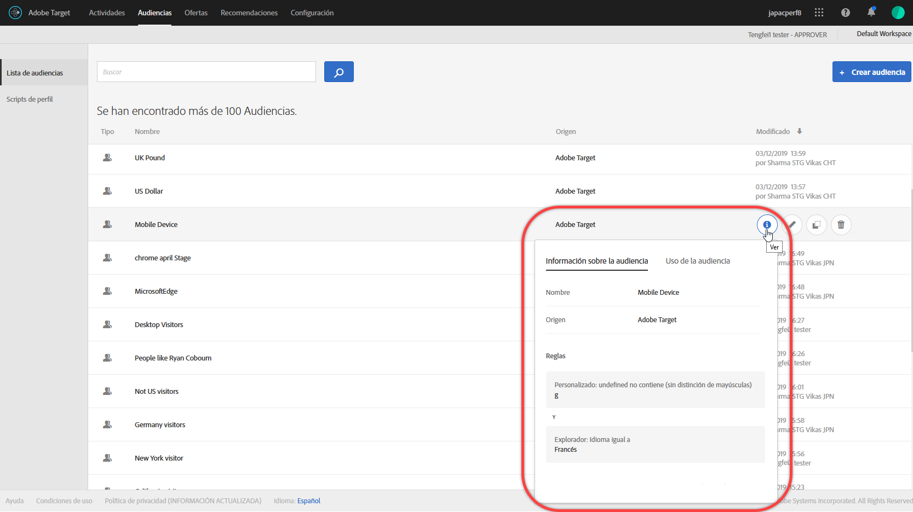
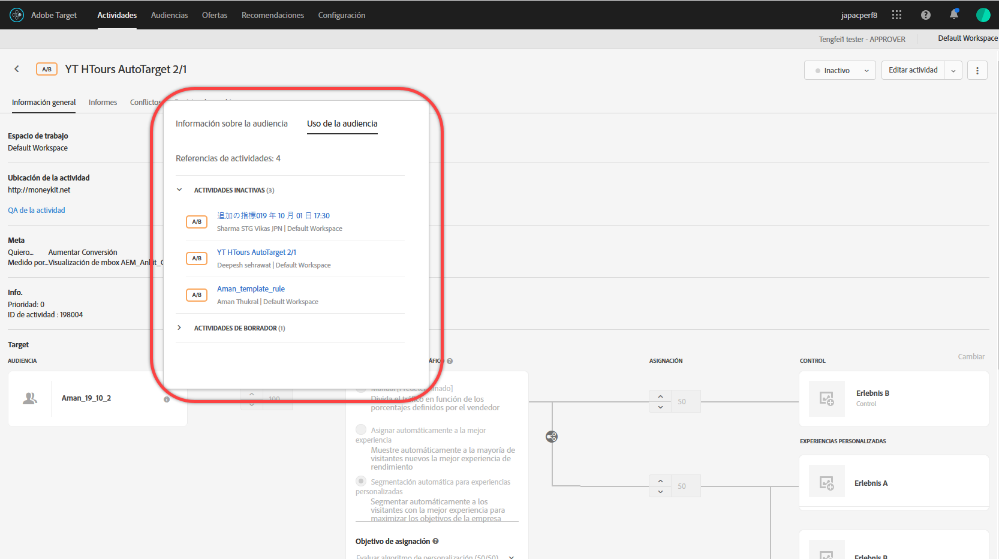
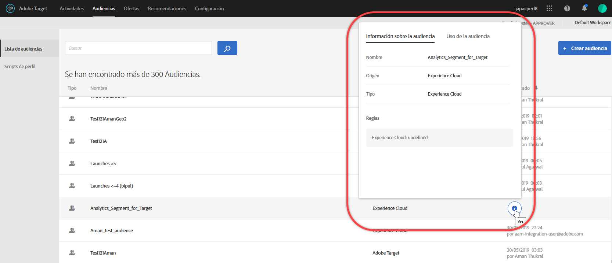

# Crear audiencias

Las audiencias en [!DNL Adobe Target] determinan quién ve el contenido y las experiencias en una actividad segmentada.

Las audiencias se utilizan siempre que está disponible la determinación de objetivos. Al segmentar una actividad, tiene las siguientes opciones:

* Seleccione una audiencia reutilizable de la lista [!UICONTROL Audiencias]
* [Crear una ](/help/c-target/creating-activity-only-audience.md) audiencia específica de actividad y segmentarla
* [Combinación de varias ](/help/c-target/combining-multiple-audiences.md#concept_A7386F1EA4394BD2AB72399C225981E5) audiencias para crear una audiencia ad-hoc

También puede usar datos de audiencia recopilados por [!DNL Adobe Analytics] para personalización y segmentación en tiempo real en [!DNL Target] y otras aplicaciones [!DNL Adobe Experience Cloud]. Consulte [Audiencias de Experience Cloud](https://experienceleague.adobe.com/docs/core-services/interface/audiences/audience-library.html?lang=es) en la guía *Componentes de la interfaz central de Experience Cloud*.

Existen dos tipos de audiencias en [!DNL Target]:

* **Audiencias de segmentación:** se usan para entregar distintos contenidos a distintos tipos de visitantes.
* **Audiencias de informes:** se usan para determinar cuántos tipos distintos de visitantes responden al mismo contenido y, así, analizar los resultados de las pruebas.

   En [!DNL Target], las audiencias de informes solo se pueden configurar si se usa [!DNL Target] como fuente de informes. Si utiliza [ Adobe Analytics como fuente de informes](/help/c-integrating-target-with-mac/a4t/a4t.md) (A4T), tiene que configurar la audiencia de informe en [!DNL Analytics].

## Usar la lista [!UICONTROL Audiencias] {#use-list}

Para acceder a la lista [!UICONTROL Audiencias], haga clic en **[!UICONTROL Audiencias]** en la barra de menús superior:

La lista [!UICONTROL Audiencias] contiene las audiencias que puede usar en sus actividades. Utilice la lista [!UICONTROL Audiencias] para crear, editar, duplicar, copiar o combinar audiencias. La lista también indica la fuente donde se creó la audiencia:

* [!DNL Adobe Target]
* [!DNL Adobe Target Classic]
* [!DNL Experience Cloud]
* [!DNL Adobe Experience Platform]

   >[!NOTE]
   >
   >La fuente [!DNL Adobe Experience Platform] está disponible para todos los clientes [!DNL Target] que utilizan el [Adobe Experience Platform Web SDK](/help/c-implementing-target/c-implementing-target-for-client-side-web/aep-web-sdk.md). Las audiencias disponibles en [!DNL Adobe Experience Platform] se pueden usar tal cual o [combinadas con audiencias existentes](/help/c-target/combining-multiple-audiences.md).

No se puede cambiar el nombre a las audiencias predefinidas como &quot;[!UICONTROL Nuevos visitantes]&quot; y &quot;[!UICONTROL Visitantes que regresan]&quot;.

Al trabajar con audiencias creadas originalmente en [!DNL Experience Cloud] o [!DNL Adobe Experience Platform], [!DNL Target] le alerta si hace referencia a una audiencia en actividades [!DNL Target] que luego se eliminaron en [!DNL Experience Cloud] o [!DNL Adobe Experience Platform].

* Si se eliminó una audiencia en [!DNL Experience Cloud] o [!DNL Adobe Experience Platform], aparece un icono de advertencia tanto en la lista [!UICONTROL Audiencia] como en el selector de audiencias. Un consejo de herramienta en la interfaz de usuario [!DNL Target] también indica que la audiencia se eliminó en [!DNL Experience Cloud] o [!DNL Adobe Experience Platform].
* Si intenta combinar varias audiencias con una audiencia eliminada, o si intenta guardar una actividad que hace referencia a una audiencia eliminada, aparecerá un mensaje de advertencia.

También puede segmentar parámetros de perfil personalizados y parámetros de `user.`. Al crear una audiencia, arrastre los atributos que desee utilizar para segmentar la actividad a la ventana del generador de audiencias. Si no se muestra el atributo deseado, un mbox no lo ha activado. Encontrará otros parámetros personalizados disponibles de mbox en la lista desplegable [!UICONTROL Parámetros personalizados].

Utilice el botón [!UICONTROL Filters] para filtrar la lista [!UICONTROL Audiencias] por fuente: [!DNL Adobe Target], [!DNL Adobe Target Classic], [!DNL Experience Cloud] y [!DNL Adobe Experience Platform].

Utilice el cuadro [!UICONTROL Buscar audiencias] para buscar en la lista [!UICONTROL Audiencias]. Puede buscar cualquier parte del nombre de una audiencia, o bien encerrar entre comillas una cadena específica.

Puede ordenar la lista [!UICONTROL Audiencias] por nombre o por la fecha de la última modificación. Para ordenar por nombre o fecha, haga clic en el encabezado de columna y, a continuación, seleccione si quiere mostrar las audiencias en orden ascendente o descendente.

## Ver definiciones de audiencia {#section_11B9C4A777E14D36BA1E925021945780}

Puede ver los detalles de definición de una audiencia en una tarjeta emergente en varios lugares de la interfaz de usuario de [!DNL Target] sin necesidad de abrir la audiencia. Esta funcionalidad se aplica a las audiencias creadas en [!DNL Target Standard/Premium] y a las importadas desde [!DNL Target Classic] o creadas mediante API.

Por ejemplo, se accede a la siguiente definición de audiencia haciendo clic en el icono [!UICONTROL Ver detalles] para la audiencia deseada:

Para acceder a la siguiente definición de audiencia, haga clic en el icono [!UICONTROL Ver detalles] de la página [!UICONTROL Información general] de una actividad:

La tarjeta de definición de audiencia muestra el tipo, la fuente y los atributos de la audiencia. Haga clic en **[!UICONTROL Ver detalles completos]** para ver otras actividades que hacen referencia a esa audiencia, si corresponde. Si está viendo una tarjeta de definición de audiencia desde la página [!UICONTROL Información general] de una actividad, haga clic en **[!UICONTROL Uso de audiencias]**.

La información de uso de la audiencia puede ayudarle a evitar impactos accidentales en otras actividades mientras edita audiencias. La información incluye [!UICONTROL Actividades en directo], [!UICONTROL Actividades inactivas], [!UICONTROL Actividades archivadas] y [!UICONTROL Actividades de sincronización]. Esta función está disponible para todas las audiencias (audiencias de biblioteca y  [audiencias solo de actividad](/help/c-target/creating-activity-only-audience.md#concept_A6BADCF530ED4AE1852E677FEBE68483)).

Si una audiencia [se combina con otra audiencia](/help/c-target/combining-multiple-audiences.md) y la audiencia combinada se usa para crear una actividad, la información de uso para ambas audiencias indica la actividad recién creada.

<!--The following audience definition card is for an audience imported from the Adobe Experience Cloud. In this instance, the audience was imported from Adobe Audience Manager (AAM).

The following details are available for these imported audience types:

| Audience Type | Details |
|--- |--- |
|Mobile audience|Marketing Name, Vendor, and Model. The `matches | does not match` operator displays instead of `equals | does not equal` .|
|Visitor-behavior audience|**user.categoryAffinity:** `categoryAffinity` with `FAVORITE` parameter.  **Monitoring:** Monitoring service equals true. **No Monitoring Service:** Monitoring service equals false. |
|Audiences using the NOT operator|**Single Rule:** Target displays the audience in the format `[All Visitor AND [NOT [rule]`. Single NOT rule displays with AND with `AllVisitor` audience. |

Keep the following points in mind as you work with imported audiences:

* Expression target audiences are no longer supported in Target Standard/Premium. 
* Target Standard/Premium does not support some deprecated audiences or has improved operators for ease of use. Because of this, the definition of an imported audience, although working as per definition, does not mean that same is now available for creation in the Standard/Premium interface. For example, Social Audiences are visible with their rules but Target Standard/Premium does not allow social audiences to be created.-->

## Vídeo de formación: Uso de Audiencias 

Este vídeo contiene información sobre el uso de las audiencias.

* Explicar el término “audiencia”
* Explicar las dos formas de usar audiencias para la optimización
* Buscar audiencias en la lista de audiencias
* Dirigir una actividad a una audiencia
* Usar audiencias para la creación pasiva de informes en una actividad

>[!VIDEO](https://video.tv.adobe.com/v/17398)
