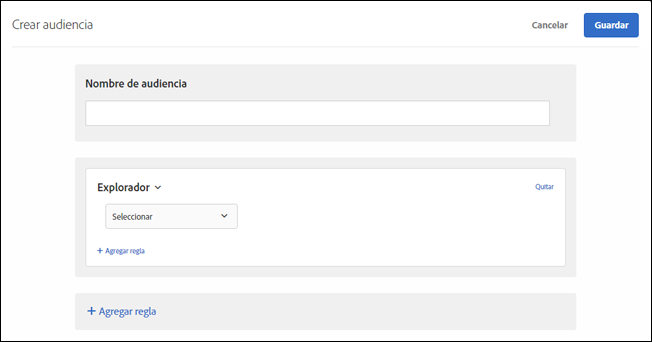

# Explorador

Puede segmentar usuarios que usen un navegador específico y opciones del navegador concretas cuando visiten una página.

Se pueden segmentar los siguientes navegadores:

* Chrome
* Firefox
* Safari
* Internet Explorer
* Microsoft Edge
* Opera
* iPad
* iPhone|

Hay dos formar de segmentar según el navegador:

* **Audiencia prediseñada:** utilice la audiencia prediseñada si quiere segmentar solo los visitantes que usan un navegador concreto para visitar el sitio. Si, por ejemplo, ofrece una extensión de Chrome, se dirigiría solo a los usuarios de este navegador.

   1. Al configurar la actividad, seleccione el explorador en la lista desplegable.

      Esta opción dirige la actividad únicamente a los visitantes que usan el navegador especificado.

      

* **Regla de audiencia de navegador personalizada:** una audiencia personalizada le permite dirigirse a varios navegadores o configurar reglas o exclusiones para navegadores, versiones de navegador o idiomas de navegador específicos. Esta funcionalidad proporciona una flexibilidad significativa al segmentar una actividad en función de los atributos del explorador.

   1. En la interfaz de [!DNL Target], haga clic en **[!UICONTROL Audiencias]** > **[!UICONTROL Crear audiencia]**.
   1. Asigne un nombre a la audiencia y añada una descripción opcional.
   1. Arrastre y suelte **[!UICONTROL Browser]** en el panel del generador de audiencias.

      

   1. Haga clic en **[!UICONTROL Seleccionar]** y, a continuación, elija una de estas opciones:

      * **Tipo:** dirija la actividad a un navegador o exclúyalo. Consulte [Tipo](/help/c-target/c-audiences/c-target-rules/browser.md#section_6ADC758F23F145B3A310151546D83D56).
      * **Idioma:** dirija la actividad ciertos navegadores que estén configurados en idiomas específicos o exclúyalos. Consulte [Idioma](/help/c-target/c-audiences/c-target-rules/browser.md#section_7520D1AA464A45A6843EABE2D2B431A1).
      * **Versión:** dirija la actividad a ciertas versiones del navegador o exclúyalas. Consulte [Versión](/help/c-target/c-audiences/c-target-rules/browser.md#section_37CC8CE45DA04E8682AE6388321BA6EF).
   1. (Opcional) Configure reglas adicionales para la audiencia.
   1. Haga clic en **[!UICONTROL Finalizado]**.

   El siguiente ejemplo muestra una audiencia que incluye usuarios de Microsoft Edge en las versiones 91 o 92:

   

## Opciones del navegador {#concept_221D8EEF53CC45AEACEB17CF336A3658}

Dirija la actividad a visitantes o exclúyalos en función del tipo, el idioma o la versión de navegador que tengan.

### Tipo  {#section_6ADC758F23F145B3A310151546D83D56}

Dirija la actividad a un navegador o exclúyalo.

Seleccione **[!UICONTROL Tipo]** y, a continuación, elija igual a o no es igual a.

* Igual a: dirija la actividad a los navegadores seleccionados.
* No es igual a: excluya los navegadores seleccionados.

Seleccione uno o varios. Si hay varias opciones, se conectan con un parámetro O.

### Idioma  {#section_7520D1AA464A45A6843EABE2D2B431A1}

Dirija la actividad ciertos navegadores que estén configurados en idiomas específicos o exclúyalos.

Por ejemplo, si una oferta solo está disponible en español, puede segmentar exploradores en los que el idioma establecido sea el español. O, si su página no está habilitada para los idiomas de doble byte, puede excluir los navegadores en los que se haya establecido un idioma asiático oriental.

La inclusión o exclusión de idiomas de navegador puede proporcionar una segmentación del visitante más precisa que segmentarlos según la ubicación geográfica, al menos en aquellos casos en los que el idioma es más importante que la ubicación. Si, por ejemplo, ofrece un artículo escrito en español, puede dirigirlo a los países de habla hispana o a los navegadores en los que el idioma establecido es el español. Segmentar según el navegador facilita el artículo a los hablantes de español ubicados en países en los que el español no es el principal idioma.

Seleccione **[!UICONTROL Idioma]** y, a continuación, elija igual a o no es igual a.

* Igual: dirija el artículo a los idiomas de navegador seleccionados.
* No es igual a: excluya los idiomas de navegador seleccionados.

Seleccione uno o varios. Si hay varias opciones, se conectan con un parámetro O.

Los siguientes idiomas de navegador se pueden incluir o excluir de la segmentación:

* Inglés
* Francés
* Alemán
* Japonés
* Coreano
* Portugués
* Ruso
* Español
* Chino tradicional

### Versión  {#section_37CC8CE45DA04E8682AE6388321BA6EF}

Dirija la actividad a ciertas versiones del navegador o exclúyalas.

Si, por ejemplo, su página no se muestra correctamente en la versión 11 o anteriores de Internet Explorer, puede crear una audiencia que las excluya. En ese caso, debe configurar una regla en la que el tipo de navegador sea igual a Internet Explorer y agregar una segunda regla en la que la versión sea menor o igual a 11.

Seleccione **[!UICONTROL Versión]** y, a continuación, elija un operador:

* Es igual a
* No es igual a
* Es mayor que
* Es mayor que o igual a
* Es menor que
* Es menor que o igual a

Escriba el nombre de la versión. En el campo de texto solo se pueden introducir versiones principales. Es decir, la versión especificada incluye las versiones secundarias de la principal. Por ejemplo, si especifica la versión 10, también se incluyen los visitantes de la versión 10.1.

Si hay varias opciones, se conectan con un parámetro O.

## Vídeo de formación: Creación de audiencias 

Este vídeo contiene información sobre el uso de las categorías de audiencias.

* Crear audiencias
* Definir categorías de audiencias

>[!VIDEO](https://video.tv.adobe.com/v/17392)
