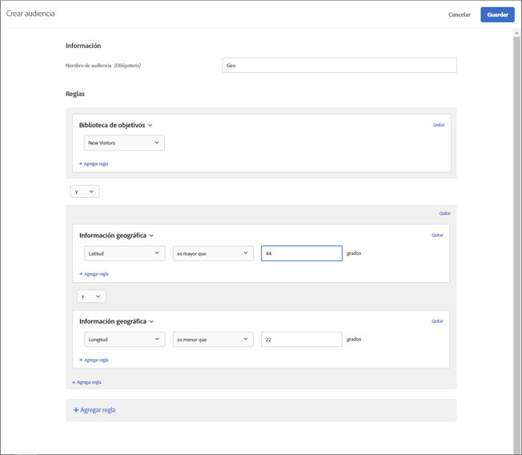

# Segmentación geográfica{#geo}

Utilice audiencias para segmentar usuarios según su ubicación geográfica, incluidos país, estado/provincia, ciudad, código postal, DMA y operador de telefonía móvil.

Los parámetros de ubicación geográfica permiten segmentar las actividades y experiencias en función de la ubicación geográfica de los visitantes. Puede incluir o excluir visitantes en función de su país, estado/provincia, ciudad, código postal, latitud, longitud, DMA y operador de telefonía móvil. Estos datos se envían con cada petición de Target y se basan en la dirección IP del visitante. Seleccione estos parámetros igual que cualquier otro valor de segmentación.

## Crear una audiencia con segmentación geográfica.   {#section_49CBFFAAC8694C4AAD3DE4B2DB7B05DE}

1. En la interfaz de [!DNL Target], haga clic en **[!UICONTROL Audiencias]** > **[!UICONTROL Crear audiencia]**.
1. Ponga un nombre a la audiencia.
1. Haga clic en **[!UICONTROL Agregar regla]** > **[!UICONTROL Geográfica]**.

1. Haga clic en **[!UICONTROL Seleccionar]** y, a continuación, elija una de estas opciones:

   * País
   * Estado
   * Ciudad
   * Código postal
   * Latitud
   * Longitud
   * DMA
   * Operador de telefonía móvil

   La dirección IP de los visitantes se transmite con una solicitud de mbox, una vez por visita (sesión), para resolver los parámetros de segmentación geográfica para dichos visitantes.

   Para el operador de telefonía móvil, [!DNL Target] utiliza los datos de registro de la dirección IP (a quien pertenece el bloque de direcciones IP) para determinar el operador de telefonía móvil correspondiente mediante los códigos de país móviles [(MCC, Mobile Country Codes) y códigos de red móviles (MNC, Mobile Network Codes)](https://www.mcc-mnc.com).

1. Especifique un operador y el valor adecuado.
1. (Opcional) Haga clic en **[!UICONTROL Agregar regla]** y configure reglas adicionales para la audiencia.
1. Haga clic en **[!UICONTROL Guardar]**.

La siguiente ilustración muestra una audiencia que segmenta usuarios que acceden a la actividad desde una latitud superior a 44 grados y una longitud inferior a 22 grados.

## Precisión {#section_D63D5FFCB49C42F9933AFD0BD7C79DF1}

La precisión de la segmentación geográfica depende de varios factores. Las conexiones WiFi son más precisas que las redes móviles. Cuando el visitante está usando una conexión de datos móviles, la precisión de la búsqueda geográfica puede verse afectada por la ubicación, la relación de datos del proveedor con [DeviceAtlas](https://deviceatlas.com/device-data/user-agent-tester) y otros factores. Las conexiones de redes basadas en torres celulares pueden ser menos precisas que las conexiones cableadas o WiFi. Además, la dirección IP de un usuario puede asignarse a su ubicación ISP, que quizás no coincida con la ubicación real del visitante. Algunos problemas de geolocalización móvil se pueden resolver con la [API de geolocalización](https://developer.mozilla.org/en-US/docs/Web/API/Geolocation_API).

En la tabla siguiente se muestra la precisión de la información geográfica basada en IP desde [DigitalEnvoy](https://www.digitalelement.com/solutions/) para conexiones a Internet cableadas o WiFi. DigitalEnvoy proporciona los datos más precisos de la industria. La precisión global es de más del 99,9 por ciento en el ámbito de país y de hasta el 97 por ciento en el ámbito de ciudad. La información de precisión no se aplica a redes basadas en torres celulares.

| País | Estado | Ciudad | Región |
|--- |--- |--- |--- |
| US | 99,99 % | 96 % | 94 % |
| Canadá | 99,99 % | 96 % | 94 % |
| Europa | 99,99 % |  |  |
| RU | 99,99 % |  | 87 % |
| Alemania | 99,99 % | 95 % | 93 % |
| Escandinavia | 99 % | Entre el 90 % y el 95 % | Alrededor de 85 % |
| España | 99,99 % | Alrededor del 90 % | Entre el 95 % y el 100 % |
| Asia | 99 % | Alrededor de 95 % | Entre el 90 % y el 95 % |
| Japón | 99,99 % | Alrededor de 95 % | Entre el 90 % y el 95 % |
| Australia | 99,99 % | 94 % | 91 % |

## Uso de Segmentación geográfica en scripts de perfil.   {#section_92C93138542C4A94997E3F4BE3F5DA28}

Puede usar la información geográfica para scripts de perfil.

Por ejemplo, use:

* `profile.geolocation.country`
* `profile.geolocation.state`
* `profile.geolocation.city`
* `profile.geolocation.zip`
* `profile.geolocation.dma`
* `profile.geolocation.domainName`
* `profile.geolocation.ispName`
* `profile.geolocation.connectionSpeed`
* `profile.geolocation.mobileCarrier`

De este modo, puede escribir una expresión de segmento denominada “De Norteamérica” con el siguiente código:

`return profile.geolocation.country == 'united states' || profile.geolocation.country == 'canada' || profile.geolocation.country == 'mexico';`

## Utilizar valores de segmentación geográfica como tokens {#section_E7F7FDF62C3B4934A6565D04B24655F6}

Ahora puede usar valores `profile.geolocation` directamente como tokens en ofertas, complementos, etc.

Por ejemplo, use:

* `${profile.geolocation.country}`
* `${profile.geolocation.state}`
* `${profile.geolocation.city}`
* `${profile.geolocation.zip}`
* `${profile.geolocation.dma}`
* `${profile.geolocation.domainName}`
* `${profile.geolocation.ispName}`
* `${profile.geolocation.connectionSpeed}`
* `${profile.geolocation.mobileCarrier}`
* `${profile.geolocation.latitude}`
* `${profile.geolocation.longitude}`

## Preguntas más frecuentes sobre Segmentación geográfica {#section_DD308A53AF0F48FA8C81423580561FE7}

**¿Cómo especifico la latitud y la longitud?**

* El valor de latitud/longitud debería ser un valor numérico en grados.
* El valor de latitud/longitud puede tener una precisión máxima de cinco lugares decimales.
* El valor de latitud debe situarse entre -90 y 90.
* El valor de longitud debe situarse entre -180 y 180.

**¿Cómo funciona la segmentación geográfica en los dispositivos móviles?**

La amplia mayoría de los usuarios de dispositivos móviles accede al contenido a través de una red WiFi, lo que significa que la segmentación geográfica basada en la IP de Target es tan precisa como en un equipo de escritorio. Las conexiones basadas en torres celulares pueden ser menos exactas porque la dirección IP del visitante se basa en la torre de donde se está recibiendo la señal. Algunos problemas de geolocalización móvil se pueden resolver con la [API de geolocalización](https://developer.mozilla.org/en-US/docs/Web/API/Geolocation_API).

**¿Cómo gestiona la función geográfica los visitantes de AOL?**

Debido a la forma en la que AOL dirige su tráfico, solo podemos segmentarlo a nivel de país; por ejemplo, una campaña dirigida a Francia llegará satisfactoriamente a los usuarios de AOL de Francia. Sin embargo, una campaña enfocada a París no se enfocará correctamente a usuarios de AOL de París. Si desea realizar el enfoque específicamente para usuarios de AOL, puede establecer el campo de región en “aol”. De hecho, puede dirigirse a usuarios de AOL de EE. UU. si especifica dos condiciones de segmentación: un país que coincida exactamente con “united states” (Estados Unidos) y una región que coincida exactamente con “aol”.

**¿Qué granularidad de ubicación ofrece la segmentación geográfica?**

* País: global
* Estado/provincia/región: global
* Ciudad: global
* Código postal: EE. UU., Alemania, Canadá
* DMA/ITV (Reino Unido): EE. UU., Reino Unido
* Operador de telefonía móvil - global

**¿Cómo puedo probar mis actividades si soy un usuario de una ubicación diferente?**

Puede sustituir su dirección IP por una dirección IP de una ubicación diferente y usar el parámetro `mboxOverride.browserIp url`. Así pues, si su empresa está en el Reino Unido, pero la campaña global está dirigida a visitantes de Auckland, Nueva Zelanda, deberá usar este estilo de URL suponiendo que `60.234.0.39` sea una dirección IP de Auckland:

`https://www.mycompany.com?mboxOverride.browserIp=60.234.0.39`

Tendrá que borrar las cookies antes de hacerlo.

>[!NOTE]
>
>`mboxOverride.browserIp` se admite en at.js 1.** jxonly. Esta funcionalidad no se admite en at.js 2.*x*.

**¿Cómo se asignan los territorios, como Puerto Rico y Hong Kong, a la estructura de segmentación geográfica?**

Puerto Rico, Hong Kong y otros territorios se tratan como valores de “País” independientes.

**¿ [!DNL Target] Captura (y almacena) información como Códigos postales cuando la actividad se dirige a las funciones de objetivo de ubicación geográfica?**

No, [!DNL Target] utiliza datos geográficos únicamente durante la sesión y, a continuación, se descartan los datos.

## Vídeo de capacitación: Creación de Audiencias 

Este vídeo contiene información sobre el uso de las categorías de audiencias.

* Crear audiencias
* Definir categorías de audiencias

>[!VIDEO](https://video.tv.adobe.com/v/17392)
