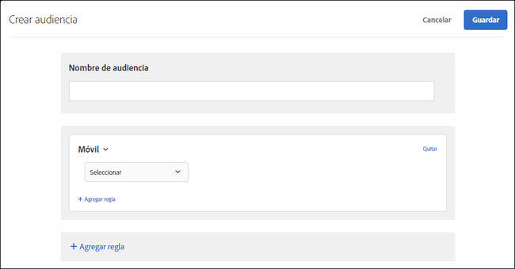

# Móvil

Cree audiencias para segmentar dispositivos móviles en función de parámetros como dispositivo móvil, tipo de dispositivo, proveedor de dispositivo, dimensiones de pantalla (en píxeles) y muchos más.

Por ejemplo, es posible que quiera mostrar contenido distinto a los usuarios cuando acceden a su página desde un teléfono con respecto a cuando acceden desde un equipo. En ese caso, puede elegir la audiencia de dispositivos móviles y seleccionar la opción **[!UICONTROL Es un teléfono móvil]**. Después, puede agregar cualquier detalle específico que sea importante para usted, como el tipo de teléfono, el tamaño de la pantalla (en píxeles), etc.

El destino para móviles se ofrece a través de [DeviceAtlas](https://deviceatlas.com/device-data/user-agent-tester), un servicio de DotMobi. DeviceAtlas es una completa base de datos de dispositivos móviles creada a partir de datos compilados de numerosas fuentes, entre las que se incluyen fabricantes y operadores de red. Estos datos se verifican y se validan para crear una gran base de datos exacta de dispositivos móviles.

La detección de dispositivos se efectúa analizando las cadenas User-Agent. Algunos fabricantes de dispositivos, como Apple, proporcionan poca información en las UA para deshabilitar esta funcionalidad.

Por ejemplo, los dispositivos Apple no comparten en las UA tokens específicos sobre el modelo de dispositivo. La consecuencia es que los modelos de iPhone (como iPhone 5S, iPhone SE, iPhone 6, etc.) no se pueden detectar con un simple método de palabras clave.

Para resolver esto, Target recopila datos adicionales para detectar con precisión los iPhone y otros dispositivos Apple mediante los siguientes parámetros:

| Parámetro | Tipo | Descripción |
|--- |--- |--- |
| devicePixelRatio | Cadena | Proporción entre píxeles físicos y píxeles independientes del dispositivo (dips) en el navegador.  por ejemplo, “1,5” o “2” |
| screenOrientation | Cadena | El dispositivo y el motor JavaScript del navegador admiten la orientación del dispositivo. Puede ser horizontal o vertical. |
| webGLRenderer | Cadena | Procesador del controlador de gráficos del navegador. |

>[!NOTE]
>
>Los clientes que utilicen el SDK móvil no tienen que hacer nada para aprovechar esta funcionalidad. Los clientes que utilizan at.js deben [actualizar a la versión 1.5.0 de at.js](/help/c-implementing-target/c-implementing-target-for-client-side-web/target-atjs-versions.md#reference_DBB5EDB79EC44E558F9E08D4774A0F7A) (o posterior).

Puede elegirse más de una propiedad de dispositivo móvil. Si realiza varias selecciones, debe unirlas mediante OR.

Los clientes que utilicen una integración personalizada (sin usar at.js o el SDK móvil) pueden recopilar estos parámetros ellos mismos y pasarlos como parámetros de mbox.

1. En la interfaz de [!DNL Target], haga clic en **[!UICONTROL Audiencias]** > **[!UICONTROL Crear audiencia]**.
1. Ponga un nombre a la audiencia.
1. Haga clic en **[!UICONTROL Agregar regla]** > **[!UICONTROL Móvil]**.
1. Haga clic en **[!UICONTROL Seleccionar]** y, a continuación, elija una de estas opciones:

   * Nombre de marketing del dispositivo
   * Modelo de dispositivo
   * Proveedor de dispositivo
   * Es dispositivo móvil
   * Es un teléfono móvil
   * Es una tableta
   * Sistema operativo
   * Altura de la pantalla (px)
   * Anchura de la pantalla (px)

   >[!NOTE]
   >
   >Debido a los nuevos cambios introducidos en iOS 12.2, la creación de una audiencia con reglas definidas por un Nombre de marketing de dispositivo y un Modelo de dispositivo que especifique modelos de iPhone se ve afectada. Ya no podemos segmentar usuarios que tengan iPhone con iOS 12.2 instalado. Sin embargo, si esos usuarios no tienen iOS 12.2, la segmentación del modelo iPhone seguirá funcionando correctamente.
   >
   >La actualización de iOS 12.2 no afecta a la identificación de los modelos siguientes, ya que estos modelos no son compatibles con la actualización a iOS 12.2: iPhone, iPhone 3 G, iPhone 3 GS, iPhone 4, iPhone 4s, iPhone 5, iPhone 5c, iPad, iPad 2, iPad/Pantalla Retina, iPad Retina (4ª generación), iPod Touch 4 y iPod Touch 5.

   >[!NOTE]
   >
   >Puede segmentar por operador de dispositivo móvil mediante la [configuración Geográfica](/help/c-target/c-audiences/c-target-rules/geo.md#concept_5B4D99DE685348FB877929EE0F942670).

1. (Opcional) Haga clic en **[!UICONTROL Agregar regla]** y configure reglas adicionales para la audiencia.
1. Haga clic en **[!UICONTROL Guardar]**.

La siguiente ilustración muestra una audiencia segmentada para visitantes que utilicen dispositivos fabricados por Google que sean dispositivos móviles.

## Vídeo de formación: Creación de audiencias

Este vídeo contiene información sobre el uso de las categorías de audiencias.

* Crear audiencias
* Definir categorías de audiencias

>[!VIDEO](https://video.tv.adobe.com/v/17392)
