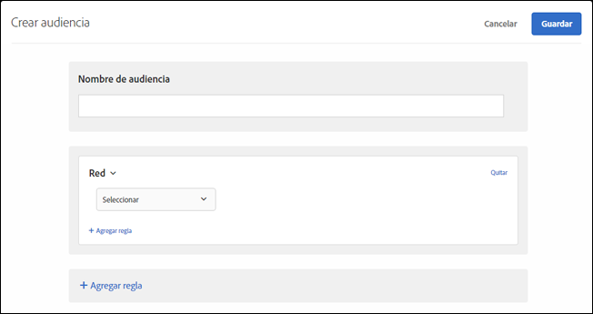

# Red{#network}

Puede crear audiencias que estén basadas en datos de la red.

1. En la interfaz de [!DNL Target], haga clic en **[!UICONTROL Audiencias]** > **[!UICONTROL Crear audiencia]**.
1. Ponga un nombre a la audiencia.
1. Haga clic en **[!UICONTROL Agregar regla]** > **[!UICONTROL Red]**.
1. Haga clic en **[!UICONTROL Seleccionar]** y, a continuación, elija una de estas opciones:

   * **ISP:** un ISP es una organización que proporciona acceso a Internet a sus suscriptores, generalmente por una tarifa mensual o anual. Muchos ISP proporcionan servicios adicionales, como hospedaje web o correo electrónico. El campo ISP es un ISP comercial (como Comcast o TimeWarner) u otra entidad como una institución comercial o educativa.

      Los siguientes son algunos ejemplos de ISP populares en los Estados Unidos:

      | Nombre popular | Nombre de ISP | Nombre de dominio | Dirección IP de ejemplo |
      |---|---|---|---|
      | Cablevision | Cablevision Systems Corp. | *.optonline.net | 68.196.130.239 |
      | CenturyLink | Qwest Communications Company, LLC | *.centurylink.net | 64.40.65.0 |
      | Charter Communications | Comunicaciones de la Carta | *.charter.com | 71.85.225.124 |
      | Comcast | Comcast Cable Communications, Inc. | *.comcast.net | 76.27.24.28 |
      | Cox | Cox Communications Inc. | *cox.net | 68.224.174.22 |
      | Speakeasy | MegaPath Corporation | *.speakeasy.net | 66.93.240.0 |
      | Time Warner | Time Warner Cable Internet LLC | *.res.rr.com | 72.229.28.185 |
      | Verizon FiOS | MCI Communications Services, Inc. d/b/a Verizon Business | *.fios.verizon.net | 173.68.112.34 |
      | Vivint | Smartrove Inc. | *.vivintwireless.net | 170.72.26.105 |
      | AT&amp;T Wireless | AT | *.mycingular.net |  |
      | Sprint mobile | Sprint Personal Communications Systems | dirección IP |  |
      | T-Mobile | T-Mobile USA, Inc. | dirección IP | 208.54.86.0 |
      | Verizon Wireless | Cellco Partnership DBA Verizon Wireless | *.myvzw.com | 70.195.74.199 |

      >[!NOTE]
      >
      >Al segmentar en función del ISP, use el nombre del ISP, no el nombre popular. Asegúrese de que la regla no distingue entre mayúsculas y minúsculas o utilice siempre minúsculas.

      Puede probar los valores de ISP y nombre de dominio. https://www.whoismyisp.org es un buen recurso para fines de segmentación. Puede usar las direcciones IP de ejemplo que aparecen en la tabla anterior o escribir sus propias direcciones. A continuación use el parámetro `mboxOverride.browserIp= URL` para imitar la dirección IP.

   * **Nombre de dominio:** es el nombre de dominio de la dirección IP del visitante. No es el nombre de dominio del sitio web que está usando con [!DNL Target]. Este nombre de dominio está relacionado con la dirección IP del visitante y a veces se denomina nombre de host. Generalmente es muy similar al nombre de ISP. A veces el nombre de host hace referencia a nombres más antiguos de compañías que han cambiado el nombre de marca de su ISP pero no el nombre de dominio.
   * **Velocidad de conexión:** es la velocidad de la conexión a Internet del visitante. Las opciones incluyen: banda ancha, cable, acceso telefónico, móvil, oc3, oc12, satélite, t1, t2, inalámbrico y xdsl.

      Este campo está basado en el tipo de conexión y no en la velocidad real. [!DNL Target] no puede determinar las velocidades exactas de la conexión. El tipo de conexión Banda ancha se usa cuando no existe indicación de otros tipos de conexión, por lo que no se puede elegir un tipo específico.

1. (Opcional) Haga clic en **[!UICONTROL Agregar regla]** y configure reglas adicionales para la audiencia.
1. Haga clic en **[!UICONTROL Guardar]**.

La siguiente ilustración muestra una audiencia dirigida a visitantes que utilizan AT&amp;T con una velocidad de conexión [!UICONTROL móvil].

## Vídeo de formación: Creación de audiencias

Este vídeo contiene información sobre el uso de las categorías de audiencias.

* Crear audiencias
* Definir categorías de audiencias

>[!VIDEO](https://video.tv.adobe.com/v/17392)