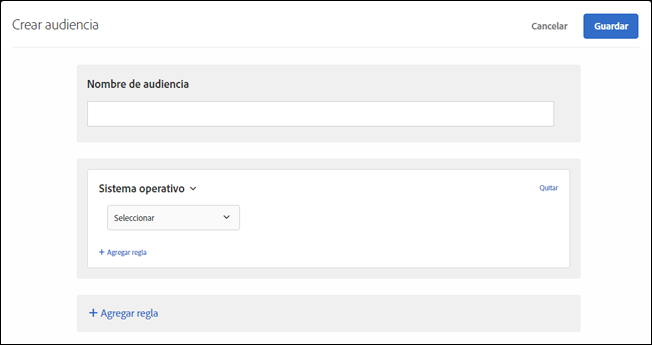

# Sistema operativo{#operating-system}

Puede segmentar visitantes que usen un sistema operativo determinado.

1. En la interfaz de [!DNL Target], haga clic en **[!UICONTROL Audiencias]** > **[!UICONTROL Crear audiencia]**.
1. Ponga un nombre a la audiencia.
1. Haga clic en **[!UICONTROL Agregar regla]** > **[!UICONTROL Sistema operativo]**.
1. Haga clic en **[!UICONTROL Seleccionar]** y, a continuación, elija una de estas opciones:

   * Linux
   * Macintosh
   * Windows

1. (Opcional) Haga clic en **[!UICONTROL Agregar regla]** y configure reglas adicionales para la audiencia.
1. Haga clic en **[!UICONTROL Guardar]**.

Las ilustraciones siguientes muestran una audiencia dirigida a visitantes que utilizan un sistema operativo Macintosh.

## Vídeo de formación: Creación de audiencias

Este vídeo contiene información sobre el uso de las categorías de audiencias.

* Crear audiencias
* Definir categorías de audiencias

>[!VIDEO](https://video.tv.adobe.com/v/17392)
