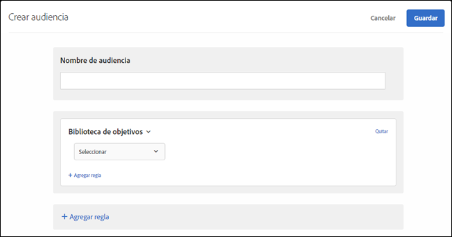

# Biblioteca de segmentos{#target-library}

Usuarios de Target según las reglas de segmentación prediseñadas.

Las audiencias prediseñadas de la categoría Biblioteca de objetivos son audiencias heredades y existentes de otras categorías. Si desea conocer más información y prácticas recomendadas, consulte  [Preguntas más frecuentes sobre audiencias y segmentación de experiencias](/help/c-target/c-troubleshooting-targets-and-audiences/troubleshooting-targets-and-audiences.md#concept_C4EE4B8F4840430CBD798D579A8F208D).

1. En la interfaz de [!DNL Target], haga clic en **[!UICONTROL Audiencias]** > **[!UICONTROL Crear audiencia]**.
1. Ponga un nombre a la audiencia.
1. Haga clic en **[!UICONTROL Agregar regla]** > **[!UICONTROL Biblioteca de objetivos]**.

   

1. Haga clic en **[!UICONTROL Seleccionar]** y seleccione una regla de segmentación prediseñada.

   Las reglas de segmentación prediseñadas incluyen Sistema operativo Windows, Dispositivo de tableta, Navegador Safari, Visitantes que repiten, Remitidos desde Google, etc.

   La audiencia predefinida “Tablet” ya cualifica cuando el agente usuario contiene una de las siguientes cadenas (algunas de las cuales son números de modelos de dispositivos). No es necesario crear reglas de segmentación personalizadas para estos dispositivos.

   Kindle, Silk, iPad, Sony Tablet, TF101, GT-P1000, GT-P1000R, GT-P1000M, SGH-T849, SHW-M180S, GT-I9000T, BNTV250 y Tablet PC.

1. (Opcional) Haga clic en **[!UICONTROL Agregar regla]** y configure reglas adicionales para la audiencia.
1. Haga clic en **[!UICONTROL Guardar]**.

## Vídeo de formación: Creación de audiencias

Este vídeo contiene información sobre el uso de las categorías de audiencias.

* Crear audiencias
* Definir categorías de audiencias

>[!VIDEO](https://video.tv.adobe.com/v/17392)
