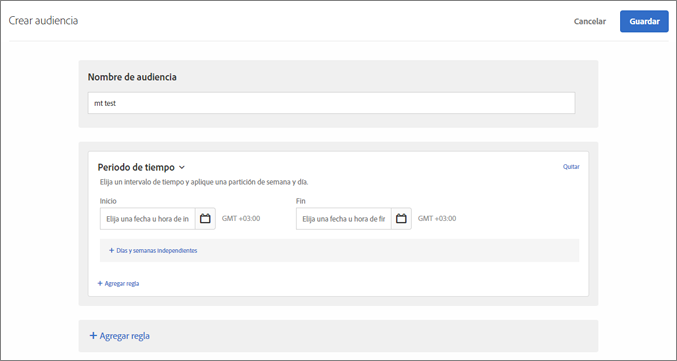
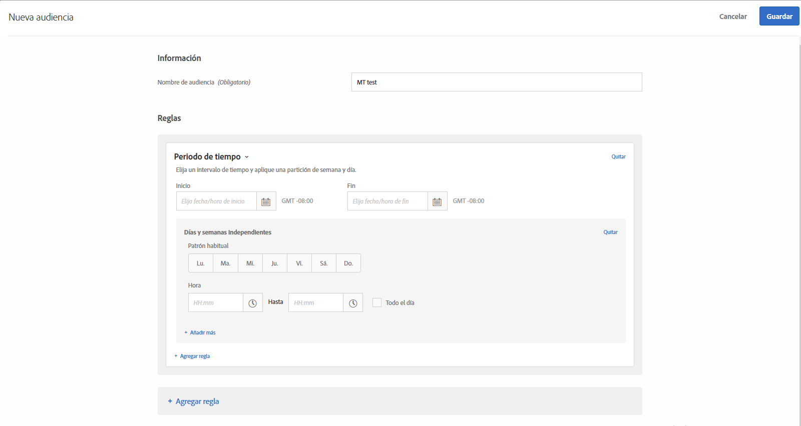

# Periodo de tiempo

Puede agregar fechas y horas de inicio y finalización en [!DNL Adobe Target] para dirigirse a los usuarios que visitan el sitio durante un intervalo de tiempo específico. También puede establecer opciones de Partición por semana y día para crear patrones recurrentes en la segmentación de audiencia.

Por ejemplo, con la función [audiencias combinadas ad hoc](/help/c-target/combining-multiple-audiences.md#concept_A7386F1EA4394BD2AB72399C225981E5), puede dirigirse a las personas que gastan poco para mostrarles contenido específico durante los tres días anteriores al Black Friday y otro contenido después del Black Friday.

1. En la interfaz de [!DNL Target], haga clic en **[!UICONTROL Audiencias]** > **[!UICONTROL Crear audiencia]**.
1. 
   1. Asigne un nombre a la audiencia y añada una descripción opcional.
1. Arrastre y suelte **[!UICONTROL Lapso de tiempo]** en el panel del generador de audiencias.

   

1. Especifique las fechas y horas [!UICONTROL Start] y [!UICONTROL End] para la audiencia.

   Deje en blanco la fecha de inicio para empezar a dirigirse a su audiencia siguiendo la programación de la actividad. Deje en blanco la fecha de fin para continuar dirigiéndose a su audiencia hasta la fecha y hora de fin de la actividad.

   También puede dejar en blanco tanto la fecha de inicio como la de fin. Esta funcionalidad le permite utilizar la misma audiencia en varias actividades (sin hacer una copia de la audiencia) mientras controla las fechas de inicio y finalización en el nivel de actividad.

   >[!NOTE]
   >
   >La zona horaria de las fechas de inicio/fin aparece como GMT +/-NN:NN, donde NN:NN es la diferencia con respecto a la zona GMT. Refleja la zona horaria de la cuenta, no la del visitante. Por ejemplo, la zona horaria de California sería GMT -08:00.

1. (Condicional) Haga clic en **[!UICONTROL Definir frecuencia]** para establecer patrones recurrentes, incluidos los días de las semanas y las horas.

   

   Por ejemplo, puede utilizar las opciones [!UICONTROL Frequency] para mostrar la opción &quot;Chatear ahora&quot; a los visitantes solo durante los días y las horas laborables de su centro de llamadas.

   Seleccione uno o varios días de la semana y luego defina las horas de inicio y fin. Haga clic en **[!UICONTROL Agregar frecuencia]** para especificar patrones adicionales, según lo desee.

   >[!NOTE]
   >
   >La zona horaria de [!UICONTROL División por semana y día] aparece como GMT +/- NN:NN, donde NN:NN es la diferencia con respecto a la zona GMT, y refleja la zona horaria de la cuenta, no la del visitante. Por ejemplo, la zona horaria de California para la hora del Pacífico se mostraría como GMT -07:00.

1. (Opcional) Configure reglas adicionales para la audiencia.

   Si lo desea, puede repetir el paso 5 con cada regla.

1. Haga clic en **[!UICONTROL Finalizado]**.

## Vídeo de formación: Creación de audiencias 

Este vídeo contiene información sobre el uso de las categorías de audiencias.

* Crear audiencias
* Definir categorías de audiencias

>[!VIDEO](https://video.tv.adobe.com/v/17392)
