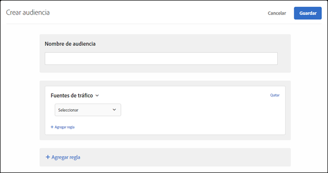

# Fuentes de tráfico.{#traffic-sources}

Cree audiencias para segmentar visitantes en función del motor de búsqueda o de la página de aterrizaje que les lleve a su sitio.

Por ejemplo, puede segmentar según el navegador, el motor de búsqueda o la página de aterrizaje de referencia del visitante. La página de aterrizaje de referencia es la página en la que el visitante hace clic para llegar al sitio actual de la sesión. (Por ejemplo, si el visitante hace clic en un anuncio que se encuentra en Google y se le dirige a la página principal de `adobe.com`, entonces la página de aterrizaje de referencia es `google.com`).

Puede combinar varias fuentes de tráfico para crear una regla de segmentación compleja.

1. En la interfaz de [!DNL Target], haga clic en **[!UICONTROL Audiencias]** > **[!UICONTROL Crear audiencia]**.
1. Ponga un nombre a la audiencia.
1. Haga clic en **[!UICONTROL Agregar regla]** > **[!UICONTROL Fuentes de tráfico]**.

   

1. Haga clic en **[!UICONTROL Seleccionar]** y, a continuación, elija una de estas opciones:

   * Desde Baidu
   * Desde Bing
   * Desde Google
   * Desde Yahoo
   * Página de aterrizaje que deriva: dirección URL
   * Página de aterrizaje que deriva: dominio
   * Página de aterrizaje que deriva: consulta

   Según su selección, es posible que necesite proporcionar información adicional (evaluador y/o valores).

1. (Opcional) Haga clic en **[!UICONTROL Agregar regla]** y configure reglas adicionales para la audiencia.
1. Haga clic en **[!UICONTROL Guardar]**.

Puede segmentar usuarios dirigidos a su sitio por un motor de búsqueda específico o desde una página de aterrizaje concreta.

## Vídeo de formación: Creación de audiencias  

Este vídeo contiene información sobre el uso de las categorías de audiencias.

* Crear audiencias
* Definir categorías de audiencias

>[!VIDEO](https://video.tv.adobe.com/v/17392)
