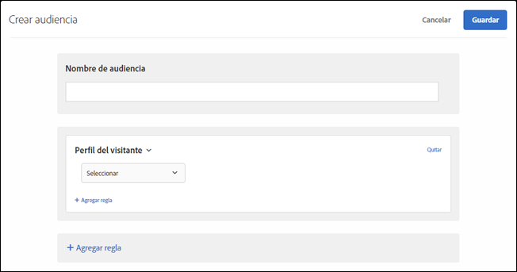

# Perfil del visitante{#visitor-profile}

Cree audiencias para segmentar visitantes que cumplan parámetros de perfil específicos.

1. En la interfaz de [!DNL Target], haga clic en **[!UICONTROL Audiencias]** > **[!UICONTROL Crear audiencia]**.
1. Ponga un nombre a la audiencia.
1. Haga clic en **[!UICONTROL Agregar regla]** > **[!UICONTROL Perfil del visitante]**.

   

1. Haga clic en **[!UICONTROL Seleccionar]** y, a continuación, elija una de estas opciones:

   Los parámetros de perfil de visitante se pasan a través del mbox (perfil). Puede segmentar visitantes nuevos o recurrentes, o bien incluir todos los usuarios.

   * Nuevo visitante
   * Visitante que regresa
   * En otras pruebas
   * No está en otras pruebas
   * Primera página de la sesión
   * No es primera página de la sesión
   * Afinidad de la categoría

   Se crea un perfil de visitante en la memoria perimetral local para cada llamada a mbox con el nuevo `mboxPC`. Después de 30 minutos de inactividad, el perfil se guarda en la base de datos de Target y es accesible desde otros perímetros.

   Cuando el visitante de un sitio inicia sesión en la mitad de la sesión y obtiene un `3rdpartyId`, todos los atributos de perfil cargados previamente y asociados al `3rdPartyId` quedan disponibles de forma inmediata.

   Puede segmentar parámetros personalizados de perfil y parámetros `user.`. Elija el parámetro que quiera usar para segmentar la actividad. Si el parámetro que desea utilizar no está en la lista, significa que ningún mbox lo ha activado.

1. (Opcional) Haga clic en **[!UICONTROL Agregar regla]** y configure reglas adicionales para la audiencia.
1. Haga clic en **[!UICONTROL Guardar]**.

## Vídeo de capacitación: Creando distintivo de Audiencias 

Este vídeo contiene información sobre el uso de las categorías de audiencias.

* Crear audiencias
* Definir categorías de audiencias

>[!VIDEO](https://video.tv.adobe.com/v/17392)
