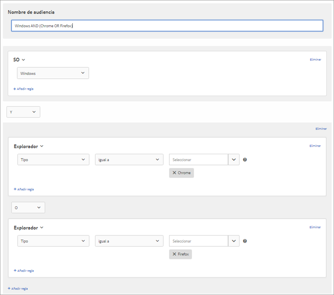

# Crear audiencias en [!DNL Target]

Puede crear audiencias personalizadas y guardarlas en la biblioteca [!DNL Adobe Target] [!UICONTROL Audiences] para usarlas en sus actividades. También puede copiar una audiencia existente que luego puede editar para crear una audiencia similar y combinar varias.

## Información general de audiencia

Las audiencias están definidas por reglas que determinan quién se incluye o excluye de una actividad de [!DNL Target]. Una definición de audiencia puede incluir varias reglas y cada regla puede incluir varios parámetros. Las definiciones de audiencias complejas usan operadores booleanos Y y O para combinar reglas y parámetros para otorgarle un control detallado sobre qué visitantes del sitio se cuentan como participantes de actividades.

Cuando se combinan reglas o parámetros con Y, cualquier miembro potencial de la audiencia debe cumplir *todas* las condiciones definidas para que se le incluya como participante. Por ejemplo, si define una regla de sistema operativo AND (y) una regla de navegador, solo se incluyen en la actividad los visitantes que usan el sistema operativo *y* el navegador especificados.

Cuando se combinan reglas o parámetros con O, cualquier miembro potencial de la audiencia solamente necesita cumplir cualquier condición única definida para que se lo incluya como participante. Por ejemplo, si se definen varias reglas móviles conectadas por O, se incluyen en la actividad los visitantes que cumplen *cualquiera* de los criterios definidos.

Puede combinar ambos operadores booleanos para crear reglas complejas; sin embargo, los operadores del mismo nivel de regla deben coincidir. La interfaz de usuario se aplica automáticamente al operador correcto.

Por ejemplo, la siguiente regla segmenta a los visitantes que usan Chrome *o* Firefox en un equipo Windows:

>[!NOTE]
>
>Tenga cuidado de evitar crear reglas que excluyen todos los miembros potenciales de la audiencia. Por ejemplo, no es posible visitar una página con los navegadores Chrome *y* Firefox simultáneamente.

## Crear una audiencia

1. Haga clic en **[!UICONTROL Audiencias]** en la barra de menú superior.

   

1. En la lista [!UICONTROL Audiencias], haga clic en **[!UICONTROL Crear audiencia]**.

   O

   Para copiar una audiencia existente, en la lista [!UICONTROL Audiencias], haga clic en el icono **[!UICONTROL Más acciones]** (icono de elipsis) y, a continuación, haga clic en **[!UICONTROL Duplicar]**. Luego puede editar la audiencia para crear otra parecida.

1. Escriba un nombre descriptivo y único para la audiencia y una descripción opcional.
1. Arrastre y suelte los atributos deseados de la lista **[!UICONTROL Atributos]** a la derecha del panel del generador de audiencias.

   

   Cada tipo de regla tiene sus propios parámetros. Consulte [Categorías para audiencias](/help/c-target/c-audiences/c-target-rules/target-rules.md#concept_E3A77E42F1644503A829B5107B20880D) para obtener más información sobre cómo configurar cada tipo de regla de audiencia.

1. Defina los parámetros de la regla.

   Por ejemplo, la siguiente audiencia está dirigida a visitantes de Utah que utilizan el sistema operativo Macintosh.

   

1. (Condicional) Siga agregando y definiendo los atributos deseados.

   Para crear otro contenedor, haga clic en **[!UICONTROL Agregar contenedor]** o simplemente arrastre otro atributo al panel de Audience Builder. A continuación, puede ajustar el operador (Y u O) mediante la lista desplegable.

1. Haga clic en **[!UICONTROL Finalizado]**.

   Las audiencias recién creadas aparecen en la lista tras unos segundos de retraso en el procesamiento. Si la audiencia no aparece en la lista inmediatamente, pruebe a buscarla o actualice la lista.

## Vídeo de formación: Creación de audiencias  

Este vídeo contiene información sobre la creación de audiencias.

* Crear audiencias
* Definir categorías de audiencias

>[!VIDEO](https://video.tv.adobe.com/v/17392)
