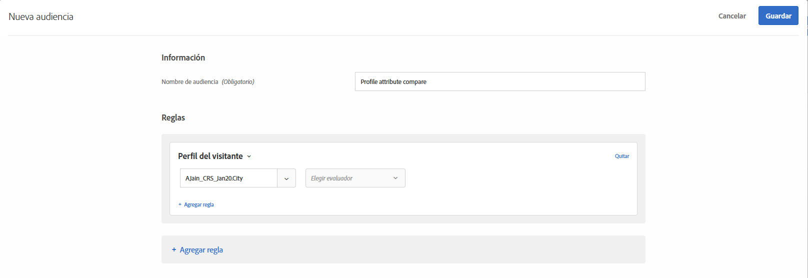
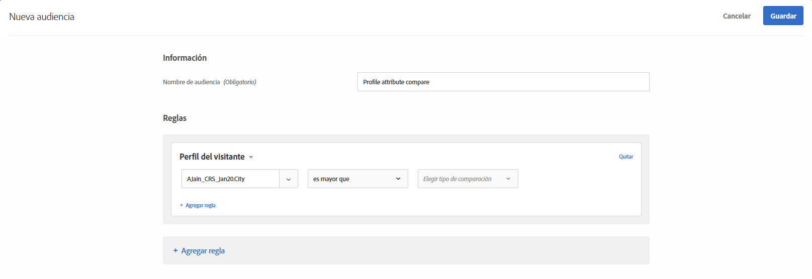
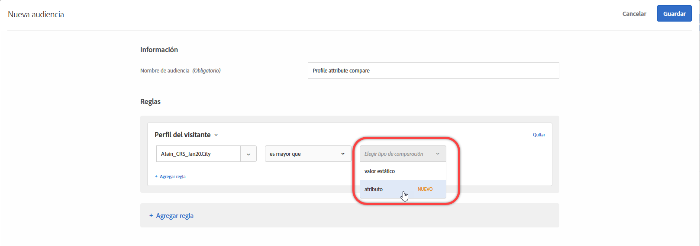

# Crear una audiencia de comparación de atributos de perfil{#create-a-profile-attribute-comparison-audience}

Defina una audiencia con el fin de comparar dos atributos de perfil para su [biblioteca de audiencias](/help/c-target/c-audiences/audiences.md) o en una [audiencia solo de actividad](/help/c-target/creating-activity-only-audience.md). Mediante operadores como mayor que, menor que o igual a, defina una audiencia que compare de forma dinámica el valor de dos atributos de perfil diferentes.

>[!NOTE]
>
>Esta funcionalidad solo está disponible para la categoría [Perfil de visitante](/help/c-target/c-audiences/c-target-rules/visitor-profile.md#concept_E972690B9A4C4372A34229FA37EDA38E).

## Información general {#section_303CBC78194D49A2A004945D425441E1}

Las audiencias están definidas por reglas que determinan quién se incluye o excluye de una actividad de Target. Una definición de audiencia puede incluir múltiples reglas, cada una de las cuales puede incluir múltiples parámetros. Si una de las reglas incluidas utiliza la categoría Perfil del visitante, puede definir una regla basada en el valor específico del atributo de perfil del visitante, o bien comparar el valor de dicho atributo con otro atributo de perfil del visitante.

Por ejemplo, supongamos que trabaja para una empresa de muebles y que ha cargado en Target la puntuación de inclinación de dos clientes:

* Probabilidad de comprar mobiliario de comedor en los próximos 90 días
* Probabilidad de comprar mobiliario de salón en los próximos 90 días

Podría crear una audiencia definida como que la inclinación a comprar mobiliario de comedor es mayor que la inclinación a comprar mobiliario de salón. A continuación, Target compara dinámicamente las puntuaciones de inclinación hacia comedor y salón de un visitante específico para determinar si el visitante entra o no en la audiencia.

Para obtener más información, consulte [Métodos para obtener datos en Target](/help/c-implementing-target/c-considerations-before-you-implement-target/c-methods-to-get-data-into-target/methods-to-get-data-into-target.md#concept_0069C0EFB56C4700BB33F2F35C2B9B17).

## Crear una audiencia de comparación de atributos de perfil {#section_7A62FD47D5C74C3EBC3417ACDBB85013}

1. Haga clic en **[!UICONTROL Audiencias]** > **[!UICONTROL Crear audiencia]** > **[!UICONTROL Agregar regla]** > **[!UICONTROL Perfil del visitante]**.
1. En la lista desplegable **[!UICONTROL Perfil del visitante]**, elija un atributo:

   

1. Elija un evaluador:

   

1. En la lista desplegable **[!UICONTROL Elegir tipo de comparación]**, seleccione **[!UICONTROL Atributo]**.

   El tipo de comparación “valor estático” permite comparar el atributo de perfil del visitante con valores específicos.

   

   >[!NOTE]
   >
   >Si utiliza una de las categorías predeterminadas de perfil del visitante en el paso 1 (por ejemplo, Nuevo visitante o Visitante que regresa), solo puede elegir la opción del valor estático. Las opciones de comparación dinámica no están disponibles para las categorías predeterminadas. Otros ejemplos en los que las opciones de comparación dinámica no están disponibles son “Primera página de la sesión”, “No está en otras pruebas”, “No es primera página de la sesión” y “Afinidad de la categoría”.

1. Elija el atributo adicional que desee comparar con su atributo inicial.

   

## Vídeo de capacitación  {#section_3BB8DBF3418F4520B3E274B6F40AF8F3}

Vea el siguiente vídeo para obtener más información y ver un caso en el que podría utilizar esta función:

>[!VIDEO](https://video.tv.adobe.com/v/23218/)