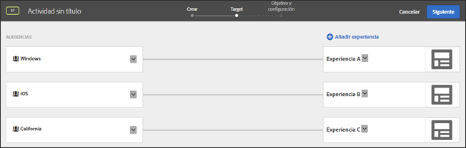

# Preguntas más frecuentes sobre audiencias y segmentación{#targets-and-audiences-faq}

Lista de preguntas más frecuentes sobre audiencias y segmentación de experiencias.

## ¿Cómo evalúa Destinatario las direcciones URL en los objetivos? {#url}

Destinatario evalúa las direcciones URL de forma diferente en función de si se usa el objetivo de URL de audiencia al crear una actividad o si se usa el objetivo de URL al crear una audiencia.

Considere la siguiente dirección URL:

`http://www.example.com/path1/path2/path3?queryStringParam1=test123&queryStringParam2=test7`

### Objetivo de URL de audiencia

Para aplicar el objetivo de URL de audiencia, al crear una actividad, en la página Experiencias (paso uno del flujo de trabajo guiado de tres pasos), haga clic en el icono de engranaje, haga clic en Envío de página y especifique la dirección URL deseada.

El objetivo de URL de audiencia busca una coincidencia de URL exacta. Si la dirección URL coincide, Destinatario no tiene en cuenta la lógica adicional. En la dirección URL anterior, si la actividad está configurada para activarse `www.example.com`, la dirección URL coincide con las siguientes direcciones URL porque la segmentación por URL de audiencia no depende de la consulta:

* `www.example.com?query=something`
* `www.example.com?query=anything`
* `www.example.com?query=nothing&qa=true&stuff=random&product=shoes&height=superTall`

Más allá del objetivo de audiencia en la dirección URL, también puede especificar valores específicos que pueden estar en la consulta.

### Dirección URL

Para aplicar el objetivo de URL, al crear una audiencia, haga clic en Añadir regla, en Páginas del sitio, seleccione una opción de la primera lista desplegable (Página actual, Página anterior o Página de aterrizaje), seleccione Dirección URL en la segunda lista desplegable, especifique un evaluador y luego especifique la dirección URL que desee.

El objetivo de URL transforma la URL en un conjunto de reglas para evaluar:

* Dominio de URL = `example.com`
* Ruta = path1/path2/path3
* queryStringParam1 = test123
* queryStringParam2 = test7

## Al crear cadenas URL complejas, ¿ [!DNL Target] evalúa toda la dirección URL?

Si utiliza el mismo nombre de parámetro más de una vez en una cadena URL, HTTP considera el nombre del primer parámetro y omite los parámetros posteriores con el mismo nombre.

Por ejemplo, en la siguiente cadena URL:

`https://www.adobe.com/SearchResults.aspx?sc=BM&fi=1&fr=1&ps=0&av=0&Category=C0010438&Category=C000047`

se evalúa la primera instancia del `Category` parámetro y se ignora el segundo `Category` parámetro.

Se recomienda tener varios valores asociados a una sola categoría, como se muestra a continuación:

`https://www.adobe.com/SearchResults.aspx?sc=BM&fi=1&fr=1&ps=0&av=0&Category=C0010438,C000047`

## A la hora de crear audiencias, ¿por qué las audiencias prediseñadas en Biblioteca de Objetivos se encuentran en otras categorías? {#section_9EBF5B0F9DF94168A15B92B905CCF7E0}

Las audiencias prediseñadas de la categoría Biblioteca de objetivos son audiencias heredades y existentes de otras categorías. Por ejemplo, la audiencia heredada Biblioteca de objetivos > Nuevos visitantes tiene un equivalente actualizado: Perfil del visitante > Nuevo visitante.

Se recomienda utilizar las audiencias más nuevas porque han mejorado su rendimiento. Es posible que algunos clientes que utilicen audiencias prediseñadas heredadas, de modo que no se han eliminado de la interfaz de Target.

## ¿Cómo sé de qué manera se dividirá el tráfico entre las audiencias?   {#section_067EEFB956E7465CBF77EC86834470AB}

De manera predeterminada, el tráfico se divide a partes iguales entre las experiencias. Sin embargo, puede especificar   segmentos de porcentaje para cada experiencia. En este caso, se genera un número aleatorio que se utiliza para elegir la experiencia que se mostrará. Es posible que los porcentajes resultantes no coincidan exactamente con los objetivos especificados, pero con más tráfico resulta necesario dividir las experiencias para aproximarse a los objetivos.

## ¿Qué experiencia se muestra si un usuario cumple los criterios de una actividad que contiene varias experiencias con varias audiencias aptas?   {#section_94A60B11212D48FD8AB0803C6C7E7253}

El usuario cumple los criterios de la primera experiencia o audiencia que se muestra en la página de [!UICONTROL Target] de la actividad.

Por ejemplo, en la siguiente ilustración, un usuario de California que utiliza un dispositivo Windows cumple los criterios de la Experiencia A (audiencia de Windows) y de Experiencia C (audiencia de California). Este usuario vería la Experiencia A porque aparece en la lista anterior por encima de Experiencia C en la página de Target.

## ¿Por qué los nombres de las mismas audiencias en Target, Adobe Audience Manager (AAM) y la Biblioteca de audiencias en los servicios principales son diferentes?{#section_F67E61A607B6444C8DAA4F99C3E95AED}

Los nombres de las audiencias en [!DNL Target] son únicos; sin embargo, en [!DNL AAM] y en la [!DNL Audience Library], varias audiencias pueden tener el mismo nombre (si están en carpetas diferentes). Cuando [!DNL Target] encuentra un nombre de audiencia que coincide con el de una audiencia [!DNL AAM] o [!DNL Audience Library], [!DNL Target] añade &quot;#&lt;number>&quot; al nombre.

Por ejemplo, es posible que vea las siguientes audiencias: “Usuarios en PC” (en [!DNL AAM]) y “Usuarios en PC #1” (en [!DNL Target]).

## ¿Por qué no puedo cambiar el nombre de un audiencia?{#section_54E420556F534D20836E261E253D8B97}

Algunas audiencias de Target están predefinidas, como “Nuevos visitantes” y “Visitantes que repiten”. Los usuarios no pueden cambiar el nombre de estas audiencias predefinidas.

## ¿Por qué no aparece ningún parámetro de perfil en la interfaz de usuario de Target?   {#section_3CD947D15C984EE9AD19550220E0E8BD}

[!DNL Target] tiene un límite de 50 atributos de perfil únicos por llamada de mbox. Si necesita pasar más de 50 atributos de perfil a [!DNL Target], puede hacerlo por medio del método de API [!UICONTROL Profile Update]. Para obtener más información, consulte [Profile Update](https://developers.adobetarget.com/api/#authentication-tokens) en la documentación de la API de Adobe Target.

## ¿Por qué los visitantes ven experiencias para una actividad AP que no deberían ver?{#section_41CECEAE0881446A8D9F3B016857914B}

Las actividades de personalización automatizada se evalúan una vez por sesión. Si hubo sesiones activas que se han calificado para una experiencia en particular y ahora se han agregado nuevas ofertas, los usuarios verán el nuevo contenido junto con las ofertas que se mostraron anteriormente. Debido a que anteriormente se han calificado para esas experiencias, todavía las verían durante la sesión. Si desea evaluar esto en cada visita a una página, debe cambiar al tipo de actividad de segmentación de experiencias (XT).

## ¿Por qué los cambios realizados en las audiencias creadas mediante API no se reflejan en la interfaz de usuario de Target?   {#section_6BEB237CAC004A06A290F9644E5BF0FB}

A diferencia de las ofertas y los scripts de perfil, los cambios realizados por API en las audiencias creadas mediante Target Standard no se sincronizan con la interfaz de usuario de Target.

## Las cadenas que representan números (números de coma flotante también son compatibles) se comparan como números.{#strings-that-represent-numbers}

Si la parte izquierda y derecha de expresiones igual se pueden analizar en un número, las dos partes se comparan como números, no como cadenas.

Por ejemplo:

| Valor | Criterios de segmentación | Resultado |
| --- | --- | --- |
| 1.0 | igual a 1 | true |
| 1 | igual a IgnoreCase 1.0 | true |
| 1,230 | igual a 1 | true |
| 1,500 | igual a 1,5 | true |
| 1,200 | menor que 2 | true |
| 2 | mayor que 3,0 | false |
| 045 | igual a 45 | true |

Los números escritos en notación científica siempre se comparan como cadenas.

Por ejemplo,

“4e-2” solo es igual a “4e-2”. *No* será igual a “0,04”.