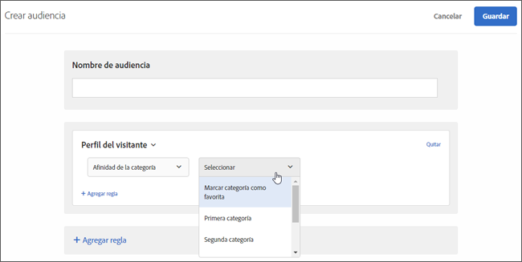

# Afinidad de la categoría{#category-affinity}

La función de afinidad de la categoría captura automáticamente las categorías que visitan los usuarios y luego calcula la afinidad del usuario hacia las categorías, de forma que se pueda establecer como objetivo y se le apliquen segmentos. Esto contribuye a garantizar que el contenido se orienta a los visitantes que tienen más probabilidades de realizar alguna acción a partir de esa información.

## Transferir información sobre la afinidad de la categoría a Target {#section_B0C8E46EEBAC4549AD90352A47787D04}

Cada vez que un usuario visite su sitio web, en la base de datos de [!DNL Target] se registrarán unos parámetros de perfil exclusivos para ese visitante. Dichos datos están unidos a la cookie del usuario. Un parámetro especialmente útil es `user.categoryId`, un parámetro de mbox asignado en una página de producto. A medida que el visitante continúa la visita, o vuelve para otra sesión, se pueden registrar las categorías de productos que un visitante concreto elige ver. También puede registrar información de categoría pasándola como el parámetro de mbox `user.categoryId` en cualquier mbox (incluido un mbox anidado), como un parámetro de URL `user.categoryId` o en parámetros de página de Target con un mbox global. Si desea obtener más detalles, consulte a su representante de cuentas.

Separe las categorías con una coma para incluir un elemento en varias categorías. Por ejemplo:

* `user.categoryId=clothing,shoes,nike,running,nike clothing,nike shoes,nike running shoes`

Según la frecuencia y la proximidad en tiempo de las visitas a sus categorías de productos, se registrará la afinidad de la categoría de los usuarios (si existe). La afinidad de la categoría se puede usar para dirigir las actividades a una población concreta.

Puede utilizar `user.categoryAffinities[]` en un script de perfil para devolver una matriz de las afinidades que ha rellenado un visitante.

>[!IMPORTANT]
>
>El atributo `user.categoryId` utilizado para el algoritmo de afinidad de categoría de Adobe Target es distinto del atributo `entity.categoryId` utilizado para las recomendaciones de productos y de productos en Recommendations de Adobe Target. `user.categoryId` es necesario para rastrear la categoría favorita de un usuario. `entity.categoryId` es necesario para basar las recomendaciones en la categoría o el elemento actual. Pase ambos valores a Adobe Target si desea utilizar ambas funciones.

## Caso de negocio para la afinidad de la categoría {#section_D6FF913E88E6486B8FBCE117CA8B253B}

La actividad que los visitantes realizan durante una sesión (por ejemplo, la categoría que visitan más a menudo) se puede usar para dirigir las visitas posteriores. Se registran todas las páginas de categorías que ve un visitante durante una sesión y su categoría “favorita” se calcula según el modelo de proximidad en tiempo y de frecuencia. A continuación, cada vez que el visitante regresa a la página principal, el área de la imagen primordial se puede dirigir para que muestre contenido relacionado con su categoría favorita.

## Ejemplo del uso de afinidad de la categoría {#section_A4AC0CA550924CB4875F4F4047554C18}

Pongamos por supuesto que se dedica a la venta de instrumentos musicales por Internet y quiere dirigir las promociones de venta de bajos a los visitantes que ya antes hayan mostrado interés por las guitarras. Si usa afinidad de la categoría, puede crear ofertas que se muestren únicamente a los visitantes con esta afinidad de la categoría.

## Algoritmo de afinidad de la categoría {#section_8B86C7FF50294208866ABF16F07D5EB9}

El algoritmo de afinidad de la categoría funciona de la siguiente forma:

* 10 puntos por la primera categoría visualizada
* 5 puntos por cada categoría pulsada después de la primera.
* Cuando se hace clic en una categoría nueva, se resta 1 punto de todas las categorías previamente pulsadas.
* Si ya se hizo clic en una categoría (vista), volver a hacer clic en ella no restará 1 punto del resto de categorías.
* Si se hace clic en una sexta categoría nueva, se abandona la categoría con menos puntos de entre las primeras cinco categorías del cálculo.
* Al final de la sesión, se dividen todos los valores entre 2.

### Ejemplo: algoritmo de afinidad de la categoría

Por ejemplo, si ve la categoría `mens-clothing` y luego `accessories`, después `jewelry` y después de nuevo `accessories` en una sesión, resultan las afinidades:

* `accessories`: 9 (+5 – 1 + 5)

* `mens-clothing`: 8 (+10 – 1 – 1)

* `jewelry`: 5 (+5)

Cuando la sesión termina y el usuario vuelve al sitio, las puntuaciones se reducen a la mitad:

* `accessories`: 4,5 (9/2)

* `mens-clothing`: 4 (8/2)

* `jewelry`: 2,5 (5/2)

Suponiendo que el usuario ve, en orden, `jewelry`, `accessories`, `beauty`, `shoes` y `womens-clothing`:

* `accessories`: 6,5 (4,5 + 5 – 1 – 1 – 1)

* `womens-clothing`:: 5 (+5)

* `jewelry`: 4,5 (2,5 + 5 – 1 – 1 – 1)

* `shoes`: 4 (+5 – 1)

* `beauty`: 3 (+5 – 1 – 1)

* `mens-clothing` se elimina después del último clic en `womens-clothing` como la categoría de puntuación inferior, con una puntuación de 1 (4 – 1 – 1 – 1)

Cuando la sesión termina y el usuario vuelve al sitio, las puntuaciones se reducen a la mitad:

* `accessories`: 3,3 (6,5/2)

* `womens-clothing`: 2,5 (5/2)

* `jewelry`: 2,3 (4,5/2)

* `shoes`: 2 (4/2)

* `beauty`: 1,5 (3/2)

## Usar la afinidad de la categoría para segmentar {#concept_5750C9E6C97A40F8B062A5C16F2B5FFC}

Explicamos cómo usar una audiencia de [!UICONTROL Afinidad de la categoría] para segmentar en una actividad.

Esta sección contiene la información siguiente:

* [Crear una audiencia para usar la afinidad de la categoría](/help/c-target/c-visitor-profile/category-affinity.md#section_A27C600BBA664FE7A74F8FE076B78F40)
* [Usar la audiencia de afinidad de la categoría en una actividad](/help/c-target/c-visitor-profile/category-affinity.md#section_91526B942D1B4AEBB8FCDF4EBFF931CF)

## Crear una audiencia para usar la afinidad de la categoría {#section_A27C600BBA664FE7A74F8FE076B78F40}

1. En la lista **[!UICONTROL Audiencias]**, haga clic en **[!UICONTROL + Crear audiencia]**.

   O

   Para copiar una audiencia existente, en la lista Audiencias, pase el ratón sobre la audiencia que quiera y luego haga clic en el icono Copiar. Luego puede editar la audiencia para crear otra parecida.

1. Escriba un nombre descriptivo para la audiencia.
1. Haga clic en **[!UICONTROL + Agregar regla]** > **[!UICONTROL Perfil del visitante]**.
1. En la lista desplegable **[!UICONTROL Perfil del visitante]**, seleccione **[!UICONTROL Afinidad de la categoría]**.

   

1. Seleccione la categoría que quiera:

   

   Las categorías incluyen:

   * Categoría favorita
   * Primera categoría
   * Segunda categoría
   * Tercera categoría
   * Cuarta categoría
   * Quinta categoría

   Las opciones &quot;Categoría favorita&quot; y &quot;Primera Categoría&quot; son equivalentes.

1. Elija el evaluador:

   * Contiene (sin distinción de mayúsculas y minúsculas)
   * No contiene (sin distinción de mayúsculas y minúsculas)
   * Es igual a

1. Coloque cada valor nuevo en una línea distinta (por ejemplo, “zapatos”).
1. Haga clic en **[!UICONTROL Guardar]**.

## Usar la audiencia de afinidad de la categoría en una actividad {#section_91526B942D1B4AEBB8FCDF4EBFF931CF}

Las audiencias de afinidad de la categoría se pueden usar en cualquier actividad. Durante el flujo de trabajo guiado de tres pasos, en el paso de Target, elija a la audiencia que quiera.
