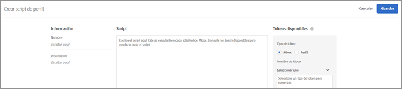
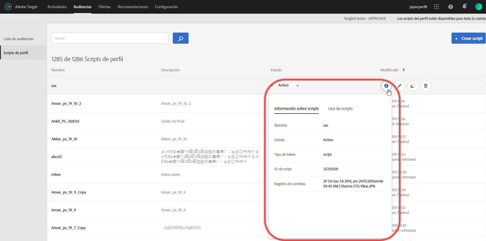
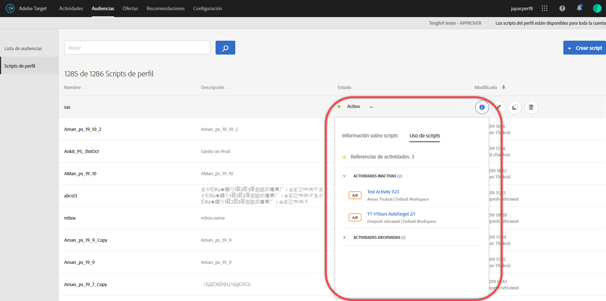
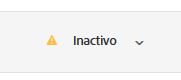
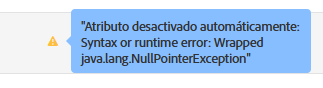

# Atributos de perfil{#profile-attributes}

Los atributos de perfil son parámetros específicos de un visitante. Estos atributos se almacenan en el perfil del visitante para proporcionar información acerca de ese visitante que puede utilizar en sus actividades.

Un perfil de usuario contiene información demográfica y de comportamiento de un visitante de página web, como edad, sexo, productos comprados, última vez de la visita, etc., que el Destinatario utiliza para personalizar el contenido que sirve al visitante.

Cuando un visitante explora su sitio web o cuando el visitante regresa para otra sesión, los atributos de perfil guardados en el perfil se pueden utilizar para destinatario de contenido o registrar información para filtrar segmentos.

Para configurar atributos de perfil:

1. Haga clic en **[!UICONTROL Audiencias]** > **[!UICONTROL Secuencias de comandos de Perfil.]**

   

1. Haga clic en **[!UICONTROL Crear secuencia de comandos]**.

   

   Se encuentran disponibles los siguientes tipos de atributos de perfil:

   | Tipo de parámetro | Descripción |
   |--- |--- |
   | mbox | Se pasan directamente a través del código de la página cuando el mbox se crea. Consulte [Pasar parámetros a un mbox global](/help/c-implementing-target/c-implementing-target-for-client-side-web/t-mbox-download/c-understanding-global-mbox/pass-parameters-to-global-mbox.md).<br>**Nota**: Target tiene un límite de 50 atributos de perfil únicos por llamada de mbox. Si necesita pasar más de 50 atributos de perfil a Target, puede hacerlo por medio del método de API Profile Update. Para obtener más información, consulte [Profile Update en la documentación de la API de Adobe Target](http://developers.adobetarget.com/api/#updating-profiles). |
   | Perfil | Definido directamente con un fragmento de código de JavaScript. Pueden almacenar totales acumulados (como, por ejemplo, el importe total que un usuario ha gastado) y se ejecutan en cada solicitud de mbox. Consulte Atributos de script de perfil a continuación. |

## Atributos de script de perfil {#concept_8C07AEAB0A144FECA8B4FEB091AED4D2}

Defina un atributo de script de perfil con su fragmento de código de JavaScript asociado.

Los scripts de perfil se pueden usar para capturar atributos de visitantes en varias visitas. Son fragmentos de código definidos en Target que utilizan un tipo de JavaScript del servidor. Por ejemplo, puede usar un script de perfil para capturar la frecuencia con que una persona visita su sitio y ver cuándo fue la última vez que lo hizo.

Los scripts de perfil no son lo mismo que los parámetros de perfil. Los parámetros de perfil capturan información sobre los visitantes mediante la implementación con código de mbox de Target.

## Creación de scripts de perfil {#section_CB02F8B97CAF407DA84F7591A7504810}

Los scripts de perfil están disponibles en la ficha [!UICONTROL Audiencias] de la interfaz de [!DNL Target].

Para agregar un nuevo script de perfil, haga clic en la pestaña **[!UICONTROL Scripts de perfil]** y en **[!UICONTROL Crear script]**. A continuación, escriba el script.

O

Para copiar una secuencia de comandos de perfil existente, en la lista [!UICONTROL Perfil Scripts], pase el ratón sobre la secuencia de comandos que desee y haga clic en el icono **[!UICONTROL Copiar]**: 

Luego puede editar la audiencia para crear otra parecida.



Los scripts ejecutan “catchers” de atributos de perfil en cada solicitud de ubicación. Cuando se recibe una solicitud de ubicación, Target determina la actividad que debe ejecutarse y muestra el contenido apropiado para esa actividad y esa experiencia, rastrea el éxito de la actividad y ejecuta todos los script de perfil pertinentes. Esto le permite rastrear información sobre la visita, como la ubicación del visitante, la hora del día, la cantidad de veces que ese visitante ha estado en el sitio, si ha realizado compras con anterioridad, etc. A continuación, esta información se agrega al perfil del visitante con el objetivo de rastrear mejor su actividad en el sitio.

Los atributos de script de perfil tienen la etiqueta `user.` insertada antes del nombre de atributo. Por ejemplo:

```
if (mbox.name == 'Track_Interest') { 
    if (profile.get('model') == "A5" &&; profile.get('subcat') == "KS6") { 
        return (user.get('A5KS6') || 0) + 1; 
    } 
}
```

Tenga en cuenta la siguiente información:

* Haga referencia a los atributos de script de perfil (incluido el que se está usando) en el código con `user.get('parameterName')`.
* Guarde las variables a las que posiblemente se vaya a tener acceso la próxima vez que se ejecute el script (en la siguiente solicitud de mbox) con `user.setLocal('variable_name', 'value')`. Haga referencia a la variable con `user.getLocal('variable_name')`. Esto es práctico en situaciones en las que se quiere remitir a la fecha y hora de la última solicitud.
* Los parámetros y valores hacen distinción de mayúsculas y minúsculas. Haga que las mayúsculas y minúsculas de los parámetros y valores que va a recibir durante la actividad o prueba sean las mismas.
* Consulte la sección “Referencia JavaScript para parámetros de perfil de secuencia de comandos” para obtener más sintaxis de JavaScript.
* El parámetro permanece en el perfil después de desactivar la secuencia de comandos. Los usuarios cuyos perfiles ya contengan un parámetro que se utilice en la audiencia de una actividad se clasificarán en esa actividad.
* Las secuencias de comandos de perfil no se pueden eliminar mientras se utilizan en una actividad.
* No se recomienda crear secuencias de comandos de perfil dependientes que utilicen el resultado de una secuencia de comandos de perfil en otra secuencia de comandos de perfil. El orden de ejecución de la secuencia de comandos de perfil no está garantizado.

## Visualización de tarjetas de información de scripts de perfil {#section_18EA3B919A8E49BBB09AA9215E1E3F17}

Puede ver tarjetas emergentes con información sobre scripts de perfil similares a las tarjetas de información de ofertas. Estas tarjetas le permiten ver la lista de actividades que hacen referencia al script de perfil seleccionado, además de otros metadatos útiles.

Por ejemplo, a la siguiente tarjeta de información se accede pasando el cursor sobre un script de perfil en la lista Scripts de perfil (Audiencias > Scripts de perfil) y, a continuación, haciendo clic en el icono Información.

La pestaña [!UICONTROL Información de script] contiene la siguiente información: Nombre, Estado, Tipo de token, ID de script, Registro de cambios y Descripción.



La pestaña [!UICONTROL Uso del script] enumera las actividades (y sus espacios de trabajo) que hacen referencia al script de perfil seleccionado.



>[!NOTE]
>
>La pestaña Uso del script no muestra las actividades que hacen referencia al script de perfil seleccionado en las situaciones siguientes:
>
> * La actividad se encuentra en estado de Borrador.
> * El contenido u oferta utilizado en la actividad emplea variables de script (una oferta en línea dentro de la actividad o una oferta de la biblioteca de ofertas).


## Target deshabilita los scripts de perfil en determinadas situaciones {#section_C0FCB702E60D4576AD1174D39FBBE1A7}

[!DNL Target] desactiva automáticamente las secuencias de comandos de perfil en determinadas situaciones, como si tardan demasiado en ejecutarse o tienen demasiadas instrucciones.

Cuando se deshabilita un script de perfil, aparece un icono de alerta amarillo junto al script del perfil en la interfaz de usuario de Target, como se muestra a continuación:



Al pasar el ratón por encima, aparecen los detalles del error, como se muestra a continuación:



Estas son las razones habituales por las que el sistema deshabilita los scripts de perfil:

* Se hace referencia a una variable sin definir.
* Se hace referencia a un valor no válido. Esto suele deberse a valores de redirección URL y otros datos introducidos por el usuario sin la validación adecuada.
* Se están utilizando demasiadas instrucciones JavaScript. Target tiene un límite de 2000 instrucciones JavaScript por script, pero esto no se puede calcular simplemente de forma manual leyendo el JavaScript. Por ejemplo, Rhino trata todas las llamadas de función y “nuevas” llamadas como 100 instrucciones. Esto significa que cualquier llamada a una función consume 100 instrucciones. Además, el tamaño de los datos de entrada, como los valores URL, puede afectar a la contabilización de instrucciones.
* Elementos no destacados en la sección [prácticas recomendadas](/help/c-target/c-visitor-profile/profile-parameters.md#section_64AFE5D2B0C8408A912FC2A832B3AAE0) a continuación.

## Prácticas recomendadas {#best}

Las siguientes directrices pretenden ayudarle a escribir secuencias de comandos de perfil simplificadas que tengan la menor probabilidad de caer en errores mientras escribe el código que falla, por lo que se procesa sin forzar una parada de secuencia de comandos del sistema. Estas instrucciones son el resultado de las prácticas recomendadas cuya eficacia ha sido demostrada. Estas directrices se tiene que aplicar junto a los principios y recomendaciones descritos por la comunidad de desarrollo Rhino.

* Establezca el valor de la secuencia de comandos actual en una variable local en la secuencia de comandos del usuario, establezca una conmutación por error en una cadena en blanco.
* Valide la variable local y asegúrese de que no se trate de una cadena en blanco.
* Utilice funciones de manipulación basadas en cadenas en comparación con Expresiones regulares.
* Utilice bucles limitados en lugar de bucles sin fin o continuos.
* No supere los 1300 caracteres o las 50 repeticiones de bucle.
* No supere las 2000 instrucciones de JavaScript. Target tiene un límite de 2000 instrucciones JavaScript por script, pero esto no se puede calcular simplemente de forma manual leyendo el JavaScript. Por ejemplo, Rhino trata todas las llamadas de función y “nuevas” llamadas como 100 instrucciones. Además, el tamaño de los datos de entrada, como los valores URL, puede afectar a la contabilización de instrucciones.
* Tenga en cuenta no solo el rendimiento del script, sino también el rendimiento combinado de todos los scripts. Como práctica recomendada, debería utilizarse un máximo de 5000 instrucciones en total. Recuento del número de instrucciones no es obvio, pero lo importante es que las secuencias de comandos que superen las 2000 instrucciones se desactiven automáticamente. El número de secuencias de comandos de perfil activas no debe superar los 300. Cada secuencia de comandos se ejecuta con cada llamada de mbox. Ejecute solo los scripts necesarios.
* En un regex, tener punto y asterisco al principio (p. ej.: `/.*match/`, `/a|.*b/`) casi nunca es necesario. La búsqueda de regex comienza desde todas las posiciones en una cadena (a menos que se enlace con `^`), por lo que se asume un punto y un asterisco. La ejecución de la secuencia de comandos se puede interrumpir si este regex coincide con datos de entrada lo suficientemente largos (que pueden contener varios cientos de caracteres).
* Si falla todo, ajuste el script a un try/catch.
* Las siguientes recomendaciones pueden ayudarle a limitar la complejidad del script de perfil. Las secuencias de comandos de perfil pueden ejecutar un número limitado de instrucciones.

   Como práctica recomendada:

   * Mantenga las secuencias de comandos de perfil pequeñas y sencillas lo más posible.
   * Evite expresiones regulares o utilice solo expresiones regulares muy sencillas. Incluso las expresiones simples pueden tomar muchas instrucciones para evaluarlas.
   * Evite la recursión.
   * Los scripts de perfil deben probarse de rendimiento antes de agregarse al Destinatario. Todas las secuencias de comandos de perfil se ejecutan en cada solicitud de mbox. Si las secuencias de comandos de perfil no se ejecutan correctamente, las solicitudes de mbox tardan más en ejecutarse. Esto podría afectar al tráfico y a la conversión.
   * Si las secuencias de comandos de perfil se vuelven demasiado complejas, considere la posibilidad de utilizar [tokens de respuesta](/help/administrating-target/response-tokens.md) en su lugar.

* Consulte la documentación del motor JS Rhino para obtener más información: [https://www.mozilla.org/rhino/doc.html](https://www.mozilla.org/rhino/doc.html).

## Depuración de scripts de perfil {#section_E9F933DE47EC4B4E9AF2463B181CE2DA}

Se pueden utilizar los métodos siguientes para depurar scripts de perfil:

>[!NOTE]
>
>El uso de [!DNL console.log] en un script de perfil no genera el valor del perfil, ya que los scripts de perfil se ejecutan en el servidor.

* **Agregar scripts de perfil como tokens de respuesta para depurar scripts de perfil:**

   En Destinatario, haga clic en **[!UICONTROL Administración]**, haga clic en **[!UICONTROL Tokens de respuesta]** y, a continuación, habilite la secuencia de comandos de perfil que desee depurar.

   Cada vez que carga para el sitio una página que incluye Target, parte de la respuesta de Target contendrá su valor para el script de perfil dado, como se muestra a continuación:

   

* **Utilice la herramienta de depuración mboxTrace para depurar scripts de perfil.**

   Este método requiere un token de autorización que puede generar haciendo clic en **[!UICONTROL Destinatario]** > **[!UICONTROL Administración]** > **[!UICONTROL Implementación]** > **[!UICONTROL Generar token de autorización]** en la sección [!UICONTROL Herramientas del depurador].

   A continuación, agregue estos dos parámetros a la URL de su página después de “?”: `mboxTrace=window&authorization=YOURTOKEN`.

   Proporciona algo más de información que el token de respuesta porque se obtiene una instantánea de su perfil anterior a la ejecución y otra posterior a la ejecución. También muestra todos los perfiles disponibles.

   

## Preguntas más frecuentes sobre scripts de perfil {#section_1389497BB6D84FC38958AE43AAA6E712}

**¿Es posible utilizar scripts de perfil para capturar información de una página que reside en una capa de datos?**

Los scripts de perfil no pueden leer la página directamente porque se ejecutan en el lado del servidor. Los datos se deben pasar a través de una solicitud de mbox o a través de otros  [métodos de obtención de datos en Target](/help/c-implementing-target/c-considerations-before-you-implement-target/c-methods-to-get-data-into-target/methods-to-get-data-into-target.md#concept_0069C0EFB56C4700BB33F2F35C2B9B17). Una vez que los datos están en Target, los scripts de perfil pueden leer los datos como un parámetro de mbox o un parámetro de perfil.

## Referencia de JavaScript para parámetros de perfil de secuencia de comandos

Se requiere un conocimiento simple de JavaScript para utilizar con eficacia el perfil de secuencias de comandos
parámetros. Esta sección sirve como referencia rápida para aumentar su productividad con esta funcionalidad en solo unos minutos.

Los parámetros de perfil de secuencia de comandos se encuentran en la pestaña mboxes/perfiles. Puede escribir programas Javascript que devuelvan cualquier tipo de Javascript (cadena, número entero, matriz, etc.).

### Ejemplos de parámetros de perfil de secuencia de comandos  {#examples}

**Nombre:** *user.recency*

```
var dayInMillis = 3600 * 24 * 1000;
if (mbox.name == 'orderThankyouPage') {
    user.setLocal('lastPurchaseTime', new Date().getTime());
}
var lastPurchaseTime = user.getLocal('lastPurchaseTime');
if (lastPurchaseTime) {
    return ((new Date()).getTime() - lastPurchaseTime) / dayInMillis;
}
```

Crea una variable por día según se mide en milisegundos. Si el nombre del mbox es `orderThankyouPage`, establece un atributo de perfil de usuario local (invisible) denominado `lastPurchaseTime` para que se tome el valor de la fecha y la hora actuales. El valor de la última compra se lee y, si se define, devuelve el tiempo que ha pasado desde la última compra, dividido por el número de milisegundos en un día (lo que resulta en el número de días desde la última compra).

**Nombre:** *user.frequency*

```
var frequency = user.get('frequency') || 0;
if (mbox.name == 'orderThankyouPage') {
    return frequency + 1;
}
```

Crea una variable llamada `frequency`, inicializándola en el valor anterior o en 0, si no había ningún valor anterior. Si el nombre del mbox es `orderThankyouPage`, se devuelve el valor incrementado.

**Nombre:** *user.monetaryValue*

```
var monetaryValue = user.get('monetaryValue') || 0;
if (mbox.name == 'orderThankyouPage') {
    return monetaryValue + parseInt(mbox.param('orderTotal'));
}
```

Crea una variable llamada `monetaryValue`, buscando el valor actual para un visitante determinado (o configurándolo en 0 si no había ningún valor anterior). Si el nombre del mbox es `orderThankyouPage`, se devuelve un nuevo valor monetario sumando el valor anterior y el valor del parámetro `orderTotal` que se pasa al mbox.

**Nombre:** adobeQA

```
if (page.param("adobeQA"))
     return page.param("adobeQA");
else if (page.param("adobeqa"))
     return page.param("adobeqa");
else if (mbox.param("adobeQA"))
     return mbox.param("adobeQA");
```

Crea una variable llamada `adobeQA` para rastrear a un usuario para [control de calidad de la Actividad](/help/c-activities/c-activity-qa/activity-qa.md).

### Objetos y métodos

Los parámetros de perfil de secuencia de comandos pueden hacer referencia a las siguientes propiedades y métodos:

| Objeto o método | Detalles |
| --- | --- |
| `page.url` | La dirección URL actual |
| `page.protocol` | El protocolo usado para la página (http o https). |
| `page.domain` | El dominio URL actual (todo antes de la primera barra). Por ejemplo, `www.acme.com` en `http://www.acme.com/categories/men_jeans?color=blu e&size=small`. |
| `page.query` | La cadena de consulta de la página actual. Todo después de “?”. Por ejemplo, `blue&size=small` en `http://www.acme.com/categories/mens_jeans?color=blue&size=small`. |
| `page.param(‘<par_name>’)` | El valor del parámetro indicado por `<par_name>`. Si la dirección URL actual es la página de búsqueda de Google y había introducido `page.param('hl')`, obtendrá “en” para la dirección URL `http://www.google.com/search?hl=en& q=what+is+asdf&btnG=Google+Search`. |
| `page.referrer` | El mismo conjunto de operaciones que se aplica arriba se aplica al referente y al aterrizaje (por ejemplo, referrer.url será la dirección URL del referente). |
| `landing.url`, `landing.protocol`, `landing.query`, y `landing.param` | Similar a la de la página, pero para la página de aterrizaje. |
| `mbox.name` | El nombre del mbox activo. |
| `mbox.param(‘<par_name>’)` | Un parámetro de mbox por el nombre dado en el mbox activo. |
| `profile.get(‘<par_name>’)` | El parámetro de perfil de usuario creado por el cliente por el nombre `<par_name>`. Por ejemplo, si el usuario configura un parámetro de perfil denominado “gender”, el valor se puede extraer usando “profile.gender”. Devuelve el valor de “`profile.<par_name>`” configurado para el visitante actual; devuelve nulo si no se ha establecido ningún valor. Tenga en cuenta que `profile.get(<par_name>)` se califica como una llamada de función. |
| `user.get(‘<par_name>’)` | Devuelve el valor de “`user.<par_name>`” configurado para el visitante actual; devuelve nulo si no se ha establecido ningún valor. |
| `user.categoryAffinity` | Devuelve el nombre de la mejor categoría. |
| `user.categoryAffinities` | Devuelve una matriz con las mejores categorías. |
| `user.isFirstSession` | Devuelve verdadero si es la primera sesión del visitante. |
| `user.browser` | Devuelve el agente de usuario en el encabezado HTTP. Como por ejemplo, puede crear un objetivo de expresión únicamente dirigido a los usuarios de Safari: `if (user.browser != null && user.browser.indexOf('Safari') != -1) { return true; }` |

### Operadores comunes


Todos los operadores de JavaScript estándar están presentes y pueden utilizarse. Los operadores JavaScript se pueden utilizar en cadenas y números (así como en otros tipos de datos). Una breve explicación:

| Operador | Descripción |
| --- | --- |
| `==` | Indica igualdad. Es verdadero cuando los operandos de ambos lados son iguales. |
| `!=` | Indica desigualdad. Es verdadero cuando los operandos de ambos lados no son iguales. |
| `<` | Indica que la variable a la izquierda es menor que la variable de la derecha. Evaluará en falso si las variables son iguales. |
| `>` | Indica que la variable a la izquierda es mayor que la variable de la derecha. Evaluará en falso si las variables son iguales. |
| `<=` | Igual que `<`, excepto si las variables son iguales, que entonces se evaluará en verdadero. |
| `>=` | Igual que `>`, excepto si las variables son iguales, que entonces se evaluará en verdadero. |
| `&&` | Lógicamente “Y” las expresiones a la izquierda y a la derecha de la misma, son solo verdaderas cuando ambos lados son verdaderos (falso en caso contrario). |
| `||` | Lógicamente “O” las expresiones a la izquierda y a la derecha de la misma, son solo verdaderas si uno de los lados es verdadero (falso en caso contrario). |
| `//` | Comprueba si la fuente contiene todos los elementos que el booleano de destino contiene (origen de matriz, destino de matriz).<br>`//` extrae la subcadena de destino (correspondiente a regexp) y la descodifica `Array/*String*/ decode(String encoding, String regexp, String target)`.<br>La función también es compatible con el uso de valores de cadena constantes, agrupación (`condition1 || condition2) && condition3` y expresiones regulares (`/[^a-z]$/.test(landing.referring.url)`. |

## Vídeo de capacitación: Secuencias de comandos de perfil 

En este vídeo se explica cómo usar y crear scripts de perfil.

* Explicar qué es un script de perfil
* Explicar en qué se diferencia un script de perfil de un parámetro de perfil
* Crear un script de perfil simple
* Usar el menú Token disponible para acceder a las opciones disponibles
* Habilitar y deshabilitar scripts de perfil

>[!VIDEO](https://video.tv.adobe.com/v/17394)
