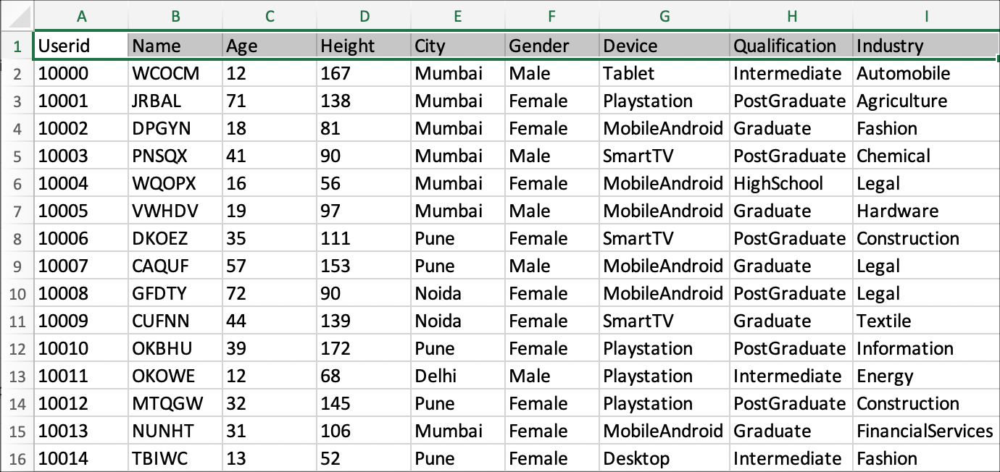
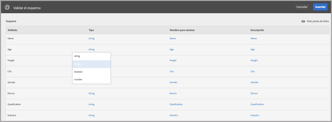
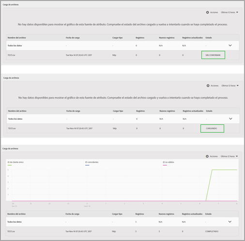

# Atributos del cliente{#customer-attributes}

Información sobre el uso de datos de clientes empresariales en una base de datos de administración de la relación con los clientes (CRM) para la segmentación de contenido en Adobe Target mediante el uso de Atributos del cliente en el servicio principal Perfiles y audiencias de Adobe.

Los datos de clientes empresariales obtenidos a través de múltiples fuentes y almacenados dentro de una base de datos CRM pueden usarse en [!DNL Target] para ofrecer de forma estratégica el contenido más relevante para los clientes, centrándose específicamente en los clientes que regresan. El servicio principal [!DNL People] (conocido anteriormente como Perfiles y audiencias) combina la recopilación y el análisis de datos con las pruebas y la optimización ofreciendo datos e información procesables.

## Información general sobre Atributos del cliente {#section_B4099971FA4B48598294C56EAE86B45A}

El servicio principal Personas es parte de [!DNL Adobe Experience Cloud] y proporciona a las empresas una herramienta para trasladar los datos de sus clientes a la plataforma [!DNL Experience Cloud]. Los datos introducidos en [!DNL Experience Cloud] están disponibles para todos los flujos de trabajo de [!DNL Experience Cloud]. [!DNL Adobe Target] utiliza estos datos para segmentar a los clientes que regresan en función de los atributos. [!DNL Adobe Analytics] consume estos atributos, que pueden entonces utilizarse para el análisis y la segmentación.


Tenga en cuenta lo siguiente al trabajar con Atributos del cliente y Target:

* Deben cumplirse algunos requisitos antes de poder usar la función [!UICONTROL Atributos del cliente] en el servicio principal [!DNL People]. For more information, see "Prerequisites for Uploading Customer Attributes" in [Customer attributes](https://docs.adobe.com/content/help/en/core-services/interface/customer-attributes/attributes.html) in the *Core Services User Guide*. Tenga en cuenta que se requiere [!DNL at.js] (cualquier versión) o [!DNL mbox.js] versión 58 o posterior.
* Adobe no garantiza que el 100 % de los datos de los atributos del cliente (perfil del visitante) procedentes de bases de datos CRM se introduzca en Experience Cloud y que, por tanto, vaya a estar disponible para la segmentación en Target. En el diseño actual, existe la posibilidad de que un pequeño porcentaje de datos se quede sin introducir.
* La duración de los datos de atributos del cliente importados de Experience Cloud a Target depende de la duración del perfil del visitante, que de forma predeterminada es de 14 días. Para obtener más información, consulte  [Duración del perfil del visitante](../../c-target/c-visitor-profile/visitor-profile-lifetime.md#concept_D9F21B416F1F49159F03036BA2DD54FD).
* Si los parámetros `vst.*` son los únicos que identifican al usuario, el perfil “autenticado” existente no se recuperará mientras `authState` no esté autenticado (0). El perfil solo entrará en juego si `authState` se cambia a UNAUTHENTICATED (1).

   Por ejemplo, si el parámetro `vst.myDataSource.id` se utiliza para identificar al usuario (donde `myDataSource` es el alias del origen de datos) y no hay ningún MCID ni ID de terceros, al utilizar el parámetro `vst.myDataSource.authState=0`, no se recuperará el perfil que se podría haber creado mediante una importación de Atributo de cliente. Si el comportamiento deseado pasa por recuperar el perfil autenticado, `vst.myDataSource.authState` debe tener el valor de 1 (AUTHENTICATED).

* No se pueden enviar los siguientes caracteres en `mbox3rdPartyID`: signo más (+) y barra diagonal (/).

## Flujo de trabajo de Atributos del cliente para Target {#section_00DAE94DA9BA41398B6FD170BC7D38A3}

Complete los siguientes pasos para usar datos CRM en [!DNL Target], como se muestra abajo:


Detailed instructions for completing each of the following tasks can be found in [Create a customer attribute source and upload the data file](https://docs.adobe.com/content/help/en/core-services/interface/customer-attributes/t-crs-usecase.html) in the *Core Services User Guide*.

1. Cree un archivo de datos.

   Exporte datos de los clientes desde la CRM al formato CSV para crear un archivo [!DNL .csv]. También puede crear un archivo zip o gzip para su carga. Asegúrese de que la primera fila del archivo CSV es el encabezado y de que todas las filas (datos de los clientes) tengan el mismo número de entradas.

   

   

1. Cree un origen de atributos y cargar el archivo de datos.

   Especifique un nombre y descripción de la fuente de datos y el ID de alias. El ID de alias es un ID exclusivo que se usa en el código Atributo del cliente en VisitorAPI.js.

   >[!IMPORTANT]
   >
   >El nombre de la fuente de datos y el nombre del atributo no pueden contener un punto.

   Puede cargarse archivos de datos de hasta 100 MB con el método HTTP. Los archivos mayores de 100 MB y hasta 4 GB pueden cargarse mediante FTP.

   * **HTTPS:** puede arrastrar y soltar el archivo de datos [!DNL .csv] o hacer clic en [!UICONTROL Examinar] para cargar desde su sistema de archivos.
   * **FTP:** haga clic en el vínculo FTP para [cargar un archivo mediante FTP](https://docs.adobe.com/content/help/en/core-services/interface/customer-attributes/t-upload-attributes-ftp.html). El primer paso es proporcionar una contraseña para el servidor FTP de Adobe. Introduzca la contraseña y, a continuación, haga clic en [!UICONTROL Hecho].

      Ahora, transfiera su archivo CSV/ZIP/GZIP al servidor FTP. Una vez completada la transferencia de archivos, cree un nuevo archivo con el mismo nombre y extensión [!DNL .fin]. Transfiera este archivo vacío al servidor. Esto indica un Fin de transferencia; Experience Cloud comienza a procesar el archivo de datos.

1. Valide el esquema.

   El proceso de validación le permite asignar nombres para mostrar y descripciones en atributos cargados (cadenas, números enteros, números y demás). Asigne cada atributo a su tipo de datos, su nombre en pantalla y su descripción.

   Haga clic en [!UICONTROL Guardar] cuando se complete la validación del esquema. El tiempo de carga del archivo varía en función del tamaño.

   

   

1. Configure suscripciones y activar el origen de atributos.

   Haga clic en **[!UICONTROL Agregar suscripción]** y, a continuación, seleccione la solución para suscribirse a estos atributos. [Configurar suscripciones](https://docs.adobe.com/content/help/en/core-services/interface/customer-attributes/subscription.html) configura el flujo de datos entre Experience Cloud y las soluciones. Activar el origen de atributos permite el flujo de datos a las soluciones suscritas. Los registros de cliente que ha cargado concuerdan con las señales de ID entrantes de su sitio web o aplicación.

   

   

   Mientras realiza este paso, tenga en cuenta las siguientes limitaciones:

   * El tamaño máximo de archivo para cada carga con el método HTTP es de 100 MB.
   * El tamaño máximo de archivo para cada carga con el método FTP es de 4 GB.
   * Número de atributos a los que puede suscribirse: 5 de [!DNL Target Standard] y 200 de [!DNL Target Premium].

## Uso de atributos del cliente en Target {#section_107E3A0F0EC7478E82E6DBD17B30B756}

Puede utilizar los atributos del cliente en [!DNL Target] de los siguientes modos:

### Creación de audiencias de segmentación

En [!DNL Target], puede seleccionar un atributo del cliente en la sección Perfil del visitante cuando cree una audiencia. Todos los atributos del cliente tienen el prefijo &lt;data_source_name&gt; en la lista. Combine estos atributos según sea necesario con otros atributos de datos para crear audiencias.


### Creación de scripts de perfil mediante tokens

Se puede hacer referencia a los atributos del cliente en las secuencias de comandos de perfil con el formato `crs.get('<Datasource Name>.<Attribute name>')`.

Este script de perfil puede usarse directamente en ofertas para enviar atributos que pertenecen al visitante actual.

### Uso de mbox3rdPartyID en su sitio web para una correcta implementación y utilización

Pase mbox3rdPartyId como parámetro al mbox global dentro del método `targetPageParams()`. El valor de mbox3rdPartyId debe establecerse en el ID del cliente presente en el archivo de datos CSV.

```
<script type="text/javascript">
            function targetPageParams() {
               return 'mbox3rdPartyId=2000578';
            }
</script>
```

### Uso del servicio Experience Cloud ID.

Si está utilizando el servicio de Experience Cloud ID, necesita establecer un ID de cliente y un estado de autenticación para poder usar atributos del cliente en la segmentación. For more information, see [Customer IDs and Authentication State](https://docs.adobe.com/content/help/en/id-service/using/reference/authenticated-state.html) in the *Experience Cloud Identity Service Help*.

Para obtener más información sobre el uso de atributos del cliente en [!DNL Target], consulte los siguientes recursos:

* [Crear un origen de atributos de cliente y cargar el archivo](https://docs.adobe.com/content/help/en/core-services/interface/customer-attributes/t-crs-usecase.html) de datos en la Guía del usuario de servicios *principales*
* [Atributos del cliente: cuanto más sabe, mejor se relaciona](https://blogs.adobe.com/digitalmarketing/analytics/customer-attributes-know-better-connect/) en el *blog Digital Marketing*

## Problemas que los clientes encuentran con frecuencia {#section_BE0F70E563F64294B17087DE2BC1E74C}

Podría encontrar los siguientes problemas al trabajar con atributos del cliente y [!DNL Target]:

| Problema | Detalles |
|--- |--- |
| Los atributos del cliente se eliminan porque el perfil es demasiado grande | No hay límite de caracteres para un campo particular en el perfil del usuario, pero si el perfil supera los 64 K, se trunca eliminando los atributos más antiguos hasta que vuelve a quedar por debajo de los 64 K. |
| Los atributos no aparecen en la biblioteca de audiencias de [!DNL Target], ni siquiera después de varios días | Suele deberse a un problema de conexión de Pipeline. Como solución, pida a su equipo de Atributos del cliente que vuelva a publicar la fuente. |
| La entrega no funciona basada en el atributo | El perfil todavía no se ha actualizado en el perímetro. Como solución, pida a su equipo de Atributos del cliente que vuelva a publicar la fuente. |
| Problemas de implementación | Tenga en cuenta los siguientes problemas de implementación:<ul><li>El ID de visitante no se pasó correctamente. El ID se pasó en mboxMCGVID en vez de `setCustomerId`.</li><li>El ID de visitante se pasó correctamente, pero el estado de AUTENTICACIÓN no se estableció en Autenticado.</li><li>`mbox3rdPartyId` no se pasó correctamente.</li> |
| `mboxUpdate` no se realizó correctamente. | mboxUpdate no se realizó correctamente con `mbox3rdPartyId`. |
| Los atributos de cliente no se importan en Target. | Si no encuentra los datos de Atributos del cliente en Target, asegúrese de que la importación se produjo en los últimos x días, donde x es el valor de [Duración del perfil del visitante](/help/c-target/c-visitor-profile/visitor-profile-lifetime.md) de Target (14 días de forma predeterminada). |

Los problemas de las filas 1 y 2 suponen aproximadamente el 60 % del total en esta área. La fila 3 supone aproximadamente el 30 % de los problemas. El problema en la fila 4 supone aproximadamente el 5 % del total. El 5 % restante corresponde a otros problemas diversos.

## Vídeo de formación: Carga de datos sin conexión mediante atributos del cliente {#section_9A4E0FA0D0934D06BD8D5BFA673E9BD8}

Este vídeo muestra cómo se importan sin conexión datos de CRM, centro de atención, punto de venta y otros datos de marketing al servicio Experience Cloud People, y cómo dichos datos se asocian a los visitantes por medio de sus ID conocidos.

>[!VIDEO](https://video.tv.adobe.com/v/17802t1/?captions=spa)
