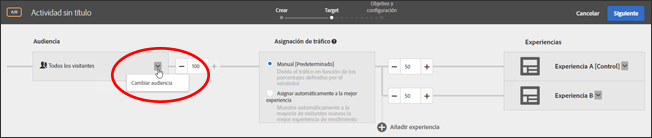
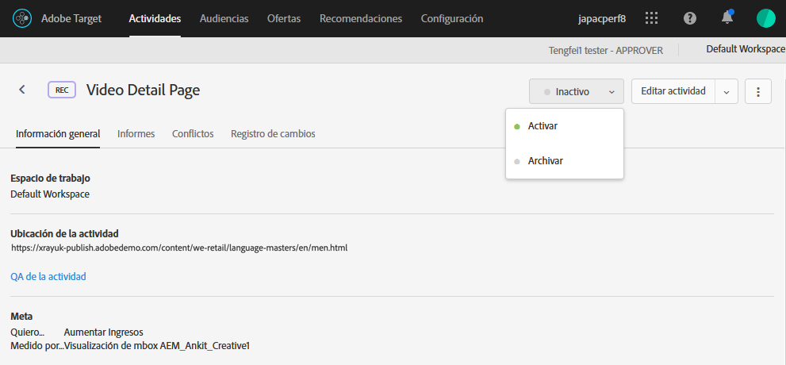

# Crear una audiencia solo de actividad{#create-an-activity-only-audience}

Cree audiencias solo de actividad dentro del flujo de trabajo guiado de tres pasos para la creación de una actividad. Estas audiencias ad-hoc pueden usarse en otros lugares dentro de la misma actividad, pero no se almacenan en la [!UICONTROL Biblioteca de audiencias] para su uso en otras actividades.

Las audiencias solo de actividad proporcionan las siguientes ventajas:

* Puede utilizar audiencias solo de actividad para crear una audiencia que quiera usar una única vez y que no desee almacenar en la [!UICONTROL Biblioteca de audiencias]. Así se evita que la [!UICONTROL Biblioteca de audiencias] se llene de elementos que no va a volver a utilizar.
* Las audiencias solo de actividad no pueden verse en la [!UICONTROL Biblioteca de audiencias]. Por ello quedan resguardadas de cualquier cambio no deseado por parte de otros usuarios de la organización.

1. Al crear una [actividad](/help/c-activities/activities.md#concept_D317A95A1AB54674BA7AB65C7985BA03), en la página de **[!UICONTROL Target]**, haga clic en el icono Editar audiencia y, a continuación, en **[!UICONTROL Reemplazar audiencia]**.

   

1. En la página [!UICONTROL Elegir audiencia], haga clic en **[!UICONTROL Audiencia solo de actividad]**.

   

1. Haga clic en **[!UICONTROL Crear audiencia]**.
1. Escriba un nombre descriptivo para la audiencia.
1. Haga clic en **[!UICONTROL + Agregar regla]**.

   Las reglas permiten limitar la audiencia a un subconjunto de los visitantes del sitio.

1. Seleccione un tipo de regla.

   Cada tipo de regla tiene sus propios parámetros. Consulte [Categorías para audiencias](/help/c-target/c-audiences/c-target-rules/target-rules.md#concept_E3A77E42F1644503A829B5107B20880D) para obtener más información sobre cómo configurar cada tipo de regla de audiencia.

1. Defina los parámetros de la regla.
1. Haga clic en **[!UICONTROL Guardar]**.

## Consideraciones

Tenga en cuenta lo siguiente al trabajar con audiencias solo de actividad:

* Puede crear audiencias solo de actividad en el Compositor de experiencias visuales (VEC) o en el Compositor de experiencias basadas en formularios. Esta funcionalidad reemplaza las reglas de refinamiento de versiones anteriores de Target.
* Puede crear una actividad para almacenarla en la [!UICONTROL Biblioteca de audiencias] y reutilizarla en otras actividades, o crear una audiencia solo de actividad. Después de guardar la audiencia, no puede cambiar su tipo.
* Los refinamientos de actividades existentes se migran a audiencias solo de actividad.
* Las audiencias solo de actividad tienen un estado de [!UICONTROL Utilizada] o [!UICONTROL No utilizada]. Las audiencias solo de actividad no utilizadas se muestran hasta que la actividad se guarda. Si se dejan sin utilizar e intenta guardarlas, se muestra un mensaje de advertencia que indica que las audiencias solo de actividad no utilizadas se eliminarán.
* Puede ver los detalles de definición de una audiencia en forma de tarjeta emergente a la que se accede desde el selector de audiencias, sin necesidad de abrir la audiencia.
* Puede [combinar varias audiencias](/help/c-target/combining-multiple-audiences.md#concept_A7386F1EA4394BD2AB72399C225981E5) para crear audiencias solo de actividad.

