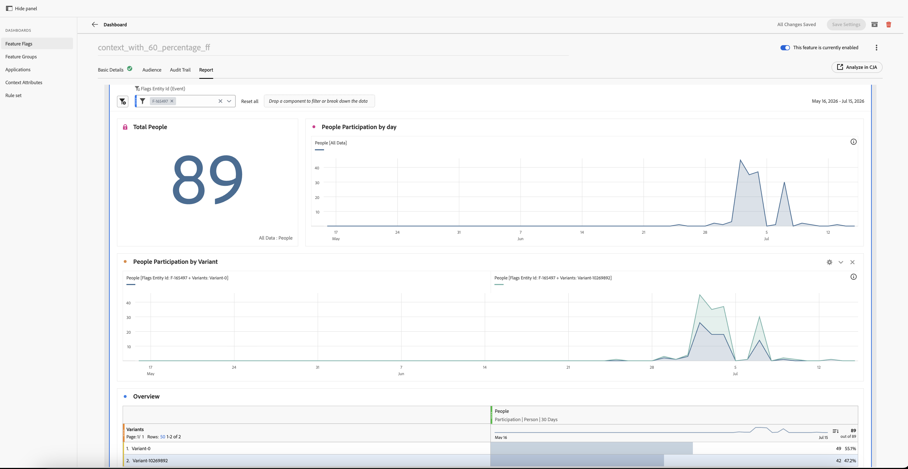

# Creación de informes {#reporting}

Marcas entrega informes a través de **Customer Journey Analytics (CJA)**. Hay una ficha **Informe** disponible en cada indicador de características y página de detalles de grupo de características. Permite ver un informe de CJA con un ámbito de ese indicador o grupo específico, incrustado directamente en la página.

>[!NOTE]
>
>Los informes se abren con una ventana de informes de **30 días** de manera predeterminada. Puede ajustar el intervalo desde el encabezado del panel.

## Requisitos previos {#prerequisites}

Antes de poder ver los informes, asegúrese de lo siguiente:

1. Los informes están configurados para su aplicación. Consulte [Configuración de CJA para informes de indicadores de características](set-up-cja-reporting.md).
1. El indicador o grupo de características está activo y tiene datos acumulados.

## Ver un informe {#view-report}

### Abra la pestaña Informe y elija una vista de datos {#open-report-tab}

1. Abra un indicador o un grupo de características y seleccione la ficha **Informe**.
1. Se abre el cuadro de diálogo **Seleccionar vista de datos**, que enumera las vistas de datos de CJA disponibles para usted. La primera está seleccionada de forma predeterminada.
1. Elija la vista de datos que desee y seleccione **Ver informe**. Seleccione **Cancelar** para cerrar el cuadro de diálogo sin cargar un informe.
1. El informe se carga dentro de la pestaña, con un ámbito de ese indicador o ID de entidad del grupo.

>[!NOTE]
>
>El cuadro de diálogo solo enumera las vistas de datos a las que tiene acceso en la zona protegida actual. Si no hay ninguno disponible, el cuadro de diálogo mostrará un mensaje y **Ver informe** permanecerá deshabilitado. Compruebe los permisos de vista de datos o cambie de zona protegida.

### Ver el informe de rendimiento {#view-performance-report}

Se muestra el panel **Información general de indicadores** incrustado:

* **Total de personas**, **Participación de personas por día** y **Participación de personas por variante** (grupo de control frente a ID de variante)
* Una tabla **Información general** que enumera cada variante con su porcentaje de personas y participación

Ajuste el intervalo de fechas del encabezado del panel para volver a trazar para una ventana diferente (valor predeterminado 30 días).

### Explorar resultados de experimentación {#explore-experimentation-results}

1. En el panel **Experimentación**, el **Experimento** (indicador o identificador de entidad de grupo) y la **variante de control** están preseleccionados.
1. Agregue una **métrica de éxito** mediante **Agregar métrica** y elija una **métrica de normalización** (valor predeterminado **Personas**) basada en el gráfico que desee trazar.
1. Habilite **Incluir límites superior/inferior de confianza**.
1. Seleccione **Generar** para calcular **Alza**, **Confianza** y **Tasa de conversión** por variante para la métrica seleccionada.

Consulte la [documentación del panel Experimentación](https://experienceleague.adobe.com/es/docs/analytics-platform/using/cja-workspace/panels/experimentation) para obtener más información sobre cómo se calculan estas métricas.

## Consulte también {#see-also}

* [Configuración de CJA para informes de indicadores de funcionalidades](set-up-cja-reporting.md)
* [Creación de la primera marca de funcionalidad](create-your-first-feature-flag.md)
* [Pruebas A/B con indicadores de funcionalidades](a-b-testing.md)
* [Creación de un grupo de funciones](create-a-feature-group.md)

<!-- -->
