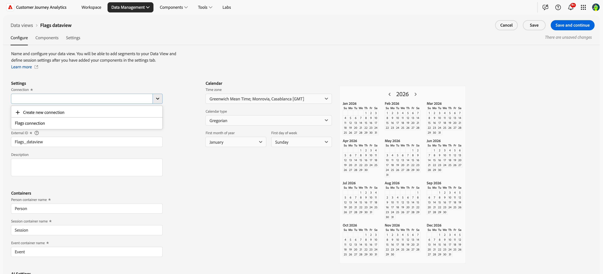

# Configuración de CJA para informes de indicadores de funcionalidades {#set-up-cja-reporting}

La integración entre Banderas y Adobe Customer Journey Analytics (CJA) permite medir de forma unificada el impacto comercial de las variantes de indicadores de funcionalidades. Aplique métricas de éxito de CJA a los informes de marcas en cualquier momento y aproveche las funciones de Customer Journey Analytics, como [Panel de experimentación](https://experienceleague.adobe.com/en/docs/analytics-platform/using/cja-workspace/panels/experimentation), para evaluar el rendimiento del experimento y comprender cómo influyen las variantes de las funciones en el comportamiento de los clientes.

## Consideraciones {#considerations}

Tenga en cuenta la siguiente información antes de utilizar la integración de Customer Journey Analytics y Banderas:

* Tanto usted como su organización deben tener acceso a Adobe Customer Journey Analytics (CJA).
* El **conjunto de datos de evento de decisión de AJO ExD** debe aprovisionarse en la zona protegida para los eventos de exposición de marcas.
* Debe estar disponible un conjunto de datos que contenga los eventos de conversión de éxito que desee utilizar como métricas de éxito.

## Configuración de una secuencia de datos {#set-up-datastream}

>[!NOTE]
>
>Esta guía utiliza un conjunto de datos de evento de Commerce Experience y `commerce.purchases.value` solo como ejemplos. Seleccione el esquema y el campo de métrica de éxito asignado adecuado para su caso de uso.

1. En Recopilación de datos, vaya a **Datastreams** y cree o abra la secuencia de datos de exposición de indicadores.
1. Establezca su esquema de asignación en **Esquema de evento de decisión de AJO ExD**.
1. Abra la secuencia de datos y seleccione **Agregar servicio**.
1. Seleccione el **conjunto de datos de evento de decisión de AJO ExD** existente como el conjunto de datos de evento y guarde.

>[!NOTE]
>
>El ID de la secuencia de datos que acaba de crear se utiliza para configurar la extensión Flags en las etiquetas de recopilación de datos.

## Configuración de una conexión de Customer Journey Analytics {#set-up-connection}

Si ya tiene una conexión configurada, puede utilizar la conexión existente y pasar al paso 3 a continuación. La conexión permite a Customer Journey Analytics empezar a extraer datos del conjunto de datos para la creación de informes.

1. En Customer Journey Analytics, en la página **Conexiones**, seleccione **Crear una nueva conexión**.
1. Configura tu [conexión y configuración de datos](https://experienceleague.adobe.com/en/docs/analytics-platform/using/cja-connections/overview) con la información correcta.
1. Añada el conjunto de datos de evento ExD que utilizó al configurar su secuencia de datos.
1. Agregue el conjunto de datos que desea usar como eventos de conversión y, a continuación, seleccione **Siguiente**.
1. Configure las [configuraciones para cada uno de los conjuntos de datos seleccionados](https://experienceleague.adobe.com/en/docs/analytics-platform/using/cja-connections/create-connection#dataset-settings), uno por uno, en el cuadro de diálogo **Agregar conjuntos de datos**.

## Configuración de la vista de datos {#set-up-data-view}

Configure una vista de datos en Customer Journey Analytics. Las vistas de datos garantizan que los datos de la conexión se puedan utilizar correctamente.

1. Configure la vista de datos y asegúrese de que apunta a la conexión creada anteriormente. Para obtener más información, consulte [Crear o editar una vista de datos](https://experienceleague.adobe.com/en/docs/analytics-platform/using/cja-dataviews/create-dataview) en la *Guía de Adobe Customer Journey Analytics*.
1. Vaya a **Administración de datos** > **Vistas de datos**.
1. Seleccione **Crear nueva vista de datos** y elija los indicadores de conexión de CJA.
1. Introduzca un nombre de vista de datos e ID externo estable.
1. Confirme la configuración del calendario y la zona horaria y, a continuación, continúe con **Componentes**.

### Configuración del experimento y las dimensiones de variante {#configure-experiment-variant-dimensions}

1. Agregue `_experience.decisioning.propositions.scopeDetails.activity.id` (asignado a **Indica el ID de entidad**) a las dimensiones y renómbrelo a &quot;Indica el ID de entidad&quot; u otro nombre descriptivo para el analista.
1. Establezca su etiqueta de contexto en Experimento de experimentación.
1. Agregar `_experience.decisioning.propositions.scopeDetails.experience.id` (asignado a una variante de indicadores de características o grupo de características) a las dimensiones.
1. Establezca su etiqueta de contexto en &quot;Variante de experimento&quot;.

>[!WARNING]
>
>Sin ambas etiquetas de contexto de experimentación, el panel Experimentación con CJA no puede identificar indicadores, experimentos y variantes.

### Configuración de la persistencia y la atribución {#configure-persistence-attribution}

Configure las dimensiones y métricas para que una exposición pueda recibir crédito por una conversión posterior. Sin la persistencia o la atribución adecuadas, CJA solo puede asociar resultados que se produzcan en el mismo evento que la exposición.

1. Agregue el campo de conversión requerido, como `commerce.purchases.value`, en Métricas.
1. Asigne un nombre claro a la métrica, como **Valor de compras**.
1. Habilite la atribución y seleccione el modelo requerido por el análisis: Último contacto, Primer contacto, Participación o Mismo contacto. Consulte [Componentes de atribución](https://experienceleague.adobe.com/en/docs/analytics-platform/using/cja-workspace/attribution/models) para obtener más información sobre modelos de atribución, contenedores y ventanas retroactivas.
1. Seleccione un contenedor y una ventana retrospectiva que coincidan con la estrategia del experimento. Un contenedor de persona con una retrospectiva según la visita o la sesión es un punto de partida común, pero confírmelo para su caso de uso.
1. Guarde la vista de datos.

## Consulte también {#see-also}

* [Informes](reporting.md)

<!-- -->
