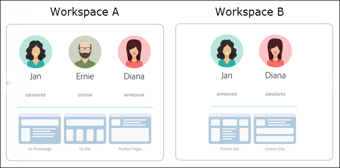
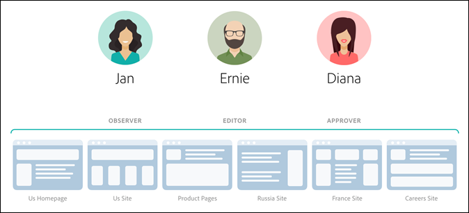

#  Permisos de usuario de Enterprise

Los permisos de usuario de Enterprise son un medio para administrar formalmente el acceso de los usuarios de toda la empresa a [!DNL Adobe Target]. Agregar usuarios a [!DNL Target], asigne permisos según sus funciones y cree espacios de trabajo para equipos en función de diferentes departamentos, ubicaciones globales, canales y otras agrupaciones lógicas. Puede asignar a los usuarios las funciones de [!UICONTROL Observador], [!UICONTROL Editor]o [!UICONTROL Aprobador].

## Determinar si tiene acceso a permisos de usuario de enterprise

>[!NOTE]
>
>La funcionalidad Propiedades y Permisos está disponible como parte de la [!DNL Target] solución Premium. No están disponibles en [!DNL Target] Standard sin una licencia de [!DNL Target] Premium.
>
>Su [!DNL Target] la implementación puede utilizar cualquier versión de at.js.

Puede comprobar si su organización dispone de una licencia Standard o Premium haciendo clic en el vínculo [!UICONTROL Administración] en la parte superior de la interfaz de usuario de [!DNL Target].

* Clientes de **[!DNL Target Standard]**: Si ve la pestaña [!UICONTROL Usuarios] ([!UICONTROL Administración > Usuarios]) (y no la pestaña [!UICONTROL Propiedades]), su organización tiene una licencia de [!DNL Target Standard]  Los clientes de [!DNL Target Standard] deben seguir las instrucciones de [Usuarios](/help/main/administrating-target/c-user-management/c-user-management/user-management.md) para agregar usuarios y asignar permisos en [!DNL Adobe Admin Console].

* **[!DNL Target Premium]Clientes**: Si ve la variable [!UICONTROL Propiedades] pestaña ([!UICONTROL Administración > Propiedades]) y [!UICONTROL Usuarios] , su organización tiene un [!DNL Target Premium] licencia. Los clientes de [!DNL Target Premium] deben seguir las instrucciones de este artículo y de [Configurar los permisos de Enterprise](/help/main/administrating-target/c-user-management/property-channel/properties-overview.md).

## Antes de empezar a usar los permisos de Enterprise

>[!IMPORTANT]
>
>Asegúrese de leer el [Advertencias](/help/main/administrating-target/c-user-management/property-channel/property-channel.md#section_9714311B1CD9497A86F4910F8AE635E2) antes de continuar con los permisos de Enterprise.

## Términos y definiciones utilizados en esta sección {#section_F8D229544FEA41C3BC2EFD1F95AA0116}

En esta sección se usan los términos siguientes, que pueden ser nuevos para los usuarios que quieran usar la funcionalidad Propiedades y Permisos de [!DNL Target] Premium.

### Propiedad

Las propiedades son similares en naturaleza a las propiedades de [!DNL Adobe Experience Platform] en que utilizan un único fragmento de código para diferenciarlos.

Una propiedad web es una biblioteca de reglas y un código incrustado. Una propiedad web puede ser cualquier conjunto de uno o varios dominios y subdominios.

Las propiedades se habilitan agregando un par nombre/valor específico como un parámetro con cualquier llamada (llamada de Target, llamada de api, etc.) a [!DNL Target].

Las propiedades pertenecen a canales específicos (web, móvil, correo electrónico o API/otros).

### Espacio de trabajo (perfil de producto)

Un espacio de trabajo permite que una organización asigne un conjunto de usuarios específico a un conjunto de propiedades concretas. En muchos aspectos, un espacio de trabajo es parecido a un grupo de informes en [!DNL Adobe Analytics].

Nota: Los espacios de trabajo se conocen como [!UICONTROL Perfiles de producto] en el [!DNL Adobe Admin Console for Enterprise].

Si forma parte de una organización multinacional, puede tener un espacio de trabajo para sus páginas web, propiedades o sitios europeos y otro para sus páginas web, propiedades o sitios estadounidenses. Si forma parte de una organización de varias marcas, puede contar con un espacio de trabajo independiente para cada una.

Los usuarios pueden formar parte de varios espacios de trabajo y pueden incluso tener diferentes roles en cada uno de ellos.

Los usuarios pueden tener diferentes vistas de [!DNL Adobe Target] al moverse entre espacios de trabajo, de forma similar a como [!DNL Analytics] los usuarios tienen diferentes vistas de [!DNL Analytics] al moverse entre grupos de informes.

Los espacios de trabajo pueden incluir audiencias, ofertas de código y actividades totalmente distintas.

Todas las audiencias y actividades creadas antes de la migración al modelo de permisos de Enterprise se agrupan en el &quot;espacio de trabajo predeterminado&quot; que se trata a continuación.

Todas las actividades creadas mediante [!DNL Adobe Experience Manager] AEM) [!DNL Adobe Mobile Services]y [!DNL Adobe Target Classic] forman parte del espacio de trabajo predeterminado.

### Espacio de trabajo predeterminado

Todos los espacios de trabajo existentes (perfiles de producto) dentro de [!DNL Admin Console] se combinan en un único espacio de trabajo denominado &quot;espacio de trabajo predeterminado&quot; durante la migración de su organización al nuevo modelo de permisos de Enterprise.

>[!IMPORTANT]
>
>No elimine el espacio de trabajo predeterminado.

Todas las funciones de usuario y acceso a todas las [!DNL Target] sigue siendo la misma que antes de la migración al nuevo modelo de permisos de Enterprise.

### Grupos de usuarios

Puede crear grupos de usuarios, como Desarrolladores, Analistas, Especialistas en marketing, Ejecutivos, etc. A continuación, puede asignar privilegios en varios productos de Adobe y espacios de trabajo. Asignar todos los privilegios apropiados en diferentes productos de Adobe a un nuevo miembro del equipo puede ser tan fácil como añadirlos a un grupo de usuarios específico.

### Roles y permisos

Las funciones y los permisos determinan los niveles de acceso que tienen los usuarios para crear y administrar actividades en su implementación de [!DNL Target]. En [!DNL Target] existen las funciones siguientes:

| Función | Descripción |
|--- |--- |
| Aprobador | Puede crear, editar y activar o detener actividades. |
| Editor | puede crear y editar actividades antes de que estén activas, pero no puede aprobar el lanzamiento de una actividad. |
| Observador | Puede ver actividades, pero no puede crearlas o editarlas. |
| Editor | Similar a la función Observador (puede ver actividades, pero no puede crearlas o editarlas). Sin embargo, la función Publicador tiene el permiso adicional de activar actividades. |

### Canal

El canal se refiere al tipo de contenido desde donde se suministran sus actividades de [!DNL Target]: páginas web, aplicaciones móviles, mensajes de correo electrónico, etc.

Cuando crea una actividad, esta se crea en el espacio de trabajo seleccionado actualmente. Verá las opciones de selección de canal en el primer cuadro de diálogo que le permite elegir el canal deseado para la actividad: Web, aplicación móvil, correo electrónico u otro/API.

## Información general sobre permisos {#section_DC2172520DA84605B218A5E9FB6D187A}

En esta sección explicamos cómo se aplicaban antes los permisos en [!DNL Target] y cómo se aplican usando la funcionalidad [!UICONTROL Propiedades] y [!UICONTROL permisos].

El nuevo [!UICONTROL Permisos] permite crear diferentes proyectos (llamados &quot;perfiles de producto&quot; en la variable [!DNL Adobe Admin Console for Enterprise]). Los proyectos permiten asignar a un único usuario diferentes permisos que dictan sus derechos de acceso a cada proyecto. Estos proyectos independientes pueden compararse con el modo en el que funcionan los grupos de informes en [!DNL Adobe Analytics]. Cada proyecto tiene usuarios específicos con funciones específicas que se aplican a un conjunto de propiedades. El resultado es que los clientes pueden restringir el acceso de visualización, edición y aprobación a sus usuarios en función de la región, el entorno (dev/stage/prod), el canal u otros criterios personalizados, como se muestra a continuación:

Por ejemplo, un usuario determinado puede tener el acceso de aprobación en los sitios web de América, pero solo el acceso de visualización en la aplicación móvil europea. Ese mismo usuario puede no tener acceso ni siquiera a la visualización de las actividades ofrecidas en propiedades web y móviles en la región Asia-Pacífico.

El modelo actual de [!DNL Target] [!UICONTROL Permisos] de tiene tres funciones de permiso (Observador, Editor y Aprobador), como se muestra en la siguiente ilustración:

Cada función tiene diferentes niveles de permisos:

| Función | Descripción |
|--- |--- |
| Aprobador | Puede crear, editar y activar o detener actividades. |
| Editor | puede crear y editar actividades antes de que estén activas, pero no puede aprobar el lanzamiento de una actividad. |
| Observador | Puede ver actividades, pero no puede crearlas o editarlas. |
| Editor | Similar a la función Observador (puede ver actividades, pero no puede crearlas o editarlas). Sin embargo, la función Publicador tiene el permiso adicional de activar actividades. |

Es importante tener en cuenta que la función de cada usuario se aplica a cada página, propiedad o sitio de su cuenta que incluya etiquetas de [!DNL Target] como se muestra a continuación:

El nuevo modelo de [!DNL Target] [!UICONTROL Permisos] de tiene las mismas funciones de permiso (Observador, Editor y Aprobador); sin embargo, estas funciones se pueden asignar a cada usuario por separado para páginas, propiedades o sitios concretos, como se muestra a continuación:

En este ejemplo, Jan tiene permisos de aprobador en la página principal y el sitio de EE. UU. y permisos de observador en el sitio de Francia.

Además, Jan no puede ver páginas, propiedades ni sitios en [!DNL Target] que no tiene permisos para ver, como se muestra a continuación:

En este ejemplo, Jan no ve las páginas de productos, el sitio de Rusia ni el sitio de ofertas de empleo.

## Casos de uso {#section_F3CE8576959E4F4CB13BEEED38311DD8}

En los siguientes casos de uso, trataremos de explicar cómo lograr los objetivos de marketing con ayuda de las propiedades, los proyectos y las funciones de [!DNL Target]:

### Organización multinacional

Si forma parte de una organización multinacional, puede tener un espacio de trabajo para sus páginas web, propiedades o sitios europeos y otro para sus páginas web, propiedades o sitios estadounidenses. 
Usando los personajes de las ilustraciones anteriores, tras una reorganización, podría configurar los espacios de trabajo y permisos de este modo:

* **Jan:** Jan es la jefa de optimización del Centro de excelencia para las páginas web, las propiedades y los sitios estadounidenses de la organización. Es muy probable que tenga derechos de administración del sistema en Adobe Experience Cloud.

   Con su función, tiene permisos de aprobación en la página principal y el sitio de EE. UU. Con los permisos de aprobación, puede crear, editar y activar o detener actividades.

   Jan también realiza consultas al equipo de optimización de Francia, por lo que tiene permisos de observación en el sitio francés que le otorgan acceso de solo lectura a las actividades. Jan puede ver actividades, pero no puede crearlas o editarlas.

   Como no tiene ninguna función que le exija ver las páginas de productos, el sitio de Rusia ni el sitio de ofertas de empleo, no ve las actividades relacionadas con estos sitios.

* **Ernie:** Ernie trabaja como administrador de marketing en la organización que se encarga del marketing de EE. UU.

   Como Ernie lleva poco tiempo en la organización y no tiene demasiada experiencia con Target, tiene permisos de edición en la página principal, el sitio de EE. UU. y las páginas de productos de EE. UU. Con los permisos de edición, Ernie puede crear y editar actividades antes de que estén activas. No puede aprobar el lanzamiento de una actividad: alguien con permisos de aprobación, como Jan, debe aprobar la actividad antes de que se pueda poner en producción.

   Como no tiene ninguna función que le exija ver el sitio de Rusia, el sitio de Francia ni el sitio de ofertas de empleo, no ve las actividades relacionadas con estos sitios.

* **Diana:** Diana trabaja como analista en la organización y se le han concedido permisos de observación en la página principal y el sitio de EE. UU., las páginas de productos, el sitio de Rusia y el sitio de Francia. Con estos permisos tiene acceso de solo lectura a las actividades. Diana puede ver actividades, pero no puede crearlas o editarlas.

   Como no tiene ninguna función que le exija ver el sitio de ofertas de empleo, no ve las actividades relacionadas con este sitio.

### Organización de varias marcas

Si forma parte de una organización de varias marcas, puede contar con un espacio de trabajo independiente para cada página web, propiedad o sitio de la marca.

Usando los personajes de las ilustraciones anteriores, tras una reorganización podría configurar los proyectos y permisos de este modo:

* **Jan:** Jan es la jefa de optimización del Centro de excelencia de una organización sanitaria que trabaja en el ámbito de productos para hospitales y consumidores. Es muy probable que tenga derechos de administración del sistema en Adobe Experience Cloud.

   Con su función, tiene permisos de aprobación en el sitio del hospital. Con los permisos de aprobación, puede crear, editar y activar o detener actividades.

   Jan también realiza consultas al equipo de optimización en el ámbito de productos para consumidores, por lo que tiene permisos de observación en el sitio correspondiente que le otorgan acceso de solo lectura a las actividades. Jan puede ver actividades, pero no puede crearlas o editarlas.

* **Ernie:** Ernie trabaja como administrador de marketing en la organización que se encarga del marketing en el ámbito de productos para consumidores.

   Como Ernie lleva poco tiempo en la organización y no tiene demasiada experiencia con Target, tiene permisos de edición en el sitio para consumidores. Con los permisos de edición, Ernie puede crear y editar actividades antes de que estén activas. No puede aprobar el lanzamiento de una actividad: alguien con permisos de aprobación para el sitio para consumidores, pero no Jan en este escenario, debe aprobar la actividad antes de que pueda entrar en producción.

   Como no tiene ninguna función que le exija ver el sitio del hospital, no ve las actividades relacionadas con estos sitios.

* **Diana:** Diana trabaja como analista en la organización y se le han concedido permisos de observación en el sitio del hospital y el sitio para consumidores. Con estos permisos tiene acceso de solo lectura a las actividades. Diana puede ver actividades, pero no puede crearlas o editarlas.

## Punto de contacto de propiedad y permisos de la interfaz de usuario de Target {#section_3414371393BB42999A268628B5456EC9}

La nueva funcionalidad Permisos puede verse en diferentes sitios de la interfaz de usuario de [!DNL Target].

* **Lista desplegable Espacio de trabajo (Perfil de producto):** la lista desplegable Espacio de trabajo se muestra en la parte superior de las páginas [!UICONTROL Actividades], [!UICONTROL Audiencias] y [!UICONTROL Ofertas]. Seleccione el espacio de trabajo deseado para filtrar la lista y mostrar únicamente los elementos de dicho espacio de trabajo.

   

* **Creación de actividades:** Cuando crea una actividad, esta se crea en el espacio de trabajo seleccionado actualmente. Verá las opciones de selección de canal en el primer cuadro de diálogo que le permite elegir el canal deseado para la actividad: Web, aplicación móvil, correo electrónico u otro/API.

   

* **Creación de audiencias:** Cuando crea una audiencia, esta se crea en el espacio de trabajo seleccionado actualmente.
* **Lista de audiencias:** Puede mover audiencias entre espacios de trabajo utilizando la variable [!UICONTROL Más acciones] > [!DNL Move] en la [!UICONTROL Audiencias] página.
* **Creación de ofertas:** Cuando crea una oferta, esta se crea en el espacio de trabajo seleccionado actualmente.
* **Página Propiedades (Administración > Propiedades):** Puede usar la variable [!UICONTROL Buscar] para buscar [!UICONTROL Propiedad] lista.

   

## Advertencias  {#section_9714311B1CD9497A86F4910F8AE635E2}

Tenga en cuenta lo siguiente al usar o configurar propiedades y permisos en [!DNL Target] Premium:

* **Importante**: No elimine espacios de trabajo con actividades. Si elimina un espacio de trabajo con actividades, trabaje con ClientCare para recuperar esas actividades.
* Al utilizar la vista Todos mis espacios de trabajo:

   * Puede ver las actividades, audiencias y ofertas de todos los espacios de trabajo para los que tenga el rol adecuado y permiso de acceso.
   * Al seleccionar la variable [!UICONTROL Todos mis espacios de trabajo] , se agrega una nueva columna a la página Actividades, Audiencias y Ofertas . En esta columna se muestra el espacio de trabajo del elemento y los permisos de usuario asociados a él (Observador, Editor o Aprobador).
   * Al crear una actividad, audiencia u oferta en la vista Todos mis espacios de trabajo, debe seleccionar el espacio de trabajo donde se creará el elemento. Solo podrá seleccionar los espacios de trabajo para los que disponga del permiso Editor o Aprobador.
   * Al copiar una actividad, audiencia u oferta en la vista Todos mis espacios de trabajo, debe seleccionar el espacio de trabajo donde se copiará el elemento. Solo podrá seleccionar los espacios de trabajo para los que disponga del permiso Editor o Aprobador.

* Cualquier configuración de la siguiente variable [!UICONTROL Administración] las páginas pueden ser controladas por cualquier [!UICONTROL Aprobador] en cualquier espacio de trabajo:

   * Compositor de experiencias visuales
   * Creación de informes
   * Configuración de Scene7
   * Implementación
   * Propiedades
   * Hosts
   * Entornos
   * Tokens de respuesta
   * Usuarios

* Los usuarios no pueden mover recursos de un espacio de trabajo (perfil de producto) a otro. Sin embargo, sí se permite la copia.
* Si visualiza las audiencias desde la página [!DNL Audiences], la página carga más lento de lo esperado. Si interactúa con la barra de búsqueda de cualquier forma, las audiencias se muestran más rápido. Este problema se conoce y se solucionará en una próxima actualización. Este problema no afecta a la selección de audiencias durante el flujo de trabajo de creación de actividades.
* Los siguientes recursos son parte del nuevo modelo de permisos de Enterprise:

   * Actividades, audiencias y ofertas de código creadas en [!DNL Target Standard/Premium] están disponibles para su uso una vez que el cliente esté habilitado para obtener permisos. (Nota: los clientes deben tener derecho a [!DNL Target Premium].)
   * Las propiedades se pueden agregar a actividades existentes en el espacio de trabajo predeterminado; sin embargo, este enfoque está sujeto a cambios.
   * Solo los nuevos recursos (como actividades, ofertas de código y audiencias) creados en Target Premium (una vez habilitados los permisos de Enterprise) se pueden restringir mediante permisos.
   * Los recursos externos solo están disponibles para los usuarios en el espacio de trabajo predeterminado. El rol de un usuario en el espacio de trabajo predeterminado se aplica globalmente (a todas las solicitudes y recursos de Target).

* Los siguientes recursos *no* son parte del nuevo modelo de permisos de Enterprise:

   * Ofertas de imágenes
   * Todos los recursos de Recommendations, incluidos la Biblioteca de criterios, Biblioteca de diseños, Catálogo, Configuración de Recommendations.
   * Los recursos existentes (como actividades, ofertas de código y audiencias) creados en Target Premium antes de habilitar los permisos de Enterprise se pueden copiar, pero no se pueden mover a otros espacios de trabajo.
   * Las actividades, audiencias, ofertas de código, ofertas de imágenes o cualquier otro recurso creado con las siguientes soluciones o métodos no se pueden controlar mediante el modelo de permisos de Enterprise, pero forman parte del espacio de trabajo predeterminado: Target Classic, Adobe Experience Manager (AEM), Adobe Mobile Services y recursos creados mediante API. Recursos creados mediante API (incluidas actividades, audiencias, ofertas de código y ofertas de imagen).
   * Ofertas de imágenes (recursos almacenados en `https://[tenantName].marketing.adobe.com/content/mac/[tenantName]/target/offers.html#image-library` no se puede controlar actualmente mediante el modelo de permisos de Enterprise.
   * clickTracking y las redirecciones funcionan cuando el vínculo de destino o la página de destino son parte de una propiedad incluida en la actividad. Además, es posible que clickTracking no funcione al usar la variable `targetPageParams()` función. La función recomendada es `targetPageParamsAll()`.

   [!DNL Target]Actualmente,  necesita que haya un token `at_property` en todas las páginas donde se lleve a cabo un seguimiento. Si el token (1) no está presente, (2) no se ha detectado en el momento de configurar la actividad (dentro del VEC) o (3) no se ha pasado a la llamada de destinatario clickTracking a través de la variable `targetPageParamsAll()` , la métrica no se incrementa y aparece como &quot;0&quot;.

   Lo mismo se aplica a las actividades que usan redirecciones. La página de destino debe tener un token `at_property` y se debe reconocer cuando se configura en el VEC.

   En una versión futura, Target funcionará en páginas donde no haya presente un token `at_property`, o donde exista un token `at_property` distinto.

* La funcionalidad Permisos de usuario de Enterprise no es compatible con [Llamadas de API de Adobe I/O](https://developer.adobe.com/target/){target=_blank}.

## Preguntas frecuentes {#faqs}

Las preguntas más frecuentes sobre permisos de Enterprise incluyen las siguientes:

### ¿Puedo trasladar una actividad de un espacio de trabajo a otro?

Por desgracia, las actividades no se pueden trasladar de un espacio de trabajo a otro. Sin embargo, puede copiar una actividad en cualquier espacio de trabajo sabiendo que los datos de los informes no se transmiten. Para obtener más información, consulte “Copiar/editar una actividad al utilizar espacios de trabajo” en [Copiar/Editar una actividad al usar espacios de trabajo.](/help/main/c-activities/edit-activity.md#section_45A92E1DD3934523B07E71EF90C4F8B6)

Las actividades creadas antes de la migración se siguen ejecutando del mismo modo en el espacio de trabajo predeterminado, a menos que se editen y se les asignen propiedades. Las actividades de un espacio de trabajo específico respetan las propiedades asignadas a ese espacio de trabajo y, por lo tanto, el comportamiento puede no ser el mismo que antes de la migración.

### ¿Puedo trasladar una audiencia de un espacio de trabajo a otro? {#move-audience}

Sí, puede mover audiencias entre espacios de trabajo utilizando la variable [!UICONTROL Más acciones] en la [!UICONTROL Audiencias] página.

1. Haga clic en el **[!UICONTROL Más acciones]** (los tres puntos suspensivos) y, a continuación, haga clic en **[!UICONTROL Mover]**.

   

1. Seleccione el espacio de trabajo deseado en el **[!UICONTROL Espacio de trabajo]** lista desplegable y haga clic en **[!UICONTROL Mover]**.

   

>[!NOTE]
>
>Debe tener los derechos adecuados para editar una audiencia. Además, la audiencia no debe utilizarse en otras actividades. Si la audiencia está siendo utilizada en otras actividades y todavía desea trasladarla a otro lugar de trabajo, elimine la audiencia de las otras actividades en las que se están utilizando.

### ¿Por qué aparece un mensaje de error que indica que no hay ninguna propiedad asociada con esta actividad, aunque haya una propiedad asignada?

Si ha implementado [!DNL Target] con etiquetas en [!DNL Adobe Experience Platform] y obtenga un mensaje de error que indique que no hay ninguna propiedad asociada con la actividad, pase el `at_property` con el parámetro `targetPageParams` función.

### ¿Se registran conversiones de rastreo de clics si una página redireccionada y la dirección URL de actividad pertenecen a propiedades diferentes?

El rastreo de clics no se registra en páginas en las que la URL de la página y de la actividad pertenecen a propiedades diferentes.

Imagine la siguiente situación:

* Página1 pertenece a Propiedad1.
* Página2 pertenece a Propiedad2.
* En la actividad, Página1 redirige a Página2, que contiene los rastreos de clics.

Cuando un visitante abre Página1 en un explorador, se redirige al visitante a Página2. Debido a que Página2 no cumple los requisitos para entregar la actividad, su llamada de Target no contiene rastreos de clics en su respuesta.

Si la página de redirección y la dirección URL de la actividad pertenecen a la misma propiedad, los rastreos de clics funcionan según lo esperado. Para obtener más información, consulte [Rastreo de clics](/help/main/c-activities/r-success-metrics/click-tracking.md).

## Vídeos de formación

Los siguientes vídeos contienen más información sobre los conceptos mencionados en este artículo.

### Vídeo de formación: Vídeo de capacitación sobre permisos de Enterprise 

Objetivos de aprendizaje:

* Los tres roles que pueden tener los usuarios de Adobe Target
* Los conceptos de propiedad y espacio de trabajo, y cómo operan estos límites y agrupamientos para permitir controlar el nivel de acceso de los usuarios
* Diferentes ejemplos de propiedades para la consideración de su organización

>[!VIDEO](https://video.tv.adobe.com/v/19042/)

### Horario de oficina: [!DNL Target] Espacios de trabajo Premium

Este vídeo es una grabación de “Horario de oficina”, una iniciativa dirigida por el equipo de atención al cliente de Adobe.

* Creación de un espacio de trabajo (perfil de producto)
* Creación de propiedades
* Adición de usuarios
* Actualización de la implementación

>[!NOTE]
>
>La interfaz del menú [!UICONTROL Administración] de [!DNL Target] (anteriormente [!UICONTROL Configuración]) se ha rediseñado para proporcionar un rendimiento mejorado, reducir el tiempo de mantenimiento necesario al lanzar nuevas funciones y mejorar la experiencia del usuario en todo el producto. La información contenida en el siguiente vídeo es correcta; sin embargo, las opciones pueden estar en ubicaciones ligeramente diferentes.

>[!VIDEO](https://video.tv.adobe.com/v/23643/)
