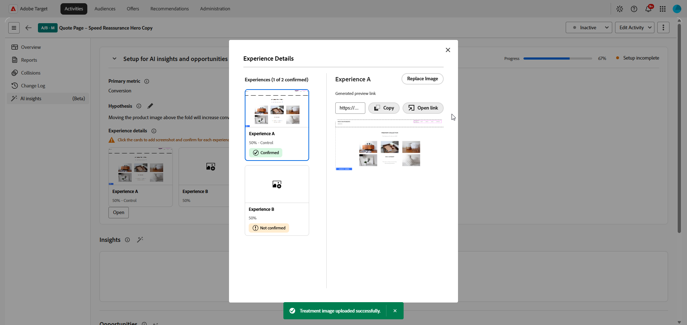

# Información de IA

>[!AVAILABILITY]
>
>Actualmente, la función de perspectivas de IA está disponible como función beta.
> 
>La sección **[!UICONTROL Información de IA]** solo está disponible para las actividades de **[!UICONTROL Prueba A/B]** con asignación de tráfico **[!UICONTROL Manual]**.

El menú **[!UICONTROL Información de IA]** de su **[!UICONTROL Información general de actividad]** le proporciona acceso a información y oportunidades de optimización. Utilice esta pestaña para revisar las lecciones aprendidas durante los experimentos, comparar tratamientos e identificar cambios que puedan mejorar las tasas de conversión.

## Configuración de las perspectivas y oportunidades de IA

>[!CONTEXTUALHELP]
>id="target_ai_insights"
>title="Perspectivas"
>abstract="Las perspectivas de experimento son las lecciones aprendidas por la IA cuando los datos del experimento han alcanzado una relevancia estadística."

>[!CONTEXTUALHELP]
>id="target_ai_insights_primary_metric"
>title="Métrica principal"
>abstract="La métrica principal se extrae automáticamente de la configuración de creación de informes. Para realizar cambios, modifique la métrica de objetivos en Objetivos y Configuración."

>[!CONTEXTUALHELP]
>id="target_ai_insights_hypothesis"
>title="Hipótesis"
>abstract="La hipótesis es una afirmación que usted define que explica el resultado esperado del experimento. Incluya una descripción de lo que se está cambiando y dónde. Posteriormente, indique qué métrica espera cambiar y cómo."

>[!CONTEXTUALHELP]
>id="target_ai_insights_treatment_details"
>title="Detalles de la experiencia"
>abstract="Los detalles de la experiencia muestran imágenes del aspecto de una experiencia cuando un usuario cumple los requisitos para ella. Puede revisar estas imágenes para todos los experimentos. Algunos experimentos pueden pedirle que confirme la imagen o que la sustituya si es necesario."

>[!CONTEXTUALHELP]
>id="target_ai_insights_primary_metric"
>title="Métrica principal"
>abstract="La métrica principal se extrae automáticamente de la configuración de creación de informes. Para realizar cambios, modifique la métrica de objetivos en Objetivos y Configuración."

>[!CONTEXTUALHELP]
>id="target_ai_insights_hypothesis"
>title="Hipótesis"
>abstract="La hipótesis es una afirmación que usted define que explica el resultado esperado del experimento. Incluya una descripción de lo que se está cambiando y dónde. Posteriormente, indique qué métrica espera cambiar y cómo."

>[!CONTEXTUALHELP]
>id="target_ai_insights_opportunities"
>title="Oportunidades"
>abstract="Las oportunidades de experimento son ideas de tratamiento sugeridas por la IA basadas en patrones de IA encontrados en las capturas de pantalla y resultados del experimento."

>[!CONTEXTUALHELP]
>id="target_ai_insights_treatment_details"
>title="Detalles del tratamiento"
>abstract="Los detalles del tratamiento muestran imágenes de cómo es un tratamiento cuando un usuario cumple sus requisitos. Puede revisar estas imágenes para todos los experimentos. Algunos experimentos pueden pedirle que confirme la imagen o que la sustituya si es necesario."

Antes de poder acceder a las perspectivas y oportunidades generadas por la IA, primero debe configurar su actividad confirmando la métrica, la hipótesis y las capturas de pantalla de experiencia principales.

La métrica principal se extrae automáticamente de la configuración de creación de informes y depende de cómo configure los Objetivos y la configuración. Debe crear la hipótesis en el panel de perspectivas de IA. [Más información](../c-activities/t-test-ab/t-test-create-ab/ab-goals-and-settings.md)

1. Abra su actividad en [!DNL Adobe Target].

1. Seleccione el menú **[!UICONTROL Información de IA]** para abrir el panel de configuración.

1. Haga clic en  para crear una hipótesis para su experimento.

   

1. Escriba su hipótesis describiendo los cambios realizados y cómo afectarán a la métrica principal.

   Haga clic en **[!UICONTROL Guardar]**.

1. En **[!UICONTROL Detalles de la experiencia]**, haga clic en una tarjeta para agregar una captura de pantalla para sus experiencias.

   >[!NOTE]
   >Es posible que algunas imágenes ya se hayan capturado automáticamente. Si es así, confirma la captura de pantalla haciendo clic en **[!UICONTROL Confirmar]**.

   

1. Seleccione **[!UICONTROL Cargar imagen]** para cargar una captura de pantalla preferida de los archivos locales para cada experiencia.

   

1. Copie el vínculo de vista previa o ábralo directamente para previsualizar la experiencia.

1. Una vez que cada experiencia tenga una captura de pantalla, revisa los detalles y haz clic en **[!UICONTROL Confirmar]** para completar la configuración.

Una vez completada la configuración, la actividad estará lista para generar oportunidades. Las perspectivas están disponibles después de que el experimento tenga datos suficientes para la validación estadística y de que se hayan confirmado los detalles necesarios del experimento.

## Perspectivas {#insights}

>[!CONTEXTUALHELP]
>id="target_ai_insights_insights"
>title="Perspectivas"
>abstract="Las perspectivas de experimento son las lecciones aprendidas por la IA cuando los datos del experimento han alcanzado una relevancia estadística."

Las perspectivas del experimento son aprendizajes generados por IA derivados de este experimento. Estas perspectivas están disponibles una vez que el experimento alcanza la relevancia estadística y proporcionan un contexto sobre lo que ha contribuido a su éxito. Resaltan los atributos clave presentes en la experiencia ganadora que son distintos del control y que probablemente influyeron en el resultado.

1. Haga clic en la tarjeta para acceder al menú **[!UICONTROL Perspectivas]**.

   

1. Examine sus perspectivas generadas por IA para revisar el aprendizaje del experimento y comparar la experiencia ganadora con el control.

   

1. En **[!UICONTROL ¿Qué hizo que esta experiencia ganara?]**, revise los detalles que explican por qué esta experiencia superó al control.

## Oportunidades

>[!CONTEXTUALHELP]
>id="target_ai_insights_opportunities"
>title="Oportunidades"
>abstract="Las oportunidades de experimento son ideas de experiencia sugeridas por IA basadas en patrones de IA encontrados en las capturas de pantalla y resultados de su experimento."

El panel **[!UICONTROL Oportunidades]** muestra recomendaciones generadas por IA diseñadas para mejorar el rendimiento de las pruebas y alinearse con objetivos y KPI empresariales más amplios.

1. Examine las oportunidades sugeridas y seleccione la que desee revisar.

   

1. Seleccione una oportunidad para abrir la ventana Detalles de la oportunidad, que describe una experiencia o variación específica. Esta vista incluye:

   * La imagen de la experiencia actual utilizada para generar la oportunidad.

   * Una hipótesis generada por IA que explica el resultado esperado de la experiencia sugerida y por qué puede mejorar el rendimiento.

   * Directrices sobre cómo implementar la recomendación en su experiencia y medir el efecto en la métrica seleccionada.

   

