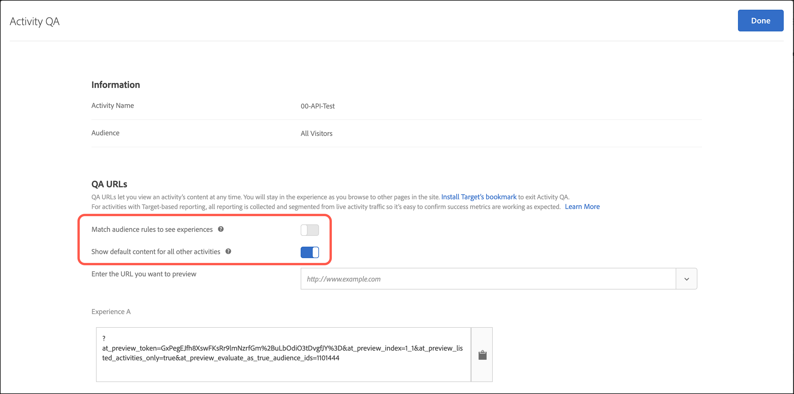

# Control de calidad de la actividad

Uso de URL de QA en [!DNL Adobe Target] para realizar sencillos controles de calidad de las actividades de extremo a extremo con vínculos de vista previa invariables, segmentar audiencias de manera opcional y crear informes de control de calidad que permanecen segmentados a partir de datos de actividades activas.

[!UICONTROL Control de calidad de actividad] le permite probar completamente su [!DNL Target] antes de lanzarlas en directo. El [!UICONTROL Control de calidad de actividad] La funcionalidad incluye:

* Vínculos que nunca cambian ni requieren regeneración, independientemente de las actualizaciones realizadas en las experiencias o actividades, para compartir con los integrantes del equipo. Esta función le permite probar todas las actividades en todo el recorrido del usuario.
* Respeto opcional a las condiciones a audiencia, de forma que los expertos en marketing puedan probar o ignorar criterios de segmentación con el fin de evaluar el aspecto de las experiencias sin necesidad de cumplir sus condiciones de audiencia.
* La realización de informes de control de calidad se captura; de este modo, los expertos en marketing pueden confirmar si las métricas aumentan del modo esperado y es posible mantener los datos de informes de control de calidad separados de los informes de producción (para la creación de informes ajenos a A4T).
* La capacidad de previsualizar una experiencia de forma aislada o con otras actividades activas que cumplan los criterios de entrega (página/[!DNL Target] solicitud/audiencia).
* La capacidad para realizar un control de calidad del viaje del usuario completo. Puede acceder a su sitio una vez con el vínculo de control de calidad y, a continuación, examinar el sitio entero durante el control de calidad de la actividad. Permanecerá en el control de calidad de la actividad hasta que termine la sesión o hasta que utilice el  [bookmarklet QA Target](/help/main/c-activities/c-activity-qa/activity-qa-bookmark.md#concept_A8A3551A4B5342079AFEED5ECF93E879)[!UICONTROL  para forzar su salida de dicho control de calidad]. Esta función es útil si tiene una actividad que abarca varias páginas web.

  >[!NOTE]
  >
  >Esta funcionalidad es verdadera para las implementaciones de at.js con la versión 2.*x* o más tarde. Para at.js 1.*x* En implementaciones de, esta funcionalidad se cumple únicamente si el explorador del visitante no bloquea las cookies de terceros.

## Acceso y uso compartido de una URL de control de calidad {#section_1C59BAA247B247BDB125D1BE8EAD4547}

1. A partir de la [!UICONTROL Información general] página, haga clic en **[!UICONTROL Control de calidad de actividad]**.

   

1. Configure los siguientes ajustes:

   

   * **[!UICONTROL Hacer coincidir reglas de audiencia para ver las experiencias]:** A veces, se desea confirmar que la coincidencia de audiencias funcione. Otras veces, se desea comprobar el aspecto de la actividad. Si esta opción está activada, los analistas deben cumplir los requisitos de segmentación para poder ver las experiencias. En el caso de actividades de Segmentación de experiencias (XT), se proporciona una única URL de actividad. La experiencia que se ve la determina el cumplimiento de alguna de las reglas de segmentación.

     Si esta opción está desactivada, al hacer clic en los vínculos se mostrarán las experiencias independientemente de si se cumplen los requisitos o no. Al realizar el control de calidad, puede cambiar repetidamente entre un ajuste y otro.

   * **Mostrar contenido predeterminado para el resto de actividades:** Si esta opción está activada, se muestra el contenido predeterminado para todas las demás actividades. Por ejemplo, la vista previa se muestra de forma aislada, sin tener en cuenta las demás actividades activas en la misma página/[!DNL Target] solicitud.

     Si el ajuste está desactivado, tenga en cuenta lo siguiente:

      * En caso de conflicto entre la actividad que está probando y otras actividades en curso, se aplicarán  [reglas de prioridad normales](/help/main/c-activities/priority.md#concept_1780C11FEA57440499F0047DD6900E0F). Debido a los conflictos, es posible que no pueda ver la actividad que desea realizar el control de calidad.
      * Las métricas aumentan para las actividades vistas, pero solo en el entorno de realización de informes de control de calidad.

1. Haga clic en **[!UICONTROL Hecho]** para guardar los cambios.
1. Comparta las direcciones URL de los vínculos de actividad con miembros de su organización para realizar pruebas.

   Los vínculos de actividad nunca caducan y no es necesario que vuelva a enviarlos si alguien cambia una actividad o experiencia. Sin embargo, si aplica una audiencia diferente a la de [!UICONTROL Biblioteca de audiencias]Además, en lugar de simplemente editar la actividad, se genera un nuevo vínculo que debe volver a compartir.

   Cada URL de vínculo de actividad (para la Experiencia A, Experiencia B, etc.) le permite iniciar el recorrido del usuario desde la experiencia correspondiente. Haga clic en la dirección URL generada para una experiencia y, a continuación, continúe con la exploración normal del sitio para ver experiencias en varias páginas (si existen varias). Se genera una única URL por experiencia, aunque esta abarque múltiples páginas (prueba de plantilla o prueba multipágina).

   Puede navegar por el sitio para ver las otras páginas porque la variable [!UICONTROL Control de calidad de actividad] el modo es fijo. Esta situación es cierta para las implementaciones de at.js con la versión 2.*x* o más tarde. Para at.js 1.*x* En implementaciones de, esta situación se da únicamente si el explorador del visitante no bloquea las cookies de terceros.

1. Para ver los informes generados a partir de las direcciones URL de los vínculos de actividad, haga clic en el **[!UICONTROL Informes]** , haga clic en **[!UICONTROL Configuración]** icono (   ) y seleccione **[!UICONTROL Tráfico del modo QA]** desde el **[!UICONTROL Entorno]** lista desplegable.

## Liberarse del modo de control de calidad

[!UICONTROL Control de calidad de actividad] es pegajoso. Después de explorar un sitio web en [!UICONTROL Control de calidad de actividad], su [!DNL Target] la sesión debe caducar o debe tener [!DNL Target] liberarlo de [!UICONTROL Control de calidad de actividad] antes de poder ver el sitio como si fuera un visitante habitual.

* **at.js 2.*x***: Si su sitio tiene at.js 2.*x* implementado, utilice el [bookmarklet QA de Target](/help/main/c-activities/c-activity-qa/activity-qa-bookmark.md#concept_A8A3551A4B5342079AFEED5ECF93E879) para forzar su salida de [!UICONTROL Control de calidad de actividad]. Al cargar una página en el sitio con un valor vacío, como se describe en la siguiente viñeta, sí lo hace *no* elimine la cookie de control de calidad del explorador cuando at.js 2.*x* se implementa.

* **at.js 1.*x***: Si su sitio tiene at.js 1.*x* implementado, además de utilizar el [bookmarklet QA de Target](/help/main/c-activities/c-activity-qa/activity-qa-bookmark.md#concept_A8A3551A4B5342079AFEED5ECF93E879), también puede forzar la salida manual cargando una página en su sitio con el `at_preview_token` parámetro con un valor vacío. Por ejemplo,

  `https://www.mysite.com/?at_preview_token=`

* **[!DNL Adobe Experience Platform Web SDK]**: Si el sitio tiene el [[!UICONTROL SDK web de Platform]](https://experienceleague.adobe.com/docs/target-dev/developer/client-side/aep-web-sdk.html){target=_blank} implementado, puede forzar la salida manual cargando una página en su sitio con el `at_qa_mode` parámetro con un valor vacío. Por ejemplo,

  `https://www.mysite.com/?at_qa_mode=`

## Consideraciones {#section_B256EDD7BFEC4A6DA72A8A6ABD196D78}

* Debido a que el control de calidad de la actividad ya está disponible para todos [!DNL Target] tipos de actividad, la función &quot;Vista previa de actividades de Automated Personalization con URL de vista previa de experiencia&quot; ya no es necesaria.
* [!UICONTROL Es posible que los vínculos de Vista previa de control de calidad de la actividad para las actividades guardadas no se carguen si hay demasiadas guardadas en su cuenta. ] Volver a intentar los vínculos de vista previa debería funcionar. Para evitar que esta situación siga ocurriendo, archive las actividades guardadas que ya no se utilizan de forma activa.
* [!UICONTROL Control de calidad de actividad] Las direcciones URL están disponibles con actividades con [Analytics como fuente de informes](/help/main/c-integrating-target-with-mac/a4t/a4t.md) (A4T). Visitas generadas al realizar el control de calidad usando [!UICONTROL Control de calidad de actividad] fluyen al mismo grupo de informes donde fluyen los datos de la actividad incluso después de activarse.
* [!UICONTROL El control de calidad de la actividad no muestra contenido para actividades archivadas o ya caducadas. ] Si desactiva una actividad finalizada, debe guardar la actividad de nuevo para [!UICONTROL Control de calidad de actividad] para trabajar.
* Actividades importadas en [!DNL Target Standard/Premium] (desde [!DNL Target Classic], por ejemplo) no admiten direcciones URL de control de calidad.
* Entrada [!UICONTROL Asignación automática] y [!UICONTROL Recommendations] actividades, el modelo no se ve afectado por las visitas capturadas en [!UICONTROL Control de calidad de actividad].
* Si especificó &quot;la URL es&quot; al crear la actividad [Mejoras en el Compositor basado en formularios](/help/main/c-experiences/form-experience-composer.md#task_FAC842A6535045B68B4C1AD3E657E56E) o [opciones de entrega de páginas en el Compositor de experiencias visuales)](/help/main/c-experiences/c-visual-experience-composer/viztarget-options.md#reference_3BD1BEEAFA584A749ED2D08F14732E81), la URL de control de calidad no funciona porque [!UICONTROL Control de calidad de actividad] anexa parámetros de URL. Para solucionar este problema, haga clic en la URL de control de calidad para ir a su sitio, elimine los parámetros añadidos a la URL y cargue la nueva dirección.
* Si tiene at.js 1.*x*, [!UICONTROL Control de calidad de actividad] El modo no es fijo si utiliza Safari u otro explorador que bloquee cookies de terceros. En estos casos, debe agregar los parámetros de vista previa a cada dirección URL a la que vaya. Lo mismo ocurre si ha implementado [CNAME](https://experienceleague.adobe.com/docs/target-dev/developer/implementation/implement-cname-support-in-target.html){target=_blank}.
* Si una actividad utiliza varias audiencias de experiencia (por ejemplo, un sitio con versiones para Reino Unido y Estados Unidos incluidas en la misma actividad), no se generan vínculos de control de calidad para las cuatro combinaciones (experiencia A/sitio EE. UU., experiencia A/sitio RU, experiencia B/sitio EE. UU., experiencia B/sitio RU). Se crean solo dos vínculos de QA (Experiencia A y Experiencia B) y los usuarios deben cumplir las condiciones de audiencia apropiadas para ver la página. Una persona con control de calidad del Reino Unido no puede ver el sitio de EE. UU.
* Todos los parámetros y valores de `at_preview` ya están codificados en la URL. La mayoría de las veces, todo funciona según lo esperado. Sin embargo, algunos clientes deben disponer de equilibradores de carga o servidores Web que intenten codificar de nuevo los parámetros de cadena de consulta.

  Debido a esta doble codificación, cuando [!DNL Target] intenta descodificar el `at_preview_token`, [!DNL Target] no se puede extraer el valor de token correcto, lo que hace que la vista previa no funcione.

  [!DNL Adobe] le recomienda que hable con su equipo de TI para asegurarse de que todos los parámetros de vista previa estén incluidos en la lista de permitidos y de que estos valores no se transformen de ninguna manera.

  En la tabla siguiente se enumeran los parámetros que se pueden ver incluidos en la lista de permitidos en el dominio:

  | Parámetro | Tipo | Valor | Descripción |
  |--- |--- |--- |--- |
  | `at_preview_token` | Cadena cifrada | Obligatorio; no hay valor predeterminado | Una entidad cifrada que contiene la lista de ID de campañas que se pueden ejecutar en modo de control de calidad. |
  | `at_preview_index` | Cadena | Vacío | El formato del parámetro es `<campaignIndex>` o `<campaignIndex>_< experienceIndex>` ambos índices comienzan con 1. |
  | `at_preview_listed_activities_only` | Booleano (true/false) | Valor predeterminado: false | Si es “true”, se procesan todas las campañas especificadas en los parámetros `at_preview_index`. Si es “false”, se procesan todas las campañas de la página, aunque no se especificaran en el token de vista previa. |
  | `at_preview_evaluate_as_true_audience_ids` | Cadena | Vacío | Lista de segmentId separada por guiones bajos (&quot;_&quot;) que siempre (en los niveles de segmentación e informes) deben evaluarse como &quot;true&quot; en el ámbito del [!DNL Target] solicitud. |
  | `_AT_Debug` | Cadena | Ventana o consola | Registro de consola o nueva ventana. |
  | `adobe_mc_ref` |  |  | Pasa la URL de referencia de la página predeterminada a la nueva página. Cuando se utiliza con `AppMeasurement.js` versión 2.1 (o posterior), [!DNL Adobe Analytics] usa este valor de parámetro como URL de referencia en la nueva página. |
  | `adobe_mc_sdid` |  |  | Pasa el [!DNL Supplemental Data Id] (SDID) y [!DNL Experience Cloud Org Id] de la página predeterminada a la nueva página. El paso de estos ID permite [!UICONTROL Analytics for Target] (A4T) para &quot;unir&quot; el [!DNL Target] en la página predeterminada con la variable [!DNL Analytics] en la nueva página. |

* El [!UICONTROL Modo de control de calidad de destino] La interfaz de usuario solo muestra la primera URL de una experiencia en una actividad de varias páginas. Se supone que está creando una prueba de recorrido y pasa de la URL 1 a la URL 2. Sin embargo, si desea ir a la URL 2 de forma independiente, copie todos los parámetros de la URL proporcionados con la URL 1 y aplíquelos a la URL 2 después de colocar “?” como se ve en la URL 1.
* Es posible que los vínculos de Vista previa de control de calidad de la actividad para las actividades guardadas no se carguen si hay demasiadas guardadas en su cuenta. Reinténtelo con los vínculos de previsualización. Archive las actividades guardadas que ya no se utilizan activamente para evitar que este problema siga ocurriendo.

## Compatibilidad con la biblioteca JavaScript [!UICONTROL Modo QA] de Target {#compatibility}

[!DNL Target] admite las siguientes bibliotecas de JavaScript:

* [at.js 1.x](https://experienceleague.adobe.com/docs/target-dev/developer/client-side/at-js-implementation/at-js/how-atjs-works.html)
* [at.js 2.x](https://experienceleague.adobe.com/docs/target-dev/developer/client-side/at-js-implementation/at-js/how-atjs-works.html)
* [SDK web de Adobe Experience Platform](https://experienceleague.adobe.com/docs/target-dev/developer/client-side/aep-web-sdk.html)

La siguiente tabla enumera los distintos tipos de actividades e indica si [!UICONTROL Control de calidad de actividad] El modo es compatible con cada biblioteca:

| Tipo de actividad | at.js 1.x | at.js 2.x | SDK web de Platform |
| --- | --- | --- | --- |
| [!UICONTROL Prueba A/B] | Sí | Sí | Sí |
| [!UICONTROL Asignación automática] | Sí | Sí | Sí |
| [!UICONTROL Segmentación automática] | Sí | Sí | Sí |
| [!UICONTROL Automated Personalization] (AP) | Sí | Sí | Sí |
| [!UICONTROL Segmentación de experiencias] (XT) | Sí | Sí | Sí |
| [!UICONTROL Prueba multivariada] (MVT) | Sí | Sí | Sí |
| [!UICONTROL Recommendations] | Sí | Sí | Sí |

