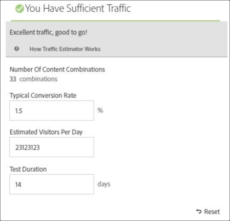

# Crear una prueba multivariable

El [!UICONTROL Compositor de experiencias visuales] (VEC) en [!DNL Adobe Target] facilita la creación de un [!UICONTROL Prueba multivariable] y para modificar partes de la página en [!DNL Target].

El [!DNL Target] el editor de apuntar y hacer clic le permite elegir cualquier ubicación y agregar varias ofertas.

La [!UICONTROL prueba multivariada] (MVT) toma un informe centrado en una página. Es decir, la prueba se ejecuta en una determinada dirección URL, con las experiencias que diseño para esa página.

1. Haga clic en **[!UICONTROL Crear actividad]** > **[!UICONTROL Prueba multivariable]**.

   

   >[!NOTE]
   >
   >Para obtener más información sobre los distintos tipos de actividades disponibles en [!DNL Target] y sus diferencias, consulte [Actividades](/help/main/c-activities/activities.md#concept_D317A95A1AB54674BA7AB65C7985BA03). Consulte [Tipos de actividades de Target](/help/main/c-activities/target-activities-guide.md) para ayudarle a decidir qué tipo de actividad encaja con sus necesidades.

1. (Condicional) Elija el tipo de entrega: [!UICONTROL Web], [!UICONTROL Móvil], [!UICONTROL Correo electrónico], o [!UICONTROL Otro/API].

1. (Condicional) Si es un [Target Premium](/help/main/c-intro/intro.md#premium) cliente, [elija un espacio de trabajo](/help/main/administrating-target/c-user-management/property-channel/property-channel.md).

1. [Especifique la dirección URL](/help/main/c-activities/c-multivariate-testing/t-create-multivariate-test/url.md#concept_C12E4A85FF3B4E518E3110F6CF1AF9C0) para la página que desea probar, haga clic en **[!UICONTROL Siguiente]**.

   >[!NOTE]
   >
   >Utilice una dirección URL completa, incluido HTTP o HTTPS del principio.

   Si aparece un mensaje pidiendo que habilite el navegador para contenido mixto, siga las instrucciones del mensaje. Después de habilitar el navegador para contenido mixto, vuelva a comenzar por el Paso 1.

   El [!UICONTROL Compositor de experiencias visuales] abre.

1. Escriba un nombre para la actividad.

   

   El nombre de la actividad no puede comenzar con ninguno de los siguientes caracteres:

   | Carácter | Descripción |
   |--- |--- |
   | `=` | Igual a |
   | `+` | Más |
   | `-` | Menos |
   | `@` | Arroba |

   El nombre de la actividad no puede contener ninguna de estas secuencias de caracteres:

   | Secuencia de caracteres | Descripción |
   |--- |--- |
   | ;= | Punto y coma, igual a |
   | ;+ | Punto y coma, más |
   | ;- | Punto y coma, menos |
   | ;@ | Punto y coma, signo de arroba |
   | ,= | Coma, igual a |
   | ,+ | Coma, más |
   | ,- | Coma, menos |
   | ,@ | Coma, Signo de arroba |
   | `[`&quot; | Corchete de apertura, comillas dobles |
   | &quot;`]` | Comillas tipográficas dobles, cerrar corchete |

1. [Cree las ofertas en cada ubicación](/help/main/c-activities/c-multivariate-testing/t-create-multivariate-test/add-offers.md#concept_DCE6B45C30F7419B8EC17AFDEE8D8AA6).

   

   Puede añadir los siguientes tipos de oferta:

   * HTML
   * Imagen
   * Texto

1. Haga clic en **[!UICONTROL Vista preliminar]** para [obtener una vista previa de las experiencias](/help/main/c-activities/c-multivariate-testing/t-create-multivariate-test/preview-experiences.md).

   

   Puede ver cada experiencia y excluir aquellas que no quiere incluir en la prueba. Para excluir una o varias experiencias, seleccione las casillas que desee y haga clic en **[!UICONTROL Excluir]**.

   

1. [Utilice el estimador de tráfico](/help/main/c-activities/c-multivariate-testing/t-create-multivariate-test/traffic-estimator.md#task_71AA6922AFD447EA8C5E610A78ABA714) para probar la viabilidad de su plan de prueba.

   

   La siguiente ilustración indica que la actividad no tiene tráfico suficiente.

   

   La siguiente ilustración indica que la actividad no tiene tráfico suficiente.

   

1. Haga clic en **[!UICONTROL Siguiente]** para avanzar a la página [!UICONTROL Segmentación.]

1. Elija la audiencia y el porcentaje de visitantes correspondiente que desea que participen de la actividad.

   

   Por ejemplo, podría limitar las entradas al 50 % de todos los visitantes o al 45 % de la audiencia de California.

   >[!NOTE]
   >
   >Además de seleccionar una audiencia existente, puede combinar varias audiencias para crear audiencias combinadas específicas en lugar de crear una nueva. Para obtener más información, consulte [Combinar varias audiencias](/help/main/c-target/combining-multiple-audiences.md#concept_A7386F1EA4394BD2AB72399C225981E5).

1. [Revise el resumen de la prueba](/help/main/c-activities/c-multivariate-testing/t-create-multivariate-test/test-summary.md#reference_971AB225963A4DC18EEB5B0E20F0A4A7), realice cualquier cambio necesario y, después, haga clic en **[!UICONTROL Siguiente]**.

1. [Especifique los objetivos y la configuración](/help/main/c-activities/c-multivariate-testing/t-create-multivariate-test/goals-and-settings.md#reference_B25389FD6F3A4989801E740364B089CC) para la prueba.

1. Haga clic en **[!UICONTROL Guardar y cerrar]** para crear la actividad.

## Vídeo de formación: Creación de pruebas multivariable (9:25) 

En este vídeo se muestra cómo planificar y crear una prueba multivariable con el [!DNL Target] flujo de trabajo guiado de tres pasos.

* Definir y diseñar una prueba multivariable
* Crear una prueba multivariable

>[!VIDEO](https://video.tv.adobe.com/v/17395)
