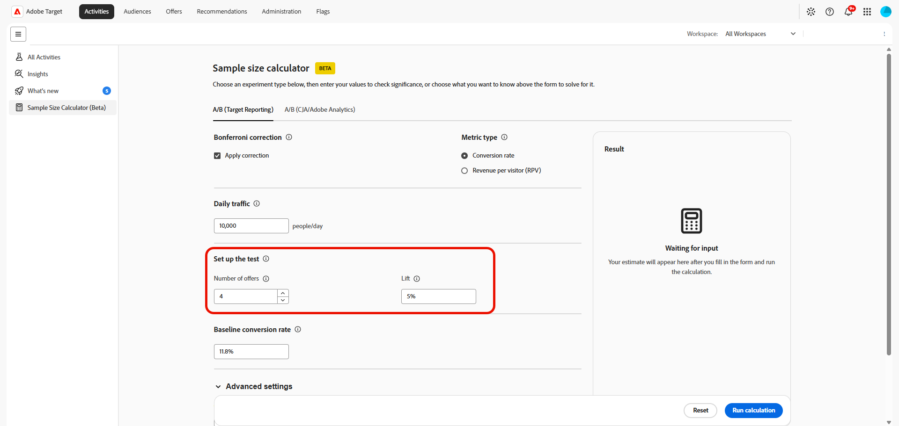

# Calculadora de tamaño de muestra

>[!CONTEXTUALHELP]
>id="target_sample_size_ab_daily_traffic"
>title="Tráfico diario"
>abstract="Cuántos usuarios entran en el experimento cada día. Si desconoce este valor, elija Volumen de tráfico más arriba y la calculadora lo resolverá utilizando las otras entradas."

>[!CONTEXTUALHELP]
>id="target_sample_size_confidence_level"
>title="Nivel de confianza"
>abstract="El grado de certeza necesario para determinar que un resultado no se debe al azar antes de considerarlo significativo. Un nivel de confianza del 95 % significa que hay como máximo un 5 % de probabilidades de obtener un falso positivo. Los valores más altos reducen los falsos positivos, pero requieren más datos."

>[!CONTEXTUALHELP]
>id="target_sample_size_statistical_power"
>title="Potencia estadística"
>abstract="La probabilidad de detectar un efecto real si existe. Un nivel de potencia del 80 % significa que hay un 80 % de probabilidades de detectar un efecto real. Una mayor potencia reduce los falsos negativos, pero requiere más tráfico o un tiempo de ejecución más largo."

>[!CONTEXTUALHELP]
>id="target_sample_size_setup_cja"
>title="Configurar la prueba"
>abstract="Estos campos definen el experimento, el resultado previsto y el umbral de confianza del resultado. El campo vinculado al valor seleccionado anteriormente se resuelve automáticamente; complete los campos restantes con los valores previstos."

>[!AVAILABILITY]
>
>Al utilizar esta calculadora de tamaño de muestra (Beta), usted reconoce por la presente que Beta se proporciona &quot;tal cual&quot; sin garantía de ningún tipo. Adobe no tiene obligación de mantener, corregir, actualizar, cambiar, modificar o apoyar de otro modo Beta. Se recomienda tener precaución y no confiar en modo alguno en el correcto funcionamiento o rendimiento de dichos Beta y/o materiales de acompañamiento. Beta se considera información confidencial de Adobe.  Cualquier &quot;comentario&quot; (información sobre Beta, incluidos, entre otros, problemas o defectos que encuentre al utilizar Beta, sugerencias, mejoras y recomendaciones) proporcionado por usted a Adobe se asigna a Adobe, incluidos todos los derechos, el título y el interés en y para dichos comentarios.

La **[!UICONTROL Calculadora de tamaño de muestra]** le permite estimar las entradas necesarias para planificar un experimento antes de iniciarlo. La calculadora le ayuda a determinar cuánto tráfico necesita, cuánto tiempo debe durar la prueba, cuántas experiencias debe incluir o qué efecto mínimo puede detectar de forma fiable en función de los valores que proporcione.

Para obtener acceso a la **[!UICONTROL Calculadora de tamaño de muestra]**, vaya al menú **[!UICONTROL Actividades]**.

## A/B (datos de informes de Target)

>[!CONTEXTUALHELP]
>id="target_sample_size_bonferroni"
>title="Corrección de Bonferroni"
>abstract="Ajusta el nivel de confianza para tener en cuenta la comparación simultánea de varias ofertas con el control. Esto es solo relevante cuando hay más de dos ofertas. Coincide con la misma corrección que se utiliza en la herramienta pública Calculadora de Target de Adobe."

>[!CONTEXTUALHELP]
>id="target_sample_size_metric_type"
>title="Tipo de métrica"
>abstract="Qué tipo de métrica está midiendo. Utilice Porcentaje para resultados binarios, como clics o conversiones, en los que cada usuario completa o no la acción. Utilice Número para métricas como los ingresos o las vistas de página, donde los valores pueden variar considerablemente de un usuario a otro."

>[!CONTEXTUALHELP]
>id="target_sample_size_number_offers"
>title="Número de ofertas"
>abstract="El número de experiencias del experimento, incluido el control. Si hay más de dos ofertas, se aplica automáticamente una corrección de Bonferroni (cuando está activada) para mantener el nivel de confianza general preciso en todas las comparaciones."

>[!CONTEXTUALHELP]
>id="target_sample_size_lift"
>title="Alza"
>abstract="La mejora relativa con respecto a la línea de base que desea detectar. Introdúzcala como porcentaje de la línea base. Por ejemplo, un alza del 5 % sobre una tasa de conversión de línea de base del 11,8 % da como resultado un objetivo del 12,39 %."

>[!CONTEXTUALHELP]
>id="target_sample_size_baseline_conversion_rate"
>title="Tasa de conversión de línea de base"
>abstract="Su tasa de conversión actual antes de que comience el experimento, que corresponde al promedio del grupo de control. Este valor siempre es obligatorio. En las métricas de porcentaje, introduzca un porcentaje como, por ejemplo, 5 para 5 %. Para las métricas de recuento, introduzca el valor decimal sin procesar."

Calcular las entradas necesarias para planificar y ejecutar una prueba A/B. Estos valores le ayudan a decidir cuánto tráfico necesita, cuánto tiempo debe ejecutarse la prueba y qué tamaño de efecto puede detectar de forma realista.

1. Acceda a la ficha **[!UICONTROL Informes A/B (informes de destino)]** para calcular las entradas de planificación para una prueba A/B.

1. Habilite la opción **[!UICONTROL Aplicar corrección]** para ajustar su nivel de confianza con el fin de tener en cuenta la comparación de más de una oferta con el control al mismo tiempo.

1. Elija su **[!UICONTROL tipo de métrica]**:

   * Tasa de conversión: utilice esta opción para resultados binarios como clics o compras, en los que cada visitante completa o no la acción.
   * Ingresos por visitante: Utilícelo para métricas de estilo de ingresos, donde los valores pueden variar considerablemente de un visitante a otro.

     

1. Especifique **[!UICONTROL Tráfico diario]**, el número de usuarios que ingresan al experimento cada día.

1. En **[!UICONTROL Configurar la prueba]**, escriba los valores restantes:

   * **[!UICONTROL Número de ofertas]**: El número de experiencias en su experimento, incluido el control. Más de dos ofertas aplica una corrección de Bonferroni, cuando está habilitada, para mantener el nivel de confianza general.

   * **[!UICONTROL Alza]**: La mejora relativa con respecto a la línea de base que desea detectar. Especifíquela como porcentaje de la línea de base; por ejemplo, un alza del 5 % con respecto a una tasa de conversión de línea de base del 11,8 % se dirige al 12,39 %.

     

1. Especifique la **[!UICONTROL tasa de conversión de línea de base]** para la experiencia actual antes de que comience el experimento.

1. Puede expandir **[!UICONTROL Configuración estadística avanzada]** para proporcionar entradas estadísticas adicionales cuando estén disponibles para el cálculo seleccionado.

   * **[!UICONTROL Nivel de confianza]**: La probabilidad de que un resultado no se deba a casualidad. Un nivel del 95% permite un 5% de probabilidad de un falso positivo.

   * **[!UICONTROL Potencia estadística]**: La probabilidad de detectar un efecto real. Una potencia del 80% reduce los falsos negativos, pero requiere más tráfico o tiempo.

1. Seleccione **[!UICONTROL Ejecutar cálculo]** para generar la estimación. Seleccione **[!UICONTROL Restablecer]** para borrar las entradas actuales y comenzar de nuevo.

El panel **[!UICONTROL Resultado]** muestra la estimación después de completar los campos obligatorios y ejecutar el cálculo. Si los campos obligatorios están incompletos, el panel le pedirá que introduzca los valores que faltan.

La calculadora proporciona una estimación para planificar un experimento. Utilice el resultado junto con el diseño del experimento, el tráfico esperado, el rendimiento de línea de base y los requisitos estadísticos para decidir cuánto tiempo se debe ejecutar la actividad.

## A/B (CJA/Adobe Analytics)

>[!CONTEXTUALHELP]
>id="target_sample_size_number_experiences"
>title="Número de experiencias"
>abstract="Número de variantes del experimento, incluido el control. Una prueba A/B consta de dos ramas. Cinco variantes más un control equivale a 6. Más ramas requieren proporcionalmente más tráfico para mantener el poder estadístico."

>[!CONTEXTUALHELP]
>id="target_sample_size_duration"
>title="Duración de la prueba A/B"
>abstract="Cuántos días durará el experimento. Las duraciones más largas le dan al experimento más tiempo para recopilar datos, lo que le permite detectar de forma fiable efectos más pequeños. Las duraciones más cortas necesitan efectos más grandes o más tráfico diario para alcanzar un resultado fiable."

>[!CONTEXTUALHELP]
>id="target_sample_size_expected_improvement"
>title="Mejora prevista"
>abstract="La mejora más pequeña que vale la pena detectar, el cambio mínimo en la métrica con el que actuaría. Es el tamaño del alza en puntos porcentuales, no el cambio porcentual en relación con la línea de base. Por ejemplo, si la línea de base es del 5 % y un alza de 1 punto porcentual es importante, escriba 1."

>[!CONTEXTUALHELP]
>id="target_sample_size_variance"
>title="Varianza"
>abstract="El grado de dispersión de los valores de la métrica, no el valor medio. Una métrica como, por ejemplo, una tasa de clics (principalmente 0 y 1) tiene una varianza baja. Mientras que una métrica como los ingresos por usuario puede tener una varianza mucho mayor. Si no lo tiene claro, deje el valor predeterminado de 1."

Calcule las entradas de planificación para una actividad A/B que se basa en datos de Adobe Analytics o Customer Journey Analytics. Esto le permite definir el tamaño del experimento, el alza esperada y la duración de la prueba antes de iniciar la actividad.

1. Acceda a la ficha **[!UICONTROL A/B (CJA/Adobe Analytics)]** para calcular las entradas de planificación para una prueba A/B.

1. En **[!UICONTROL ¿Qué desea saber?]**, seleccione el valor que desea que determine la calculadora:

   * **[!UICONTROL Duración]**: Tienes un experimento en mente y quieres saber cuánto tiempo tomaría ejecutarse y si vale la pena ejecutarlo.
   * **[!UICONTROL Número de experiencias]**: Tienes una ubicación para ejecutar un experimento y deseas averiguar cuántos tratamientos podría admitir tu tráfico.
   * **[!UICONTROL Volumen de tráfico]**: Tienes un experimento en mente y quieres saber cuántos visitantes necesitas para alcanzar la relevancia estadística.
   * **[!UICONTROL Efecto mínimo detectable]**: tiene un experimento que desea ejecutar pero desea saber cuánto alza necesita para alcanzar la relevancia estadística. Esto le ayuda a evaluar si vale la pena ejecutar o planificar el experimento.

   Los campos del formulario cambian según el valor seleccionado. La calculadora utiliza las demás entradas para determinar el resultado seleccionado.

   

1. Especifique **[!UICONTROL Tráfico diario]**, el número de usuarios que ingresan al experimento cada día.

1. En **[!UICONTROL Configurar la prueba]**, escriba los valores restantes:

   * **[!UICONTROL Número de experiencias]**: El número de variantes, incluido el control. Más variantes requieren más tráfico.

   * **[!UICONTROL Duración de la prueba A/B]**: Número de días que se ejecuta el experimento. Las pruebas más largas pueden detectar efectos más pequeños.

   * **[!UICONTROL Mejora esperada]**: La mejora que espera que produzca el experimento.

   * **[!UICONTROL Varianza]**: La dispersión de los valores de las métricas. Una tasa de pulsaciones suele tener una varianza baja, los ingresos por usuario pueden ser mucho más altos. Si no lo tiene claro, deje el valor predeterminado de 1.

     Aprenda a calcular una **[!UICONTROL variación]** en [documentación de Analytics](https://experienceleague.adobe.com/es/docs/analytics/components/calculated-metrics/calcmetrics-reference/cm-functions#variance)

     

1. Puede expandir **[!UICONTROL Configuración estadística avanzada]** para proporcionar entradas estadísticas adicionales cuando estén disponibles para el cálculo seleccionado.

   * **[!UICONTROL Nivel de confianza]**: La probabilidad de que un resultado no se deba a casualidad. Un nivel del 95% permite un 5% de probabilidad de un falso positivo. Unos niveles de confianza más bajos significan que se necesita menos tráfico, pero también aumentan el riesgo de un falso positivo.

   * **[!UICONTROL Potencia estadística]**: La probabilidad de detectar un efecto real. Una potencia del 80% reduce los falsos negativos, pero requiere más tráfico o tiempo.

1. Seleccione **[!UICONTROL Ejecutar cálculo]** para generar la estimación. Seleccione **[!UICONTROL Restablecer]** para borrar las entradas actuales y comenzar de nuevo.

El panel **[!UICONTROL Resultado]** muestra la estimación después de completar los campos obligatorios y ejecutar el cálculo. Si los campos obligatorios están incompletos, el panel le pedirá que introduzca los valores que faltan.

La calculadora proporciona una estimación para planificar un experimento. Utilice el resultado junto con el diseño del experimento, el tráfico esperado, el rendimiento de línea de base y los requisitos estadísticos para decidir cuánto tiempo se debe ejecutar la actividad.
