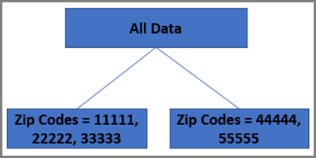

# Algoritmo de bosque aleatorio

El algoritmo de personalización principal utilizado en las actividades (AP) y [!DNL Auto-Target] es el de bosque aleatorio. Los métodos de ensamblado, como el bosque aleatorio, utilizan varios algoritmos de aprendizaje para obtener un mejor rendimiento predictivo que el que se podría obtener de cualquiera de los algoritmos de aprendizaje constituyentes. El algoritmo de bosque aleatorio en [!UICONTROL Automated Personalization] y [!UICONTROL Auto-Target] es un método de clasificación o regresión que funciona mediante la construcción de una multitud de árboles de decisión cuando se está entrenando.

Al considerar las estadísticas, es habitual pensar en un modelo de regresión único para predecir un resultado. Sin embargo, las investigaciones de ciencia de datos más recientes sugieren que los “métodos de ensamblado”, en que se crean varios modelos a partir del mismo conjunto de datos y se combinan de forma inteligente, arrojan mejores resultados que las predicciones basadas en un único modelo.

El algoritmo de bosque aleatorio es el algoritmo de personalización subyacente clave utilizado en las actividades [!UICONTROL Automated Personalization] y [!UICONTROL Auto-Target]. El bosque aleatorio combina cientos de árboles de decisiones para llegar a una mejor predicción de lo que un solo árbol podría hacer por sí mismo.

## ¿Qué es un árbol de decisión? {#section_7F5865D8064447F4856FED426243FDAC}

El objetivo de un árbol de decisión es desglosar todos los datos de visitas disponibles de los que puede aprender un sistema y luego agrupar esos datos, en los que las visitas dentro de cada grupo son lo más similares posible entre sí con respecto a la métrica de objetivo. Sin embargo, entre grupos, las visitas son lo más diferentes posible en cuanto a la métrica del objetivo (por ejemplo, tasa de conversión). El árbol de decisión tiene en cuenta las diferentes variables del conjunto de formación para determinar cómo dividir los datos de forma mutuamente exclusiva y colectivamente exhaustiva (MECE) en estos grupos (u &quot;hojas&quot;) para maximizar este objetivo.

En un ejemplo sencillo, supongamos que hay dos variables de entrada:

* Sexo (con dos valores potenciales: hombre o mujer)
* Código postal (con cinco valores potenciales en el pequeño conjunto de datos: 11111, 22222, 33333, 44444 o 55555)

Si la métrica de objetivo es conversión, el árbol primero determinaría cuál de las dos variables explica la mayor cantidad de variación en la tasa de conversión de los datos de visita.

Pongamos que el código postal es más predictivo. Esta variable formaría la primera “rama” del árbol. A continuación, el árbol de decisión determinaría cómo dividir los datos de visitas, por ejemplo, que la tasa de conversión de los registros de cada división fuera lo más similar posible y la tasa de conversión entre divisiones fuera lo más diferente posible. En este ejemplo, supongamos que 11111, 22222, 33333 una división y 44444 y 55555 una segunda división.

Esta acción resulta en la primera capa del árbol de decisión:

El árbol de decisión plantea la pregunta: &quot;¿Cuál es la variable más predictiva?&quot; En este ejemplo, solo hay dos variables, por lo que la respuesta aquí es claramente de género. El árbol ahora busca completar un ejercicio similar para dividir los datos *en cada rama*. En primer lugar, consideraremos la rama 11111, 22222 y 33333. En estos códigos postales, si hay alguna diferencia de conversión entre hombres y mujeres, habrá dos hojas (hombres y mujeres) y esta rama estará completa. En las otras ramas, 44444 y 55555, supongamos que no hay ninguna diferencia estadística entre cómo se convierten las mujeres y los hombres. En este caso, la primera rama se convierte en la división final.

El ejemplo generaría el siguiente árbol:

## ¿Cómo utiliza el bosque aleatorio los árboles de decisión? {#section_536C105EF9F540C096D60450CAC6F627}

Los árboles de decisión pueden ser una herramienta estadística muy útil. Sin embargo, presenta algunas desventajas. La más importante es que se puede producir un sobreajuste de datos, con lo que un solo árbol difícilmente predeciría datos futuros que no se hubieran utilizado para crear el árbol inicial. En estadística, este problema se conoce como [compensación sesgo-varianza](https://en.wikipedia.org/wiki/Bias%E2%80%93variance_tradeoff). Los bosques aleatorios ayudan a superar este desafío excesivo. En su máximo nivel, un bosque aleatorio es un conjunto de árboles de decisión que se ha creado de un modo algo distinto a partir del mismo conjunto de datos que “vota” conjuntamente para producir un modelo mejor que un árbol individual. Los árboles se construyen mediante la selección aleatoria de un subconjunto de registros de visita con reemplazo (conocido como ensacado) y la selección aleatoria de un subconjunto de los atributos, de modo que el bosque consta de árboles de decisión ligeramente diferentes. Con este método se introducen pequeñas variaciones en los árboles que se crean en el bosque aleatorio. Al añadir esta cantidad controlada de varianza, la precisión predictiva del algoritmo mejora.

## ¿Cómo utilizan los algoritmos de personalización de [!DNL Target] el bosque aleatorio? {#section_32FB53CAD8DF40FB9C0F1217FBDBB691}

### Cómo se crean los modelos

El diagrama siguiente resume cómo se crean los modelos para las actividades [!UICONTROL Auto-Target] y [!UICONTROL Automated Personalization]:

{width="650" zoomable="yes"}

1. Target recopila datos sobre los visitantes mientras sirve experiencias u ofertas de forma aleatoria
1. Después de que [!DNL Target] alcance una masa crítica de datos, [!DNL Target] realiza ingeniería de características
1. [!DNL Target] crea modelos de bosque aleatorio para cada experiencia u oferta
1. [!DNL Target] comprueba si el modelo cumple una puntuación de calidad de umbral
1. [!DNL Target] inserta el modelo en producción para personalizar el tráfico futuro

[!DNL Target] utiliza datos que recopila automáticamente, así como datos personalizados proporcionados por usted, para generar sus algoritmos de personalización. Estos modelos predicen la mejor experiencia u oferta para mostrar a los visitantes. Por lo general, se crea un modelo por experiencia (si hay una actividad [!UICONTROL Auto-Target]) o por oferta (si hay una actividad [!UICONTROL Automated Personalization]). [!DNL Target] muestra la experiencia u oferta que produce la métrica de éxito más alta prevista (por ejemplo, tasa de conversión). Estos modelos deben prepararse a partir de visitas ofrecidas aleatoriamente para que se puedan utilizar para la predicción. Como consecuencia, al iniciar una actividad, se muestran aleatoriamente experiencias u ofertas diferentes incluso a los visitantes que se encuentran en el grupo personalizado mientras los algoritmos de personalización no están listos.

Cada modelo debe validarse para garantizar que es bueno para predecir el comportamiento de los visitantes antes de que se utilice en la actividad. Los modelos se validan en función de su área bajo la curva (AUC). Debido a la necesidad de validación, el momento exacto en el que un modelo empieza a ofrecer experiencias personalizadas depende de los detalles de los datos. En la práctica, y para la planificación del tráfico, normalmente se requiere más de un número mínimo de conversiones para que cada modelo sea válido.

Cuando un modelo es válido para una experiencia u oferta, el icono de reloj situado a la izquierda del nombre de la experiencia/oferta se convierte en una casilla de verificación verde. Cuando hay modelos válidos para al menos dos experiencias u ofertas, algunas visitas comienzan a personalizarse.

### Transformación de funciones

Antes de que los datos pasen por el algoritmo de personalización, se someten a una transformación de la característica, que se puede considerar como una preparación de los datos recopilados en registros de formación para que los modelos de personalización los puedan utilizar.

Las transformaciones de la característica dependen del tipo de atributo. Principalmente, hay dos tipos de atributos (o “características”, tal como a veces los describen los analistas de datos):

* **Características categóricas:** no se pueden contar, pero se pueden ordenar en distintos grupos. Pueden ser características como país, sexo o código postal.
* **Características numéricas:** se pueden medir o contar, como la edad, los ingresos, etc.

Para las características categóricas, se mantiene un conjunto de todas las características posibles y la posibilidad de que se use la transformación para reducir el tamaño de los datos. En el caso de las funciones numéricas, el cambio de escala garantiza que las funciones sean comparables en todos los aspectos.

### Equilibrio entre aprendizaje y personalización con el método multi-armed bandit

Después de que [!DNL Target] tenga modelos de personalización creados para personalizar su tráfico, existe un equilibrio claro que enfrenta para futuros visitantes de su actividad. ¿Debe personalizar todo el tráfico en función del modelo actual o debe seguir aprendiendo de los nuevos visitantes ofreciéndoles ofertas aleatorias? Le interesa asegurarse de que el algoritmo de personalización siempre aprenda de las tendencias nuevas de sus visitantes, al mismo tiempo que personaliza la mayor parte del tráfico.

El método multi-armed bandit es la forma en que [!DNL Target] le ayuda a alcanzar esta meta. El método multi-armed bandit garantiza que el modelo siempre &quot;gasta&quot; una pequeña fracción del tráfico para seguir aprendiendo a lo largo de la vida de la actividad y para evitar la sobreexplotación de las tendencias aprendidas anteriormente.

En el mundo de la ciencia de datos, el problema de los bandidos multiarmados es un ejemplo clásico del dilema de exploración contra explotación en el que se da una colección de bandidos con un solo brazo, cada uno con una probabilidad de recompensa desconocida. La idea principal consiste en desarrollar una estrategia que conozca cuál es la palanca con la mayor probabilidad de éxito que debe accionarse, para maximizar el premio total obtenido. Multi-armed bandit se utiliza en el sistema para la puntuación en línea después de crear los modelos en línea. Este proceso ayuda con el aprendizaje en línea durante la exploración. El algoritmo multiarmado actual es un algoritmo voraz épsilon (). En este algoritmo, con probabilidad 1- ε, se elige la mejor palanca. Y, con probabilidad ε, se elige cualquier otra palanca aleatoriamente.
