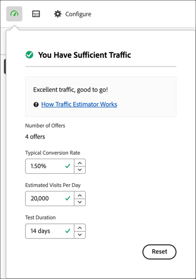

# Calcular el tráfico necesario para realizar una prueba con éxito

El [!DNL Adobe Target] [!UICONTROL Traffic Estimator] proporciona comentarios que le permiten saber si cuenta con tráfico suficiente para que la actividad [!UICONTROL Automated Personalization] (AP) se realice correctamente.

Dado que las actividades de [!UICONTROL Automated Personalization] utilizan varias combinaciones de ofertas, es importante saber cuánto tráfico se requiere para proporcionar resultados significativos. [!UICONTROL Traffic Estimator] usa estadísticas sobre su página y el número de experiencias que se están probando para estimar la cantidad de tráfico y la duración de la prueba necesarias para que la actividad se realice correctamente.

[!UICONTROL Traffic Estimator] determina si hay tráfico suficiente para generar modelos personalizados comparando las impresiones de página estimadas y la tasa de conversión típica de las páginas. Para lograr una actividad con éxito, lo ideal es que el tamaño de muestra correcto garantice que el contenido personalizado esté listo dentro del 50 % de la duración de la actividad o en 14 días, lo que sea menos. Este proceso permite tiempo suficiente para obtener contenido personalizado y aprender qué contenido entregar.

Recuerde que [!DNL Target] proporciona experiencias de forma aleatoria hasta que se crean los algoritmos de personalización. El icono de marca de verificación al lado de cada oferta muestra cuándo el modelo de esa oferta está listo y [!DNL Target] puede empezar a entregar contenido personalizado. Dado que el alza solo se espera después de que los modelos estén listos, la indicación visual le permite establecer la expectativa correcta. Use [!UICONTROL Traffic Estimator] en [!UICONTROL Visual Experience Composer] (VEC) para obtener una guía de cuándo están listos los modelos.

## Uso del estimador de tráfico

1. Desde la página [!UICONTROL Experiences] de [!UICONTROL Visual Experience Composer] en una actividad [!UICONTROL Automated Personalization], haga clic en el icono **[!UICONTROL Traffic]** (  ) en la esquina superior izquierda de la página [!UICONTROL Experiences].

   Se abre [!UICONTROL Traffic Estimator].

   

   Para ocultar [!UICONTROL Traffic Estimator], vuelva a hacer clic en el icono.

1. Especifique la tasa de conversión típica (o la tasa de conversión que espera de esta actividad), las impresiones de actividad estimadas por día y la duración de la prueba.

   | Métrica | Descripción |
   | --- | --- |
   | **[!UICONTROL Number of Offers]** | Esta métrica se calcula automáticamente según el número de experiencias que se crean como parte de la actividad, después de cualquier exclusión. |
   | **[!UICONTROL Typical Conversion Rate]** | Esta métrica se expresa como porcentaje según las estimaciones o los datos anteriores procedentes del sistema de análisis. |
   | **[!UICONTROL Estimated Visits Per Day]** | Esta métrica es el número de visitas por día de visitantes que pueden ver la actividad según los criterios de segmentación. Esta métrica se puede basar en los datos de análisis. Este número debe ser visitas, no visitantes únicos. |
   | **[!UICONTROL Test Duration]** | Número de días durante los cuales quiere ejecutar la actividad. |

   [!UICONTROL Traffic Estimator] usa estas métricas para determinar qué ajustes son necesarios para ejecutar una prueba con éxito.

   Cerca de la parte superior de [!UICONTROL Traffic Estimator], los valores especificados se calculan y se muestran los resultados.

   

   Al cambiar estos números, también cambian las estimaciones. Por ejemplo, si está probando muchas combinaciones y la tasa de conversión y las impresiones son demasiado bajas, [!UICONTROL Traffic Estimator] muestra durante cuánto tiempo debe ejecutarse la prueba para que tenga éxito. O bien, si el tráfico es bajo, [!UICONTROL Traffic Estimator] podría sugerir un número menor de combinaciones de ofertas para que pueda ejecutar la prueba el número deseado de días.

   Si no tiene tráfico suficiente, tenga en cuenta lo siguiente:

   * Considere utilizar una actividad [[!UICONTROL Auto-Target]](/help/main/c-activities/auto-target/auto-target-to-optimize.md) en lugar de [!UICONTROL Automated Personalization] para crear experiencias con varios cambios de oferta en una variación de experiencia.
   * Reduzca la cantidad de combinaciones de ofertas dentro de su actividad [!UICONTROL Automated Personalization].
   * Incremente la duración de la actividad.

   Ajuste los números hasta que [!UICONTROL Traffic Estimator] indique que dispone de tráfico suficiente y, a continuación, diseñe la prueba según corresponda.

   

   Si el tráfico es suficiente, el icono [!UICONTROL Traffic] muestra una marca de verificación verde. Si no hay suficiente, el icono muestra una etiqueta de advertencia en rojo.

## Preguntas más frecuentes sobre el estimador de tráfico

Tenga en cuenta las siguientes preguntas frecuentes mientras trabaja con [!UICONTROL Traffic Estimator]:

### ¿Por qué los modelos personalizados no se crean aunque mi actividad de AP tenga tráfico suficiente?

En algunas circunstancias, el tráfico es lo suficientemente grande como para generar un modelo personalizado, pero ese tráfico podría informar a [!DNL Target] de que no existe una diferencia significativa entre el modelo personalizado y el aleatorio. Aunque el modelo se ha creado en [!DNL Target] y se ha probado, no se implementa porque no es mejor que aleatorio.

Una posible razón para que el modelo no sea mejor que aleatorio podría ser que las ofertas no son lo suficientemente diferentes entre sí. Si es así, puede intentar hacer que las ofertas sean más visualmente diferentes si la mensajería es similar, o puede intentar cambiar la mensajería en sí.
