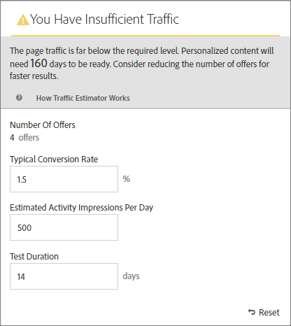

# Calcular el tráfico necesario para realizar una prueba con éxito

La variable [!DNL Adobe Target] [!UICONTROL Estimador de tráfico] proporciona comentarios que le permiten saber si tiene tráfico suficiente para [!UICONTROL Automated Personalization] actividad para que se realice correctamente.

Porque [!UICONTROL Automated Personalization] actividad utiliza varias combinaciones de ofertas, es importante saber cuánto tráfico se necesita para proporcionar resultados significativos. La variable [!UICONTROL Estimador de tráfico] utiliza estadísticas sobre la página y el número de experiencias que se están probando para estimar la cantidad de tráfico y la duración de la prueba necesarios para que la actividad tenga éxito.

La variable [!UICONTROL Estimador de tráfico] determina si hay tráfico suficiente para generar modelos personalizados comparando las impresiones de página estimadas y la tasa de conversión típica para las páginas. Para lograr una actividad con éxito, lo ideal es que el tamaño de muestra correcto garantice que el contenido personalizado esté listo dentro del 50 % de la duración de la actividad o en 14 días, lo que sea menos. Este proceso le permite disponer de tiempo suficiente para obtener contenido personalizado y saber qué contenido entregar.

Recuerde que [!DNL Target] proporciona experiencias aleatoriamente hasta que se crean los algoritmos de personalización. El icono de marca de verificación situado junto a cada oferta muestra cuándo el modelo para esa oferta está listo y [!DNL Target] puede comenzar a enviar contenido personalizado. Ya que se espera un alza solo después de que los modelos estén listos, la indicación visual permite establecer la expectativa adecuada. Utilice la variable [!UICONTROL Estimador de tráfico] en el [!UICONTROL Compositor de experiencias visuales] (VEC) para obtener una guía de cuándo los modelos están listos.

## Uso del estimador de tráfico

1. En el [!UICONTROL Compositor de experiencias visuales], haga clic en **[!UICONTROL Tráfico]**.

   

   La variable [!UICONTROL Estimador de tráfico] se abre. Puede hacer clic en **[!UICONTROL Tráfico]** para ocultar la [!UICONTROL Estimador de tráfico].

   

1. Especifique la tasa de conversión típica (o la tasa de conversión que espera de esta actividad), las impresiones de actividad estimadas por día y la duración de la prueba.

   | Métrica | Descripción |
   | --- | --- |
   | **[!UICONTROL Número de ofertas]** | Esta métrica se calcula automáticamente en función del número de experiencias que se crean como parte de la actividad, después de cualquier exclusión. |
   | **[!UICONTROL Tasa de conversión típica]** | Esta métrica se expresa como un porcentaje, en función de los datos o las estimaciones anteriores procedentes del sistema de Analytics. |
   | **[!UICONTROL Visitas estimadas por día]** | Esta métrica es el número de visitas por día de visitantes que pueden ver la actividad según los criterios de segmentación. Esta métrica se puede basar en los datos de análisis. Este número debe ser visitas, no visitantes únicos. |
   | **[!UICONTROL Duración de la prueba]** | Número de días durante los cuales quiere ejecutar la actividad. |

   La variable [!UICONTROL Estimador de tráfico] usa estas métricas para determinar qué ajustes son necesarios para ejecutar una prueba con éxito.

   Cerca de la parte superior del [!UICONTROL Estimador de tráfico], los valores introducidos se calculan y se muestran los resultados.

   

   Al cambiar estos números, también cambian las estimaciones. Por ejemplo, si está probando muchas combinaciones y la tasa de conversión y las impresiones son demasiado bajas, la variable [!UICONTROL Estimador de tráfico] muestra cuánto tiempo debe ejecutarse la prueba para que sea correcta. O, si el tráfico es bajo, la variable [!UICONTROL Estimador de tráfico] podría sugerir un número menor de combinaciones de ofertas para poder ejecutar la prueba durante el número deseado de días.

   Si no tiene tráfico suficiente, tenga en cuenta lo siguiente:

   * Considere utilizar un [Segmentación automática](/help/main/c-activities/auto-target/auto-target-to-optimize.md) actividad en lugar de [!UICONTROL Automated Personalization] para crear experiencias con varios cambios de oferta en una variación de experiencia.
   * Reduzca el número de combinaciones de ofertas dentro de su [!UICONTROL Automated Personalization] actividad.
   * Incremente la duración de la actividad.

   Ajuste los números hasta que el [!UICONTROL Estimador de tráfico] indica que tiene tráfico suficiente y luego diseñe la prueba según corresponda.

   

   Si el tráfico es suficiente, la variable [!UICONTROL Tráfico] muestra una marca de verificación verde. Si no hay suficiente, el icono muestra una etiqueta de advertencia en rojo.

## Preguntas más frecuentes sobre el estimador de tráfico

Tenga en cuenta las siguientes preguntas frecuentes cuando trabaje con el [!UICONTROL Estimador de tráfico]:

### ¿Por qué no se crean modelos personalizados aunque mi actividad AP tenga tráfico suficiente?

En determinadas circunstancias, el tráfico es lo suficientemente grande como para crear un modelo personalizado, pero ese tráfico podría informar [!DNL Target] que no hay diferencia significativa entre el modelo personalizado y el aleatorio. Aunque el modelo está integrado [!DNL Target] y probado, no se implementa porque el modelo no es mejor que aleatorio.

Una posible razón para que el modelo no sea mejor que aleatorio podría ser que las ofertas no son lo suficientemente diferentes entre sí. Si es así, puede intentar hacer que las ofertas sean más diferentes visualmente si la mensajería es similar o puede intentar cambiar la propia mensajería.
