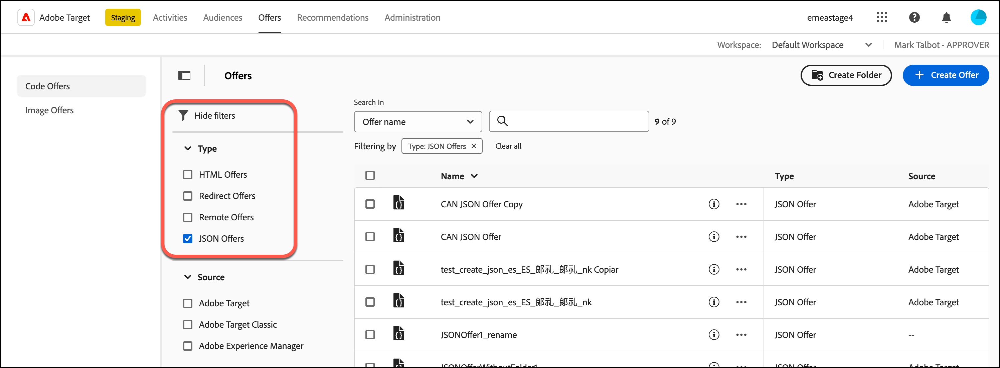

# Creación de ofertas JSON

Creación de ofertas JSON en [!UICONTROL Offer Library] in [!DNL Adobe Target] para su uso en [!UICONTROL Form-Based Experience Composer].

Las ofertas JSON se pueden utilizar en actividades basadas en formularios para habilitar casos de uso en los que [!DNL Target] SPA Se requiere la toma de decisiones para enviar una oferta en formato JSON para su consumo en integraciones de marco de trabajo o del lado del servidor de la.

## Consideraciones de JSON

Cuando trabaje con ofertas JSON, tenga en cuenta la información siguiente:

* Actualmente, las ofertas JSON solo están disponibles para [!UICONTROL A/B Test], [!UICONTROL Automated Personalization] (AP) y [!UICONTROL Experience Targeting] Actividades de (XT).
* Las ofertas JSON se pueden utilizar en [actividades basadas en formularios](/help/main/c-experiences/form-experience-composer.md) solo.
* Las ofertas JSON se pueden recuperar directamente cuando utilice el [API del servidor y SDK de Mobile Node.js, Java, .NET y Python](https://experienceleague.adobe.com/docs/target-dev/developer/server-side/server-side-overview.html?lang=es){target=_blank}.
* En el explorador, las ofertas JSON solo se pueden recuperar a través de at.js 1.2.3 (o versiones posteriores) y utilizando [getOffer()](https://experienceleague.adobe.com/docs/target-dev/developer/client-side/at-js-implementation/functions-overview/adobe-target-getoffer.html){target=_blank} filtrando acciones usando la variable `setJson` acción.
* Las ofertas JSON se proporcionan como objetos JSON nativos en vez de como cadenas. Los consumidores de estos objetos ya no son necesarios para gestionar objetos como cadenas y convertirlos en objetos JSON.
* Las ofertas JSON no se aplican automáticamente, a diferencia de otras ofertas (como la ofertas HTML), porque las ofertas JSON son ofertas no visuales. Los desarrolladores deben escribir código para obtener explícitamente la oferta utilizando [getOffer()](https://experienceleague.adobe.com/docs/target-dev/developer/client-side/at-js-implementation/functions-overview/adobe-target-getoffer.html){target=_blank}.

## Crear una oferta JSON {#section_BB9C72D59DEA4EFB97A906AE7569AD7A}

1. Clic **[!UICONTROL Offers]** > **[!UICONTROL Code Offers]**.

   

1. Clic **[!UICONTROL Create Offer]** > **[!UICONTROL JSON Offer]**.

   

1. Escriba el nombre de una oferta.
1. (Condicional) Si tiene un [[!DNL Target] Cuenta Premium](/help/main/c-intro/intro.md#premium), elija el que desee [workspace](/help/main/administrating-target/c-user-management/property-channel/property-channel.md#workspace).
1. (Condicional) Elija los atributos de perfil que desee.
1. Escriba o pegue su código JSON en **[!UICONTROL Code]** cuadro.
1. Haga clic en **[!UICONTROL Create]**.

## Ejemplo de JSON {#section_A54F7BB2B55D4B7ABCD5002E0C72D8C9}

Las ofertas JSON solo son compatibles con las actividades creadas con [Compositor de experiencias basadas en formularios](/help/main/c-experiences/form-experience-composer.md). Actualmente, la única manera de poder utilizar ofertas JSON es mediante llamadas directas de API/SDK.

Vea el siguiente ejemplo:

```json
adobe.target.getOffer({ 
  mbox: "some-mbox", 
  success: function(actions) { 
    console.log('Success', actions); 
  }, 
  error: function(status, error) { 
    console.log('Error', status, error); 
  } 
});
```

Las acciones pasadas a llamada de retorno de éxito son una matriz de objeto. Suponiendo que tenga una sola oferta JSON, que tenga este contenido:

```json
{ 
  "demo": {"a": 1, "b": 2} 
}
```

La matriz de acciones tiene esta estructura:

```json
[ 
 { 
   action: "setJson", 
   content: [{ 
     "demo": {"a": 1, "b": 2} 
   }] 
 }  
]
```

Para extraer la oferta JSON, debe iterar a través de acciones y encontrar la acción con `setJson` y, a continuación, iterar en la matriz de contenido.

## Caso de uso {#section_85B07907B51A43239C8E3498EF58B1E5}

Pongamos que la siguiente oferta JSON se entrega a su página web:

```json
{ 
    "_id": "5a65d24d8fafc966921e9169", 
    "index": 0, 
    "guid": "7c006504-c6f7-468d-a46f-f72531ea454c", 
    "isActive": true, 
    "balance": "$2,075.06", 
    "picture": "https://placehold.it/32x32", 
    "tags": [ 
      "esse", 
      "commodo", 
      "excepteur"
    ], 
    "friends": [ 
      { 
        "id": 0, 
        "name": "Carla Lyons" 
      }, 
      { 
        "id": 1, 
        "name": "Ollie Mooney" 
      } 
    ], 
    "greeting": "Hello, Stephenson Fernandez! You have 4 unread messages.", 
    "favoriteFruit": "strawberry" 
} 
  
```

El código siguiente muestra cómo acceder al atributo “bienvenida”:

```json
adobe.target.getOffer({   
  "mbox": "name_of_mbox", 
  "params": {}, 
  "success": function(offer) {           
        console.log(offer[0].content[0].greeting); 
  },   
  "error": function(status, error) {           
      console.log('Error', status, error); 
  } 
});
```

## Ejemplo de oferta JSON con atributos de perfil de CDP en tiempo real

Los atributos de perfil de Real-time CDP se pueden compartir con [!DNL Target] para su uso en ofertas de HTML y JSON.

Para obtener más información, consulte [Uso compartido de atributos de perfil de CDP en tiempo real con [!DNL Target]](/help/main/c-integrating-target-with-mac/integrating-with-rtcdp.md#rtcdp-profile-attributes).

## Filtrado de ofertas por tipo de oferta JSON {#section_52533555BCE6420C8A95EB4EB8907BDE}

Puede filtrar la variable [!UICONTROL Offers] por tipo de oferta JSON haciendo clic en el icono **[!UICONTROL Show filters]** y, a continuación, seleccionando la opción **[!UICONTROL JSON]** casilla de verificación

