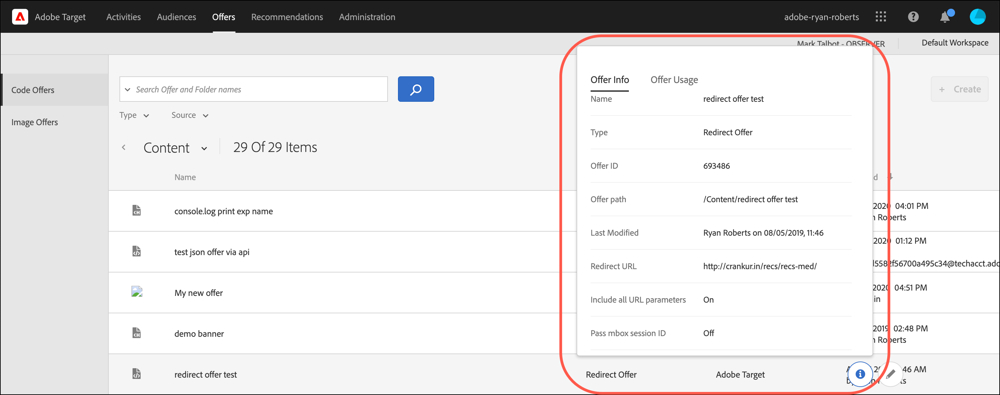

# Ofertas

Utilice el [!UICONTROL Offers] biblioteca en [!DNL Adobe Target] para administrar el contenido de ofertas de código y ofertas de imagen.

>[!NOTE]
>
>Este artículo contiene información sobre la funcionalidad de Target que actualmente forma parte de un programa beta. El equipo de Adobe Target suele habilitar nuevas funciones para clientes seleccionados con fines de prueba y comentarios. Una vez completado el periodo de prueba, estas funciones se habilitarán para todos los clientes en el futuro [!DNL Target Standard/Premium] Versiones de y anunciadas en las notas de la versión.

1. Clic **[!UICONTROL Offers]** para abrir la biblioteca.

   La biblioteca contiene las ofertas que se han configurado mediante [!DNL Target Standard/Premium], [!DNL Target Classic], [!DNL Adobe Experience Manager] (AEM), [!DNL Adobe Mobile Services] (AMS) y API. Las ofertas creadas en [!DNL Target Classic] o en otras soluciones pueden editarse en [!DNL Target Standard/Premium].

   El [!UICONTROL Offers] tiene dos pestañas a lo largo del lado derecho: [!UICONTROL Code Offers] y [!UICONTROL Image Offers] que permiten ver las ofertas por tipo.

   

1. (Opcional) Haga clic en **[!UICONTROL Type]** lista desplegable para filtrar ofertas por tipo (Oferta de HTML, [Fragmentos de experiencias](/help/main/c-experiences/c-manage-content/aem-experience-fragments.md), [Oferta de redireccionamiento](/help/main/c-experiences/c-manage-content/offer-redirect.md), [Oferta remota](/help/main/c-experiences/c-manage-content/about-remote-offers.md), [Ofertas JSON](/help/main/c-experiences/c-manage-content/create-json-offer.md), y [Carpetas](/help/main/c-experiences/c-manage-content/create-content-folder.md)).

   

1. (Opcional) Haga clic en **[!UICONTROL Source]** para filtrar ofertas por fuente (Adobe Target, Adobe Target Classic y Adobe Experience Manager).

1. (Opcional) Realice tareas adicionales pasando el puntero sobre la oferta o carpeta deseada en la [!UICONTROL Code Offers] y, a continuación, haciendo clic en el icono deseado.

   

   Las opciones incluyen:

   * Ver (para obtener más información, consulte [Visualización de definiciones de oferta](#section_6B059DD121434E6292CAB393507D010E) abajo.)
   * Editar  
   * Copiar  
   * Mover (por ejemplo, para mover uno o más elementos a una carpeta, haga clic en el icono **[!UICONTROL Move]** para el elemento deseado, haga clic en la carpeta deseada y luego haga clic en **[!UICONTROL Drop]**.)
   * Eliminar

   En función de sus permisos, es posible que no vea iconos para todas las opciones. Por ejemplo, un usuario con [!UICONTROL Observer] permisos no tiene derechos para utilizar el [!UICONTROL Copy] opción.

   Para obtener información detallada sobre las tareas que se pueden realizar en ofertas y carpetas, consulte [Trabajar con contenido en la biblioteca de recursos](/help/main/c-experiences/c-manage-content/assets-working.md).

1. (Opcional) Realice tareas adicionales pasando el puntero sobre la oferta de imagen o la carpeta que desee en la [!UICONTROL Image Offers] y, a continuación, haciendo clic en el icono deseado.

   

   Las opciones incluyen:

   * Seleccionar
   * Descargar  
   * Ver propiedades
   * Editar  
   * Anotar
   * Copiar  

   Para obtener información detallada sobre las tareas que se pueden realizar en ofertas y carpetas, consulte [Trabajar con contenido en la biblioteca de recursos](/help/main/c-experiences/c-manage-content/assets-working.md).

   >[!NOTE]
   >
   >Las ofertas de imágenes no forman parte de [Permisos de usuario de Enterprise](/help/main/administrating-target/c-user-management/property-channel/property-channel.md) modelo.

## Visualización de definiciones de oferta {#section_6B059DD121434E6292CAB393507D010E}

Puede ver los detalles de la definición de la oferta en una tarjeta emergente de la [!UICONTROL Offers] sin abrir la oferta.

Por ejemplo, para acceder a la siguiente definición de oferta de una oferta de HTML, pase el ratón sobre una oferta de la [!UICONTROL Content] y, a continuación, haciendo clic en el icono de información:

Está disponible la siguiente información:

* Nombre
* Fuente
* Tipo
* ID de oferta
* Ruta de oferta
* Última modificación

Haga clic en [!UICONTROL Offer Usage] para ver las actividades que hacen referencia a una oferta de código en la tarjeta emergente de definición de cada oferta. Esta funcionalidad no se aplica a ofertas de imagen. De esta forma, puede evitar que otras actividades se vean influidas mientras edita las ofertas. La información incluye [!UICONTROL Live Activities] y [!UICONTROL Inactive Activities].

La siguiente es la tarjeta de definición de una oferta de redireccionamiento:

Está disponible la siguiente información:

* Nombre
* Fuente
* Tipo
* ID de oferta
* Ruta de oferta
* Última modificación
* URL de redireccionamiento
* Incluir todos los parámetros de URL (activado o desactivado)
* Transferir ID de sesión de mbox (activado o desactivado)

La siguiente es la tarjeta de definición de una oferta remota:

Está disponible la siguiente información:

* Nombre
* Fuente
* Tipo
* ID de oferta
* Ruta de oferta
* Última modificación
* Tipo de URL de redireccionamiento
* URL absoluta o relativa

## Vídeo de formación: El repositorio de contenido 

Este vídeo incluye información sobre la administración de ofertas.

* Conexión entre la [biblioteca de activos de Experience Cloud](https://experienceleague.adobe.com/docs/core-services/interface/assets/creative-cloud.html) y la biblioteca de contenido de Target
* Ofertas HTML personalizadas
* Oferta HTML personalizada en el Compositor de experiencias visuales

>[!VIDEO](https://video.tv.adobe.com/v/17387)