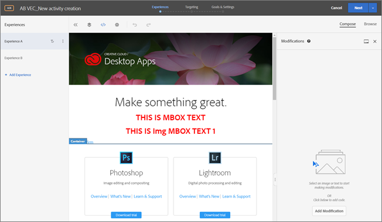

# Modificaciones

Información sobre la página [!UICONTROL Modifications] en [!DNL Adobe Target] que le permite ver las modificaciones realizadas en su página y agregar otras (selector de CSS, mbox y código personalizado).

La página [!UICONTROL Modifications] muestra todos los cambios realizados en su página en el Compositor de experiencias visuales (VEC). También le permite realizar otros cambios haciendo clic en cada elemento de la página y [seleccionando una acción](/help/main/c-experiences/c-visual-experience-composer/viztarget-options.md#reference_3BD1BEEAFA584A749ED2D08F14732E81). Cada cambio que realice aparecerá como una acción o elemento independiente en la lista [!UICONTROL Modifications]. También puede añadir modificaciones, incluidos los tipos siguientes: Selector de CSS, Mbox y Código personalizado.

## Información general sobre modificaciones {#section_EE27E7572AA74397BBDED563B2B3D509}

La página [!UICONTROL Modifications] muestra todos los cambios realizados en su página en el VEC. Cada cambio que realice aparecerá como una acción o elemento independiente en la lista [!UICONTROL Modifications].


Utilice la página Modificaciones para realizar pequeños cambios en el selector que Target elige cuando se utiliza el VEC para configurar el envío del contenido. Puede cambiar el contenido o un atributo HTML. También puede editar el código para crear el equivalente de una oferta HTML dentro de un mbox.

Utilice la página Modificaciones para:

* Ver una acción realizada en el compositor visual.

  

* Editar una acción existente. Pase el ratón sobre la modificación que quiera y luego haga clic en el icono **[!UICONTROL Edit]**.

  

  Haga los cambios.

  

* Eliminar una acción existente. Pase el ratón sobre la modificación que quiera y luego haga clic en el icono **[!UICONTROL Delete]**.

  

* Agregar una nueva modificación. Haga clic en **[!UICONTROL Add Modification]** o en el icono + y, a continuación, especifique los cambios tal como se describe a continuación.

  

  Fíjese en que, una vez que se crea una modificación, Target muestra un icono + en la parte superior del panel Modificaciones en lugar del botón Agregar modificación en la parte inferior del panel.

* Acople el panel Modificaciones verticalmente en el lateral de la interfaz de usuario de Target u horizontalmente en la parte inferior. Haga clic en el icono [!UICONTROL Dock] para alternar entre las dos configuraciones.

  

  En la siguiente ilustración se muestra el panel de Modificaciones acoplado en la parte inferior de la pantalla:

  

## Agregar modificaciones {#section_C7ABCD5731A048CB8F90EDC31A32EDF9}

1. Para mostrar la página [!UICONTROL Modifications] de una experiencia seleccionada, en el VEC, haga clic en el icono **[!UICONTROL Modifications]** &lt;/>.

   

   >[!NOTE]
   >
   >Nota: para abrir el panel Modificaciones en el Compositor de experiencias basadas en formularios, cree o modifique una oferta HTML. Para obtener más información, consulte [Compositor de experiencias basadas en formularios](/help/main/c-experiences/form-experience-composer.md#task_FAC842A6535045B68B4C1AD3E657E56E).

   Se abre la página [!UICONTROL Modifications], dividiendo la pantalla entre el modo visual a la izquierda y el panel Modificaciones a la derecha. Haga clic en el icono [!UICONTROL Dock] para acoplar el panel Modificaciones verticalmente a lo largo del lado de la interfaz de usuario de Target o horizontalmente en la parte inferior. Observe que, en la siguiente ilustración, la Experiencia A no tiene modificaciones previas.

   

   La experiencia B muestra las modificaciones anteriores en el panel [!UICONTROL Modifications] de la derecha.

   

1. Para agregar una modificación:

   * Si no se han realizado modificaciones previas en la experiencia, haga clic en el botón **[!UICONTROL Add Modification]** en la parte inferior derecha del panel [!UICONTROL Modifications].
   * Si hay modificaciones anteriores para la experiencia, haga clic en el icono + en la parte superior del panel [!UICONTROL Modifications] en el lado derecho.

   Aparecerá el panel Modificaciones:

   

1. En la lista desplegable **[!UICONTROL Modifications Type]**, elija el tipo que desee:

   | Tipo de modificaciones | Detalles |
   |--- |--- |
   | Selector de CSS | En el cuadro Selector de elemento CSS, especifique el elemento CSS que desee modificar, elija un tipo de acción (Establecer contenido o Establecer atributo) y, a continuación, rellene la información necesaria y el contenido deseado. |
   | Mbox | Especifique el nombre del mbox y el contenido deseado.<p>**Nota**: Los mboxes ya no son compatibles con el VEC en páginas que usan at.js 2.*x*.<p>Como solución alternativa:<ul><li>Si usa at.js 2.*x*, agregue una modificación al Selector de CSS en lugar de una modificación a Mbox y agregue el contenido al selector que estaba usando su mbox. </li><li>Uso de actividades basadas en formularios (funciona con mboxes y at.js 1).*x* y at.js 2.*x*).</li><li>Uso de at.js 1.*x* en el VEC.</li></ul> |
   | Código personalizado | Especifique un nombre opcional, seleccione o anule la selección de la casilla de verificación [!UICONTROL Add Code in the `<HEAD>` Sección], según sus preferencias, y después agregue el código personalizado.<p>Si selecciona [!UICONTROL Add Code in the `<HEAD>` Sección], el código personalizado se agrega a la sección `<head>` y su ejecución no espera a eventos de cuerpo o de carga de página. Añada solo los elementos `<script>` y `<style>`. Si agrega las etiquetas `<div>` y otros elementos, los restantes elementos de `<head>` podrían saltar a la sección `<body>`. Si utiliza at.js, todas las ofertas se entregarán de forma asíncrona.<p> Si anula la selección de [!UICONTROL Add Code in the `<HEAD>` Sección], el código personalizado se ejecuta inmediatamente después de la etiqueta `<body>`. Envuelva todo el código en un único `<div>` para preservar la estructura DOM. Si utiliza at.js, todas las ofertas se entregarán de forma asíncrona.<p>Si HTML para `<BODY>` contiene `<SCRIPT>` y `<DIV>`, `<DIV>` se anexa a `<BODY>` y `<SCRIPT>` se ejecuta en `<HEAD>`. Además, `<SCRIPT>` que carga un archivo externo se anexa a `<HEAD>`.<p>**Nota**: Los scripts se ejecutan de forma asincrónica. Esto significa que no puede, por ejemplo, usar `document.write` o métodos de scripts similares.<p>Código personalizado ofrece una interfaz no visual para ver, modificar y agregar nuevas acciones dentro del VEC, del Compositor de experiencias basadas en formularios y del editor de ofertas HTML. El panel proporciona una vista de código de una experiencia para ayudarlo a crear experiencias más complejas, ajustar las existentes y solucionar problemas.<p>Código personalizado está pensado para usuarios avanzados que se sientan cómodos con HTML, JavaScript y CSS. La vista de código puede ayudarle a modificar o ajustar cambios, o corregir problemas de selector. También se puede usar para agregar nuevo código y nuevas acciones personalizados. Puede agregar más de un código personalizado y, si lo desea, asignarles nombre.<p>**Nota**: actualmente, el código personalizado solo está disponible para actividades A/B y de segmentación de experiencias (XT). Código personalizado se desactiva para el solapamiento y si se aplica una oferta de redirección.<p>Código personalizado admite los siguientes casos de uso:<ul><li>Agregar JavaScript, HTML o CSS personalizado para que se ejecute en la parte superior de la página</li><li>Ver o editar el código generado por VEC tras realizar modificaciones</li><li>Establecer contenido HTML para un selector (selectores CSS solamente)</li><li>Establecer un atributo en un elemento HTML</li><li>Agregar contenido de oferta para que se entregue en un mbox regional</li><li>Intercambiar el DOM listo, con jQuery</li><li>Intercambiar el DOM listo, sin jquery (no admite Internet Explorer 8)</li><li>Intercambiar con sondeo DOM mediante el complemento “elementOnLoad”</li><li>Redireccionamiento personalizado</li></ul>Código personalizado proporciona:<ul><li>Números de línea para mejorar el uso.</li><li>Resalte de sintaxis para ayudarlo a evitar errores en las ofertas HTML.</li><li>Capacidad para crear varios códigos personalizados y, si lo desea, proporcionar un nombre para cada uno. La creación de varios códigos personalizados facilita la depuración futura. Por ejemplo, en vez de crear un único código personalizado para realizar varias modificaciones, puede crear uno distinto para cada modificación y ponerle un nombre descriptivo a cada uno. Disponer de códigos personalizados independientes hace que las modificaciones sean más modulares y manejables. Tenga en cuenta que no se puede garantizar que la ejecución de varios códigos personalizados en una actividad se realice en el orden en que se crearon.</li></ul>El panel Modificaciones divide la pantalla entre el modo visual y el modo de código. Ambos modos permanecen sincronizados. Toda modificación realizada visualmente tiene una fila correspondiente en la vista de código. Igualmente, cada cambio realizado en la vista de código se muestra en la experiencia visual. Al hacer clic en cualquier fila de la vista de código, se selecciona el elemento correspondiente en la página visual.<p>Código personalizado admite HTML, scripts y estilos. Se puede agregar o editar cualquier script o código HTML válido. |

1. Agregue todas las modificaciones que sean necesarias.

## Casos de uso de Código personalizado   {#section_26CB3360097D400FB02E20AE5FDBA352}

El panel **[!UICONTROL Custom Code]** contiene código que se ejecuta al principio de la carga de la página.

Puede ejecutar el código JavaScript en la etiqueta `<head>`. La ejecución del código no espera a que la etiqueta `<body>` esté presente en el DOM.

Los selectores para acciones visuales siguientes dependen de los elementos HTML agregados en esta pestaña.

El panel Código personalizado suele utilizarse para añadir JavaScript o CSS en la parte superior de la página.


Utilice la ficha **[!UICONTROL Custom Code]** para:

* Usar JavaScript en línea o vincular a un archivo JavaScript externo

  Por ejemplo, para cambiar el color de un elemento:

  ```javascript
  <script type="text/javascript"> 
  document.getElementById("element_id").style.color = "blue"; 
  </script> 
  ```

* Configurar un estilo en línea o vincular a una hoja de estilos externa

  Por ejemplo, para definir una clase para un elemento overlay:

  ```html
  <style> 
  .overlay 
  { position: absolute; top:0; left: 0; right: 0; bottom: 0; background: red; } 
  </style> 
  ```

* Agregar fragmentos de código HTML para definir nuevos elementos

  Por ejemplo, use el siguiente fragmento de código HTML para crear una superposición `<div>` con la clase CSS definida arriba:

  ```html
  <div class="overlay"></div>
  ```

* Intercambiar el DOM listo, con jQuery

  El siguiente ejemplo que utiliza JQuery supone que el sitio web del cliente tiene jQuery disponible en la página cuando [!DNL Target] ejecuta las ofertas.

  ```javascript
  <style>#default_content {visibility:hidden;}</style> 
  <script> 
  jQuery( document ).ready(function() { 
      jQuery("#default_content").html( "<span style='color:red'>Hello <strong>Again</strong></span>" ); 
      jQuery("#default_content").css("visibility","visible"); 
  }); 
  </script> 
  ```

* Intercambiar el DOM listo, sin jQuery (no admite Internet Explorer 8)

  ```javascript
  <style>#default_content {visibility:hidden;}</style> 
  <script> 
  document.addEventListener("DOMContentLoaded", function(event) {  
      document.getElementById("default_content").innerHTML = "<span style='color:red'>Hello <strong>Again</strong></span>"; 
      document.getElementById("default_content").style.visibility="visible"; 
  }); 
  </script> 
  ```

* Parámetros existentes de paso de redireccionamiento personalizado, parámetro `s_tnt` (para integración heredada con Analytics), parámetro referrer y sesión mbox

  ```javascript
  <style type="text/css">body{display:none!important;}</style> 
  <script type="text/javascript"> 
   var qs='';window.location.search?qs=window.location.search+'&':qs='?'; 
   window.location.replace('//www.mywebsite.com/'+qs+'s_tnt=${campaign.id}:${campaign.recipe.id}:${campaign.recipe.trafficType}&s_tntref='+encodeURIComponent(document.referrer)+'&mboxSession='+mboxFactoryDefault.getSessionId().getId()+''+window.location.hash+''); 
  </script> 
  ```

* Agregue plantillas de experiencia de Adobe Target para su uso en código personalizado. Las plantillas de experiencia de Target son muestras precodificadas con entradas configurables que se utilizan para ejecutar casos de uso habituales para expertos en marketing. Estas plantillas de experiencia se proporcionan gratuitamente a los desarrolladores y expertos en marketing como punto de partida para la ejecución de casos de uso comunes, ya sea mediante el VEC o el Compositor de experiencias basadas en formularios. Entre los casos de uso tenemos lightboxes, carruseles, cuentas atrás y muchos más.

  Para obtener más información, consulte [Plantillas de experiencias](/help/main/c-experiences/c-visual-experience-composer/c-vec-code-editor/experience-templates.md#concept_109BBD7EABC04DD39E6B7B1687786652).

## Prácticas recomendadas para código personalizado {#section_10DFFD9FB92A43C1BB444A45E0272B28}

**Siempre ajuste el código personalizado en un elemento.**

Por ejemplo:

```html
<div id="custom-code"> 
// My Code goes here 
</div>
```

En caso de que se necesiten modificaciones, realice cambios dentro de este contenedor.

Si ya no necesita el código personalizado, simplemente deje vacío este contenedor, pero no lo quite. Esto garantiza que no se vean afectadas otras modificaciones de la experiencia.

**No use el ID de elemento “CDQID” para modificaciones de la página realizadas en el Editor de código.**

Target aplica un nuevo ID de elemento con el valor “CDQID” a cualquier elemento en la página que Target haya modificado. Como este ID es aplicado por Target, no debería usarse para modificaciones o ajustes futuros en el Editor de código.

**No realice acciones document.write en scripts de código personalizado.**

Los scripts se ejecutan de forma asincrónica. Esto a menudo hace que las acciones `document.write` aparezcan en el lugar equivocado de la página. No se recomienda el uso de `document.write` en scripts creados con código personalizado.

**Si crea un elemento y luego lo modifica, no elimine el elemento original.**

Cada cambio crea un nuevo elemento en el panel Modificaciones. Como la segunda acción modifica al Elemento 1, si elimina el Elemento 1, esa acción ya no tiene nada para modificar. Por lo tanto, el cambio ya no funciona. Consulte “Resolución de problemas” a continuación para obtener más información.

**Tenga cuidado si usa la característica de código personalizado para dos actividades que segmenten la misma dirección URL.**

Si usa la característica de código personalizado para dos actividades que segmenten la misma dirección URL, JavaScript se inserta en la página desde ambas actividades. Target determina automáticamente el orden del contenido entregado. Asegúrese de que el código no dependa de la colocación. Depende de usted asegurarse de que no existan conflictos en el código.

## Solución de problemas de código personalizado {#section_6C965CBC31C348D7AA5B57B63DAB9E7F}

**El código personalizado no se ejecuta al usar `triggerView`.**

Las ofertas de código personalizado del VEC no se vuelven a procesar cuando `triggerView()` se llama con `{page: false}` como la opción.

**He recibido el aviso de que una acción no se puede aplicar debido a cambios estructurales en una página. ¿Qué significa esto?**

Este mensaje indica que la estructura de la página ha cambiado desde la última vez que se guardó la actividad.

Se puede acceder a los selectores que faltan mediante el modo Examinar. Recomendamos que elimine y después recree cada una de las experiencias para garantizar que el contenido tenga el aspecto deseado, como se indica en el mensaje de advertencia.


***Cuando elimino un elemento, veo una advertencia que dice &quot;Eliminar esta acción puede afectar a las acciones posteriores&quot;. ¿Qué significa esto?***

Por ejemplo, si ha realizado dos acciones:

* Ha agregado una clase al Elemento 1
* Ha editado el HTML del Elemento 1

Cada cambio crea un nuevo elemento en el panel Modificaciones. Como la segunda acción modifica al Elemento 1, si elimina el Elemento 1, la segunda acción ya no tiene nada para modificar. Por lo tanto, el cambio ya no funciona.

En otras palabras, si agrega un elemento con texto y luego, en una acción aparte, edita dicho elemento con un texto diferente, el panel Modificaciones muestra ambas acciones como elementos separados. Cuando editó el elemento, creó un nuevo elemento que modifica al original que usted creó, y que contiene el texto editado. Si luego elimina el elemento original, el texto editado no podrá encontrar el elemento editado y no se mostrará. El segundo elemento permanece en la lista de elementos, pero no afecta a la página porque el elemento al que cambia ya no existe.

***Un elemento que creé con `document.write` en un script no aparece donde espero que lo haga.***

Los scripts se ejecutan de forma asincrónica. Esto a menudo hace que las acciones `document.write` aparezcan en el lugar equivocado de la página. Adobe no recomienda el uso de `document.write` en scripts creados con código personalizado.

***Mi JavaScript muestra errores en el código personalizado.***

Cualquier JavaScript en línea que no sea un JavaScript válido muestra errores en el código personalizado.

***No puedo deshacer un cambio en mi código personalizado.***

En este momento no hay función Deshacer para las acciones de edición y eliminación en el panel Modificaciones y en el código personalizado. Deshacer una de estas operaciones podría provocar que la experiencia en el VEC no parezca coherente con las acciones que se muestran en el código personalizado. No obstante, las acciones del código personalizado están en el estado correcto y los envíos no se ven afectados en modo alguno. Este es un problema de la interfaz de usuario. Para actualizar la experiencia, guarde y abra de nuevo o vaya al paso siguiente y regrese. Una de las dos acciones vuelve a cargar la experiencia, que se muestra de nuevo correctamente y de forma coherente con las acciones del panel Modificaciones.

**El código personalizado no produce los resultados esperados en Internet Explorer 8.**

Target ya no admite IE8.
