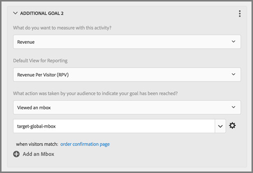

# Preguntas más frecuentes sobre mbox global

Lista de las preguntas más frecuentes (FAQ) sobre los mboxes globales.

## ¿Puedo tener más de un mbox global si [!DNL Target] ¿la cuenta se establece en varios dominios? {#section_B7252BA6C3BB4EF4AE9E53F47FD58ABD}

Se admite un único mbox global en su cuenta.

Puede limitar dónde se ejecutan sus actividades añadiéndoles reglas de URL. Para obtener más información, consulte [Incluir la misma experiencia en páginas similares](/help/main/c-experiences/c-visual-experience-composer/temtest.md#task_2539D51A18044F82B0D9895636546781).

También puede pasar un parámetro a la página utilizando [targetPageParams](https://developer.adobe.com/target/implement/client-side/atjs/atjs-functions/targetpageparams/){target=_blank} y, a continuación, seleccione esos parámetros en la sección &quot;configurar URL&quot; de la sección [!UICONTROL Compositor de experiencias visuales] (VEC) o añadiendo los parámetros como &quot;refinamientos&quot; en el Compositor de experiencias basadas en formularios.

## ¿Cómo paso los datos de ingresos en un [!DNL Target] mbox global? {#section_17AEA933BADA4D169CCEDF5833C41306}

Para recabar ingresos e información de pedidos en target-global-mbox, se deben enviar a Target “parámetros de mbox”. Estos parámetros son pares de nombre/valor que se utilizan para enviar más información a Target. Target busca automáticamente estos parámetros (son nombres reservados) para rellenar los datos de ingresos.

Para `orderConfirmPage`, debe transferir `orderTotal`, `orderId` y `productPurchasedId`.

Estos parámetros deben enviarse a target-global-mbox mediante `targetPageParams()`. Para obtener más información, consulte [Transferencia de parámetros a un mbox global](https://developer.adobe.com/target/implement/client-side/atjs/global-mbox/pass-parameters-to-global-mbox/).

También conviene añadir segmentación a la pieza de conversión, de forma que Target solo cuente las conversiones en target-global-mbox cuando se visualice la página de confirmación de pedido, como se muestra abajo:

La sección Páginas del sitio arriba ilustrada contiene las siguientes selecciones: Página actual, URL, contiene, orderconfirm.

Las opciones en la imagen anterior incluyen los siguientes ajustes.

* **Qué se quiere medir con esta actividad:** ingresos
* **Vista predeterminada para informes:** ingresos por visitante (RPV)
* **¿Qué acción realizó su audiencia para indicar que se ha alcanzado su objetivo?** Visualizó un mbox, target-global-mbox
